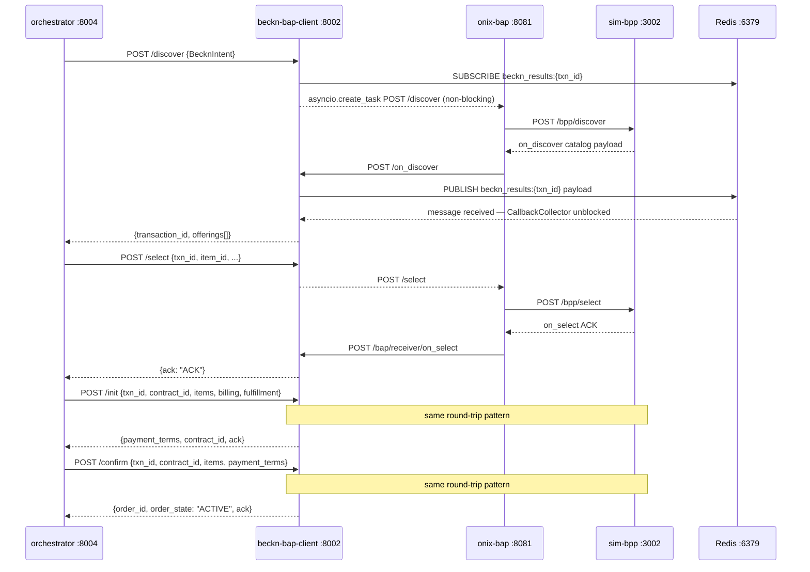
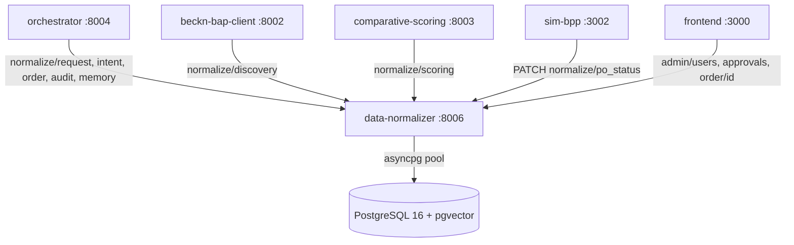

# API Reference

This document covers every HTTP API surface in the Procurement Agent stack. All services communicate over the `beckn_network` Docker bridge; inside that network the container name is the hostname. Outside Docker (host-to-container) use `localhost:{host-port}`.

**Base URL pattern:** `http://{service-name}:{port}` (inside Docker) or `http://localhost:{host-port}` (from the host).

Related reading: [Architecture](ARCHITECTURE.md) · [Data Flow](DATA_FLOW.md) · [Configuration](CONFIGURATION.md) · [Components](COMPONENTS.md)

---

## Service Port Map

| Service | Container port | Host port | Protocol |
|---|---|---|---|
| orchestrator | 8004 | 8004, 8000 (legacy) | HTTP/JSON + WebSocket |
| IntentParser | 8001 | 8001 | HTTP/JSON |
| beckn-bap-client | 8002 | 8002 | HTTP/JSON |
| data-normalizer | 8006 | 8006 | HTTP/JSON |
| catalog-normalizer | 8005 | 8005 | HTTP/JSON |
| comparative-scoring | 8003 | 8003 | HTTP/JSON |
| erp-adapter | 8007 | 8007 | HTTP/JSON |
| erp-mock | 8008 | 8008 | HTTP/JSON |
| negotiation-engine | 8004 | **18004** | HTTP/JSON |
| frontend-demo-gateway | 8015 | 8015 | HTTP/JSON |
| discovery-engine | 8006 | — | HTTP/JSON (orphaned — not in docker-compose) |
| mcp-sidecar | 3000 | 3000 | HTTP/SSE + JSON-RPC 2.0 |
| sim-bpp | 3002 | 3002 | HTTP/JSON |
| analytics | 8009 | 8009 | HTTP/JSON |
| notification-dispatcher | 8010 | — | Kafka consumer only (no HTTP API) |

> **Port conflict note:** both `orchestrator` and `negotiation-engine` bind container port 8004. `docker-compose.yml` resolves this by mapping negotiation-engine to host port **18004**. Use `negotiation-engine:8004` inside Docker and `localhost:18004` on the host.

---

## Shared Data Models

These types appear across multiple endpoints. Always refer to the canonical definitions in `shared/models.py`.

### BecknIntent

| Field | Type | Required | Notes |
|---|---|---|---|
| `item` | `str` | Yes | Canonical item name, e.g. `"A4 paper"` |
| `descriptions` | `list[str]` | No | Atomic technical specifications, e.g. `["80gsm", "A4"]` |
| `quantity` | `int` | Yes | Must be > 0 |
| `unit` | `str` | No | Default `"units"`. E.g. `"reams"`, `"meters"` |
| `location_coordinates` | `str \| null` | No | `"lat,lon"` decimal string — **never** a city name |
| `delivery_timeline` | `int \| null` | No | Positive integer in **hours**. 1 day = 24, 1 week = 168 — **never** ISO 8601 |
| `budget_constraints` | `BudgetConstraints \| null` | No | `{"max": 200.0, "min": 0.0}` — never a raw string |

### DiscoverOffering

Returned by `/discover` and stored in all session state.

| Field | Type | Notes |
|---|---|---|
| `bpp_id` | `str` | Beckn Provider Platform identifier |
| `bpp_uri` | `str` | ONIX BPP caller URL (always contains `caller` in path) |
| `provider_id` | `str` | |
| `provider_name` | `str` | |
| `item_id` | `str` | |
| `item_name` | `str` | |
| `price_value` | `str` | Numeric string, e.g. `"168.00"` |
| `price_currency` | `str` | Default `"INR"` |
| `available_quantity` | `int \| null` | |
| `rating` | `str \| null` | |
| `specifications` | `list[str]` | |
| `fulfillment_hours` | `int \| null` | Delivery lead time in hours |
| `category` | `str \| null` | |

---

## orchestrator (:8004)

The **sole entry point** for the Next.js frontend. No other service in the stack should be called directly by the frontend. The orchestrator proxies or orchestrates all downstream calls.

> **Host port note:** `docker-compose.yml` publishes two host ports for this container. Port `8004` is the primary (microservices mode, `BAP_URL=localhost:8004`). Port `8000` is the legacy Bap-1 compatible mode.

### Pipeline Entry Points

| Method | Path | Description |
|---|---|---|
| POST | `/run` | Unified single-call orchestration: NL query → discover → score → (negotiate) → optional auto-commit |
| POST | `/parse` | Proxy to intention-parser `/parse` (Stages 1+2 only, synchronous) |
| POST | `/discover` | Steps 2–4 with a pre-parsed BecknIntent body |
| POST | `/compare` | Steps 2–3 only. Stores session. Returns offerings + scoring |
| POST | `/commit` | Loads a compare session, then runs select → init → confirm |
| PATCH | `/cancel` | Mark a procurement request as cancelled |

### Session and Order Tracking

| Method | Path | Description |
|---|---|---|
| GET | `/run/{run_id}` | Current stage + state snapshot for a `/run` session. `404` for unknown, `410 Gone` if expired |
| POST | `/run/{run_id}/decide` | Advance a run after a human decision (advisory / HITL) |
| GET | `/status/{txn_id}/{order_id}` | Poll Beckn order lifecycle via beckn-bap-client. Always returns `200` |
| GET | `/order/{request_id}` | Full order detail from data-normalizer, overlaid with in-memory enrichment |

### WebSocket

| Method | Path | Description |
|---|---|---|
| GET (WS) | `/ws/status/{txn_id}` | Real-time order status push. Read-only; sends initial snapshot then Kafka-driven events |

### Admin, Approvals, Analytics

| Method | Path | Description |
|---|---|---|
| GET | `/health` | Liveness. Returns upstream service URL map |
| GET | `/analytics` | Proxy to analytics service. Query param: `period=30d\|90d\|180d` |
| GET | `/admin/users` | Proxy to data-normalizer `/admin/users` |
| PATCH | `/admin/users/{user_id}` | Proxy to data-normalizer. Updates `approval_threshold` / `department` |
| GET | `/approvals` | List pending approval requests (in-memory store) |
| POST | `/approvals/{request_id}/decide` | Approve or reject a pending order |

### Inbound Webhook

| Method | Path | Auth | Description |
|---|---|---|---|
| POST | `/webhooks/seller/status` | `X-Signature`: `base64(HMAC-SHA256(body, SELLER_WEBHOOK_HMAC_SECRET))` | BPP pushes state change. Persists, audits, publishes to Kafka `po.status.changed` |

---

### POST /run

Unified orchestration. Accepts BecknIntent fields plus mode extras. Internally runs Steps 1–4 and, for the autonomous mode, drives automated negotiation via the demo-gateway.

**Request body**

```json
{
  "item": "A4 paper",
  "descriptions": ["80gsm"],
  "quantity": 500,
  "unit": "reams",
  "location_coordinates": "12.9716,77.5946",
  "delivery_timeline": 72,
  "budget_constraints": { "max": 200.0 },
  "raw_query": "500 reams A4 paper Bangalore 3 days",
  "execution_mode": "advisory",
  "actor": { "user_id": "...", "role": "requester" }
}
```

`raw_query`, `actor`, and `execution_mode` are optional extras not part of BecknIntent.

| `execution_mode` | Behaviour |
|---|---|
| `advisory` (default) | Returns ranked offerings. Human selects via `POST /run/{run_id}/decide` |
| `hitl` | Agent recommends one item. Human approves or rejects |
| `autonomous` | Agent commits automatically when within the requester's RBAC threshold |

**Response 200 — advisory, stage `awaiting_selection`**

```json
{
  "run_id": "abc123",
  "transaction_id": "uuid",
  "request_id": "uuid",
  "stage": "awaiting_selection",
  "execution_mode": "advisory",
  "offerings": [],
  "recommended_item_id": "item_id_string",
  "scoring": {
    "recommended_item_id": "...",
    "criteria": [{ "key": "price", "label": "Price", "weight": 1.0, "direction": "min", "scores": [] }],
    "ranking": [{ "item_id": "...", "composite_score": 0.9, "rank": 1 }]
  },
  "reasoning_steps": [],
  "messages": ["Step 1 ...", "Step 2 ..."],
  "decision": {},
  "status": "live"
}
```

`status` is `"mock"` when the ONIX Docker stack is offline.

**Response 202 — RBAC approval required, stage `awaiting_rbac_approval`**

```json
{
  "run_id": "abc123",
  "stage": "awaiting_rbac_approval",
  "request_id": "uuid",
  "amount_total": 95000.0,
  "explanation": "Amount exceeds requester threshold ...",
  "decision": {}
}
```

**Response 200 — autonomous path, stage `confirmed`**

```json
{
  "run_id": "abc123",
  "stage": "confirmed",
  "order_id": "order_uuid",
  "order_state": "ACTIVE",
  "transaction_id": "uuid",
  "contract_id": "uuid",
  "bpp_id": "bpp.example.com",
  "bpp_uri": "http://onix-bpp:8082/bpp/receiver",
  "reasoning_steps": [],
  "messages": [],
  "status": "live",
  "offerings": [],
  "negotiation_settled_price": null
}
```

---

### POST /compare

Runs Steps 2–3 (discover + score). Stores session keyed by `transaction_id` with a 30-minute TTL. Does **not** run Step 4 (select).

**Request body** — BecknIntent fields plus optional `raw_query: str`.

**Response 200**

```json
{
  "transaction_id": "uuid",
  "request_id": "uuid",
  "offerings": [],
  "recommended_item_id": "item_id_string",
  "scoring": {
    "recommended_item_id": "...",
    "criteria": [],
    "ranking": []
  },
  "reasoning_steps": [{ "node": "memory_context", "role": "observe", "content": "..." }],
  "messages": ["Step 2: Discovered 5 offerings", "Step 3: Scored offerings"],
  "status": "live"
}
```

---

### POST /commit

Loads the compare session by `transaction_id`, overrides the selected item with `chosen_item_id`, then drives `/select` → `/init` → `/confirm` through beckn-bap-client.

If `order_total > user.approval_threshold`, the commit is queued to `_pending_approvals` and returns `202 Accepted` instead of `200`.

**Request body**

```json
{ "transaction_id": "uuid", "chosen_item_id": "item_id_string" }
```

**Response 200**

```json
{
  "transaction_id": "uuid",
  "request_id": "uuid",
  "order_id": "order_uuid",
  "order_state": "ACTIVE",
  "payment_terms": {
    "type": "ON_FULFILLMENT",
    "collected_by": "BPP",
    "currency": "INR",
    "status": "COMMITTED"
  },
  "fulfillment_eta": null,
  "bpp_id": "bpp.example.com",
  "bpp_uri": "http://onix-bpp:8082/bpp/receiver",
  "contract_id": "uuid",
  "reasoning_steps": [],
  "messages": [],
  "status": "live"
}
```

**Response 202 — approval gate**

```json
{
  "status": "awaiting_approval",
  "message": "Order requires manager approval ...",
  "request_id": "uuid",
  "transaction_id": "uuid",
  "amount_total": 120000.0
}
```

---

### POST /run/{run_id}/decide

Advances a run after a human decision.

**Request body**

```json
{
  "decision": "proceed",
  "chosen_item_id": "item_id_string",
  "approver_id": "user_uuid"
}
```

| Stage | `decision` values | Notes |
|---|---|---|
| `awaiting_selection` | `proceed` | `chosen_item_id` required |
| `awaiting_approval` (HITL) | `proceed` | Uses `decision.final_item_id` from session; `chosen_item_id` is an optional override |
| Any | `reject` | Cancels run. For HITL, transitions to `awaiting_selection` instead |

**Response 200** — same shape as the `/run` confirmed response.
**Response 202** — if the approved commit triggers a further RBAC escalation.

---

### POST /approvals/{request_id}/decide

`decision` must be `"approved"` or `"rejected"`. Returns `404` for unknown `request_id`.

- `rejected` — persists `cancelled` status, removes from pending queue.
- `approved` — resumes Beckn select → init → confirm from the saved session; falls back to a mock response if the session has expired.

**Request body**

```json
{ "decision": "approved" }
```

---

### GET /status/{txn_id}/{order_id}

Polls order lifecycle via beckn-bap-client `/status`. Always returns `200`. Session data provides `bpp_id`/`bpp_uri`; query params `?bpp_id=&bpp_uri=` are the fallback when the session has expired.

**Response 200**

```json
{
  "state": "SHIPPED",
  "observed_at": "2026-07-07T10:00:00.000Z",
  "fulfillment_eta": null,
  "tracking_url": null,
  "erp_state": {
    "state": "SHIPPED",
    "vendor": "sap",
    "erp_reference_id": "4500123456",
    "event_ts": "2026-07-07T09:45:00Z",
    "vendor_event_id": "sap-evt-001"
  },
  "status": "live"
}
```

`erp_state` is `null` when no ERP inbound event has been cached for the transaction.

---

### orchestrator Environment Variables

| Variable | Default | Notes |
|---|---|---|
| `INTENTION_PARSER_URL` | `http://localhost:8001` | |
| `BECKN_BAP_URL` | `http://localhost:8002` | |
| `COMPARATIVE_SCORING_URL` | `http://localhost:8003` | |
| `DATA_NORMALIZER_URL` | `http://localhost:8006` | |
| `ANALYTICS_URL` | `http://localhost:8009` | |
| `ERP_ADAPTER_URL` | `http://localhost:8007` | |
| `DEMO_GATEWAY_URL` | `http://localhost:8015` | Required for autonomous negotiation; correct port is **8015** |
| `ERP_BUDGET_CHECK_ENABLED` | `"true"` | |
| `ERP_BUDGET_CHECK_REQUIRED` | `"false"` | `"true"` = fail-closed; blocks commit if ERP is unreachable |
| `ERP_BUDGET_CHECK_TIMEOUT_MS` | `800` | Hard ceiling for the synchronous budget gate |
| `ERP_SYNC_ENABLED` | `"true"` | |
| `KAFKA_BOOTSTRAP` | `""` | Empty disables the Kafka producer/consumer |
| `KAFKA_TOPIC` | `po.status.changed` | |
| `SELLER_WEBHOOK_HMAC_SECRET` | `dev-seller-hmac-CHANGE_ME` | **Change before production** |
| `BUYER_NAME` | `Procurement Agent` | Used in billing and fulfillment blocks |
| `BUYER_EMAIL` | `procurement@example.com` | |

---

## IntentParser (:8001)

FastAPI service. Runs **locally by default** (not Dockerised). The `intention-parser` Docker container wraps only Stages 1+2; Stage 3 (pgvector + MCP sidecar validation) runs only in the local process.

All three parsing stages depend on a local [Ollama](https://ollama.ai/) instance serving `qwen3:8b` and `qwen3:1.7b`.

**Complexity routing rule (Stage 2 model selection):** query longer than 120 chars, or at least 2 numeric tokens, or contains a procurement keyword (delivery, budget, timeline, etc.) → `COMPLEX_MODEL` (default `qwen3:8b` locally, `qwen3:1.7b` in Docker). Otherwise → `SIMPLE_MODEL` (`qwen3:1.7b`).

### Endpoints

| Method | Path | Stages | Ollama required | Notes |
|---|---|---|---|---|
| POST | `/parse` | 1+2 | Yes | Synchronous; Stage 3 disabled |
| POST | `/parse/batch` | 1+2 | Yes | Parallel batch via `ThreadPoolExecutor` |
| POST | `/parse/full` | 1+2+3+recovery | Yes + pgvector + MCP sidecar | Async; full pipeline |

> There is no `GET /health` endpoint in `api.py`. Probe liveness with a minimal `POST /parse` request.

---

### POST /parse

Runs Stage 1 (intent classification) then Stage 2 (BecknIntent extraction). Synchronous; blocks on Ollama inference.

**Request body**

```json
{ "query": "500 reams A4 paper Bangalore 3 days" }
```

**Response — ParseResult**

```json
{
  "intent": "SearchProduct",
  "confidence": 0.95,
  "beckn_intent": {
    "item": "A4 paper",
    "descriptions": ["80gsm", "A4"],
    "quantity": 500,
    "unit": "reams",
    "location_coordinates": "12.9716,77.5946",
    "delivery_timeline": 72,
    "budget_constraints": null
  },
  "routed_to": "qwen3:1.7b"
}
```

For a non-procurement query:

```json
{ "intent": "GeneralInquiry", "confidence": 0.98, "beckn_intent": null, "routed_to": "qwen3:1.7b" }
```

---

### POST /parse/batch

Runs Stage 1+2 on multiple queries in parallel using `ThreadPoolExecutor` (default `max_workers=4`).

**Request body**

```json
{ "queries": ["query one", "query two"], "max_workers": 4 }
```

**Response** — `list[ParseResult]` in the same order as input.

---

### POST /parse/full

Full async pipeline: Stage 1 → Stage 2 → Stage 3 (pgvector ANN cache + MCP sidecar ONIX probe) → recovery flow if not found.

Requires: local Ollama, PostgreSQL 16 with pgvector, and mcp-sidecar on port 3000.

**Request body** — same as `/parse`.

**Response — ParseResponse**

```json
{
  "intent": "SearchProduct",
  "confidence": 0.91,
  "beckn_intent": {
    "item": "Cat6 UTP cable",
    "descriptions": ["Cat6", "UTP", "ethernet"],
    "quantity": 300,
    "unit": "meters",
    "location_coordinates": "19.0760,72.8777",
    "delivery_timeline": 120,
    "budget_constraints": null
  },
  "validation": {
    "zone": "VALIDATED",
    "top_match": {
      "item_name": "Cat6 Cable UTP",
      "bpp_id": "bpp.example.com",
      "similarity": 0.91
    },
    "mcp_validated": false
  },
  "recovery_log": [],
  "routed_to": "qwen3:1.7b"
}
```

**`validation.zone` values**

| Zone | Condition | Action |
|---|---|---|
| `VALIDATED` | ANN cosine similarity >= 0.85 | Return immediately |
| `AMBIGUOUS` | Similarity 0.45–0.85 | MCP sidecar probe attempted |
| `CACHE_MISS` | Similarity < 0.45 | MCP probe; if not found, recovery flow triggered |

**Recovery flow** (triggered when `zone = CACHE_MISS` and MCP returns `found: false`):

1. `broaden_procurement_query()` — strips specifics; optionally calls Claude Sonnet 4.6 if `ANTHROPIC_API_KEY` is set.
2. Stage 3 retry with the broadened query.
3. `log_unmet_demand()` — stub (logs only; no DB write in current implementation).
4. `notify_buyer_no_stock()` — stub.
5. `trigger_open_rfq_flow()` — stub.

`recovery_log` contains messages from each step.

---

### IntentParser Environment Variables

| Variable | Default | Notes |
|---|---|---|
| `OLLAMA_BASE_URL` | `http://localhost:11434/v1` | |
| `COMPLEX_MODEL` | `qwen3:8b` (local) / `qwen3:1.7b` (Docker) | Docker collapses both tiers to `qwen3:1.7b` |
| `SIMPLE_MODEL` | `qwen3:1.7b` | |
| `ANTHROPIC_API_KEY` | `""` | Optional; required only for Stage 3 broadening fallback |
| `DB_HOST` | `localhost` | Required for Stage 3 pgvector cache |
| `DB_PORT` | `5432` | |
| `DB_NAME` | `procurement_agent` | |
| `DB_USER` | `postgres` | |
| `DB_PASSWORD` | `""` | |

---

## beckn-bap-client (:8002)

aiohttp service. This service is the **exclusive gateway for all Beckn protocol traffic**. All Beckn actions route through `onix-bap:8081`. Never POST directly to a BPP — all `select_url` values must contain `caller` in the path.

The service exposes two route groups: orchestrator-facing routes (trigger Beckn actions) and ONIX callback receivers.

### Orchestrator-Facing Routes

| Method | Path | Description |
|---|---|---|
| GET | `/health` | Returns `{"status":"ok","service":"beckn-bap-client","bap_id":"..."}` |
| POST | `/discover` | Runs discovery via ONIX, awaits `on_discover` callback |
| POST | `/select` | Sends `/select` through ONIX |
| POST | `/init` | Sends `/init` through ONIX, awaits `on_init` callback |
| POST | `/confirm` | Sends `/confirm` through ONIX, awaits `on_confirm` callback |
| POST | `/status` | Sends `/status` through ONIX, awaits `on_status` callback. **Never returns 5xx** |

### ONIX Callback Receivers

| Method | Path | Description |
|---|---|---|
| POST | `/on_discover` | Dedicated async `on_discover` webhook; publishes to Redis and unblocks `CallbackCollector` |
| POST | `/bap/receiver/{action}` | Generic callback receiver: `on_select`, `on_init`, `on_confirm`, `on_status` |
| POST | `/{action}` | Wildcard for direct real Beckn network callbacks |

---

### POST /discover

Accepts a BecknIntent JSON body plus an optional `transaction_id`. Fires a Beckn `/discover` to onix-bap via `asyncio.create_task` (non-blocking), then awaits the `on_discover` callback via `CallbackCollector`. `CALLBACK_TIMEOUT` (default 10 s) is the wait ceiling.

**Request body**

```json
{
  "item": "Cat6 UTP cable",
  "descriptions": ["Cat6", "UTP"],
  "quantity": 300,
  "unit": "meters",
  "location_coordinates": "19.0760,72.8777",
  "delivery_timeline": 120,
  "transaction_id": "pre-generated-uuid"
}
```

`transaction_id` is injected by the MCP sidecar so the Redis channel name (`beckn_results:{transaction_id}`) matches the channel it has already subscribed to. The orchestrator omits it and lets the service generate one.

**Response 200**

```json
{
  "transaction_id": "uuid",
  "offerings": []
}
```

---

### POST /select

Sends a Beckn `/select` action through onix-bap. Required fields: `transaction_id`, `bpp_id`, `bpp_uri`.

**Request body**

```json
{
  "transaction_id": "uuid",
  "bpp_id": "bpp.example.com",
  "bpp_uri": "http://onix-bpp:8082/bpp/receiver",
  "provider_id": "provider_001",
  "item_id": "item_001",
  "item_name": "Cat6 UTP cable",
  "quantity": 300,
  "price_value": "45.00",
  "price_currency": "INR"
}
```

**Response 200**

```json
{ "ack": "ACK" }
```

---

### POST /init

Sends a Beckn `/init` action through onix-bap and awaits the `on_init` callback. Required fields: `transaction_id`, `contract_id`, `bpp_id`, `bpp_uri`.

**Request body**

```json
{
  "transaction_id": "uuid",
  "contract_id": "uuid",
  "bpp_id": "bpp.example.com",
  "bpp_uri": "http://onix-bpp:8082/bpp/receiver",
  "items": [
    { "id": "item_001", "quantity": 300, "name": "Cat6 UTP cable",
      "price_value": "45.00", "price_currency": "INR" }
  ],
  "billing": {
    "name": "Infosys Limited",
    "email": "procurement@infosys.com",
    "phone": "+91-80-28520261",
    "address": { "city": "Bangalore", "area_code": "560100", "country": "IND" }
  },
  "fulfillment": {
    "end_location": "12.9716,77.5946",
    "end_address": { "city": "Bangalore", "area_code": "560100", "country": "IND" },
    "contact_name": "Infosys Limited",
    "contact_phone": "+91-80-28520261",
    "delivery_timeline": 72
  }
}
```

`billing` and `fulfillment` are optional; the orchestrator always supplies them via `_build_billing_info()` / `_build_fulfillment_info()` from `BUYER_*` env vars.

**Response 200**

```json
{
  "payment_terms": {
    "type": "ON_FULFILLMENT",
    "collected_by": "BPP",
    "currency": "INR",
    "status": "COMMITTED"
  },
  "contract_id": "uuid",
  "ack": "ACK"
}
```

`payment_terms.status` valid enum: `DRAFT | COMMITTED | COMPLETE`.

---

### POST /confirm

Sends a Beckn `/confirm` action through onix-bap and awaits the `on_confirm` callback. On timeout returns `ack: "NACK"` with `order_id: null` so the orchestrator can build a mock response instead of propagating a 5xx.

Required fields: `transaction_id`, `contract_id`, `bpp_id`, `bpp_uri`.

**Request body**

```json
{
  "transaction_id": "uuid",
  "contract_id": "uuid",
  "bpp_id": "bpp.example.com",
  "bpp_uri": "http://onix-bpp:8082/bpp/receiver",
  "items": [
    { "id": "item_001", "quantity": 300, "name": "Cat6 UTP cable",
      "price_value": "45.00", "price_currency": "INR" }
  ],
  "payment_terms": {
    "type": "ON_FULFILLMENT",
    "collected_by": "BPP",
    "currency": "INR",
    "status": "COMMITTED"
  }
}
```

**Response 200 — success**

```json
{ "order_id": "order_uuid", "order_state": "ACTIVE", "ack": "ACK" }
```

**Response 200 — callback timeout**

```json
{ "order_id": null, "order_state": "CREATED", "ack": "NACK" }
```

> `Contract.status.code` valid enum: `DRAFT | ACTIVE | CANCELLED | COMPLETE`. `CONFIRMED` is **invalid** and rejected by the ONIX schema validator.

---

### POST /status

Sends a Beckn `/status` action through onix-bap and awaits the `on_status` callback. Never returns 5xx — any failure returns a stub response so the orchestrator's polling loop is never interrupted.

Required fields: `transaction_id`, `order_id`, `bpp_id`, `bpp_uri`.

**Request body**

```json
{
  "transaction_id": "uuid",
  "order_id": "order_uuid",
  "bpp_id": "bpp.example.com",
  "bpp_uri": "http://onix-bpp:8082/bpp/receiver",
  "items": [{ "id": "item_001", "quantity": 300 }]
}
```

**Response 200** — on failure returns `{"state": "CREATED", "fulfillment_eta": null, "tracking_url": null}`.

```json
{ "state": "SHIPPED", "fulfillment_eta": null, "tracking_url": null }
```

Beckn order state values reported by sim-bpp: `ACCEPTED | PACKED | SHIPPED | OUT_FOR_DELIVERY | DELIVERED | CANCELLED`

---

### POST /on_discover

Dedicated webhook for the Beckn `on_discover` async callback from onix-bap. Dual publish behaviour:

1. Publishes the full payload to Redis channel `beckn_results:{transactionId}` — unblocks the MCP sidecar's `SUBSCRIBE` (see [ADR-0001](../docs/architecture/decisions/0001-use-redis-pubsub-for-async-beckn-responses.md)).
2. Feeds the `CallbackCollector` so the orchestrator's collect flow also unblocks.

If Redis is unavailable, logs a warning and continues via `CallbackCollector` only; the MCP sidecar will time out and return `found: false`.

> **ONIX routing note:** the BAPReceiver routing YAML routes `on_discover` to the base URL `http://beckn-bap-client:8002`; ONIX appends `/on_discover`. Never include the action name in the routing target URL — ONIX appends it and including it doubles the path, producing a 404.

**Response** — immediate `{"message": {"ack": {"status": "ACK"}}}` returned before downstream processing to satisfy the Beckn protocol contract.

---

### Beckn Lifecycle Sequence



---

### beckn-bap-client Environment Variables

| Variable | Default | Notes |
|---|---|---|
| `ONIX_URL` | `http://localhost:8081` | Docker: `http://onix-bap:8081` |
| `BAP_URI` | `http://localhost:8002` | Must be reachable by onix-bap for callbacks |
| `BAP_ID` | `bap.example.com` | |
| `DOMAIN` | `nic2004:52110` | Docker: `beckn.one/testnet` |
| `CALLBACK_TIMEOUT` | `10.0` | Seconds. Ceiling for `on_discover` / `on_init` / `on_confirm` wait |
| `CATALOG_NORMALIZER_URL` | `http://localhost:8005` | Docker: `http://catalog-normalizer:8005` |
| `REDIS_URL` | `redis://localhost:6379` | Docker: `redis://redis:6379` |

---

## data-normalizer (:8006)

The **sole write path** into PostgreSQL for the procurement pipeline. Every persistence action in the orchestrator, beckn-bap-client, sim-bpp, and the frontend goes through this service. It never calls any other service; it only reads from and writes to the database.



### Pipeline Write Path

| Method | Path | Purpose | Success |
|---|---|---|---|
| POST | `/normalize/request` | Create `procurement_request` from raw text | 201 `{request_id: uuid}` |
| POST | `/normalize/intent` | Persist `parsed_intent` + `beckn_intent` after Stage 1+2 | 201 `{intent_id, beckn_intent_id}` |
| POST | `/normalize/discovery` | Persist `discovery_query` + `seller_offerings` | 201 `{query_id, offering_ids[]}` |
| POST | `/normalize/scoring` | Persist `scored_offers` | 201 |
| POST | `/normalize/order` | Persist full FK chain → `purchase_order` | 201 `{po_id}` |
| PATCH | `/normalize/status` | Update `procurement_request.status` | 200 |
| PATCH | `/normalize/po_status` | Update `purchase_order.status` by `beckn_confirm_ref` | 200 |

### Order Retrieval

| Method | Path | Purpose |
|---|---|---|
| GET | `/order/{request_id}` | Full order detail DTO. Returns `404` if not found |

### Audit Trail

| Method | Path | Purpose |
|---|---|---|
| POST | `/normalize/audit` | Persist `audit_trail_event`. Returns `{event_id: uuid}` with status 201 |
| GET | `/normalize/audit?request_id=X` | List all events for a request (max 500, chronological) |
| GET | `/normalize/audit?po_id=X` | List all events for a confirmed PO |
| GET | `/normalize/audit/{event_id}` | Single event with full `reasoning_payload` JSONB |

`retention_until` is set to `event_timestamp + 7 years` on every insert.

### Agent Memory

| Method | Path | Purpose |
|---|---|---|
| POST | `/normalize/memory/write` | Embed and store a confirmed transaction in `agent_memory_vectors` (vector(384), HNSW cosine). Embedding failures are silently skipped — never returns an error for embedding failure alone. |
| POST | `/normalize/memory/search` | ANN cosine search. Returns top-k (default 3) past transactions with similarity >= 0.75 |

Embedding is performed by sentence-transformers `all-MiniLM-L6-v2` (384 dimensions).

### Admin and Approvals

| Method | Path | Purpose | Notes |
|---|---|---|---|
| GET | `/admin/users` | List all users | |
| PATCH | `/admin/users/{user_id}` | Update `approval_threshold` or `department` | Role is **not** updatable here; Keycloak is source of truth |
| GET | `/approvals` | List requests in `pending_approval` status | |
| POST | `/approvals/{request_id}/decide` | Approve or reject a pending request | |

### Liveness

```
GET /health  →  {"status": "ok", "service": "data-normalizer"}
```

### Key Normalizations Applied on Write

| Field | Input | Stored as | Rule |
|---|---|---|---|
| `price_value` | `str` | `DECIMAL(15,2)` | `float(price_value)` |
| `fulfillment_hours` | `Optional[int]` | `INTEGER NOT NULL` | `None` → `24` |
| `composite_score` | `float [0, 1]` | `FLOAT [0, 100]` | `× 100`, clamped |
| `channel` | any string | text | Unrecognised channels coerced to `"web"` |
| `confidence` | float | float | Clamped to `[0.0, 1.0]` |

### FK Chain for purchase_order Creation

`POST /normalize/order` creates four rows in one transaction. If the amount exceeds the requester's `approval_threshold`, the chain pauses at `approval_decisions` with `status="pending"` and the orchestrator routes to the approvals queue.

```
negotiation_outcomes (strategy="skipped")
    └─ approval_decisions (status="auto_approved")
        └─ purchase_orders
```

### Error Handling

`db_error_middleware` maps asyncpg exceptions before they reach the caller:

| asyncpg exception | HTTP status | Body |
|---|---|---|
| `UniqueViolationError` | 409 | `{"error": "duplicate"}` |
| `ForeignKeyViolationError` | 409 | `{"error": "fk_violation"}` |
| `CheckViolationError` | 422 | structured |
| `NotNullViolationError` | 422 | structured |
| Any other `PostgresError` | 500 | generic |

### Configuration

| Variable | Default | Notes |
|---|---|---|
| `DB_HOST` | `host.docker.internal` | Override to container name if using containerised Postgres |
| `DB_PORT` | `5432` | |
| `DB_NAME` | `procurement_agent` | |
| `DB_USER` | `postgres` | |
| `DB_PASSWORD` | `postgres123` | |
| `SYSTEM_USER_ID` | `00000000-0000-0000-0000-000000000001` | UUID for automated/system-initiated requests when no `requester_id` is supplied. Not in docker-compose.yml; hardcoded default applies everywhere. |

---

## erp-adapter (:8007)

Vendor-neutral ERP integration microservice. Provides two synchronous interfaces consumed by the orchestrator (budget gate, policy evaluation) and one async outbox worker that pushes purchase orders to SAP S/4HANA or Oracle ERP Cloud. Receives inbound lifecycle events from ERP vendors via HMAC-authenticated webhooks.

### All Endpoints

| Method | Path | Auth | Purpose |
|---|---|---|---|
| GET | `/healthz` | none | Process liveness; always 200 while alive |
| GET | `/readyz` | none | DB + Redis + per-vendor health + outbox lag check |
| GET | `/metrics` | none | Prometheus exposition (9 metric series) |
| POST | `/api/v1/budget/check` | bearer | Synchronous budget gate; hard timeout 800 ms |
| POST | `/api/v1/po/sync` | bearer | Enqueue PO push; idempotent on `transaction_id`; returns 202 |
| GET | `/api/v1/po/sync/{sync_id}` | bearer | Poll outbox row state |
| POST | `/api/v1/admin/outbox/{sync_id}/replay` | bearer | Reset dead-letter-queue row to pending for retry |
| POST | `/api/v1/policy/evaluate` | bearer | ERP policy gate; returns preferred suppliers, approval flags, constraints |
| POST | `/api/v1/webhooks/sap/po-status` | HMAC | Inbound from SAP S/4HANA |
| POST | `/api/v1/webhooks/oracle/po-status` | HMAC | Inbound from Oracle ERP Cloud |
| POST | `/api/v1/webhooks/mock/po-status` | HMAC | Inbound from erp-mock (dev only; uses `SAP_WEBHOOK_HMAC_SECRET`) |

### Authentication

**Bearer tokens** — all `/api/v1/*` routes (except webhooks) require `Authorization: Bearer ${ERP_INTERNAL_TOKEN}`.

**HMAC webhook verification** — inbound vendor webhooks carry `X-{Vendor}-Signature: sha256=<hex>`. The service verifies against `{VENDOR}_WEBHOOK_HMAC_SECRET` (primary) and, on failure, against `{VENDOR}_WEBHOOK_HMAC_SECRET_NEXT` (rotation secret). This dual-secret pattern enables zero-downtime key rotation.

---

### POST /api/v1/budget/check

Called synchronously by the orchestrator before `/commit`. Blocks commit when `ERP_BUDGET_CHECK_REQUIRED=true` and the service is unreachable. Hard outer timeout: `BUDGET_CHECK_TOTAL_TIMEOUT_MS` (default 800 ms).

**Request body**

```json
{
  "transaction_id": "uuid",
  "amount_total": 45000.00,
  "currency": "INR",
  "cost_center": "CC-IND-PROC-01",
  "requester_id": "uuid"
}
```

**Response — allowed**

```json
{
  "allowed": true,
  "available_balance": "250000.00",
  "hold_id": "hold-<uuid12>"
}
```

**Response — denied**

```json
{
  "allowed": false,
  "available_balance": "0.00",
  "reasons": ["INSUFFICIENT_FUNDS"]
}
```

---

### POST /api/v1/po/sync

Enqueues the PO push to the outbox worker. Idempotent on `transaction_id`. Returns 202 immediately; the actual ERP call is asynchronous.

**Request body**

```json
{
  "transaction_id": "uuid",
  "po_id": "uuid",
  "vendor_id": "bpp.example.com",
  "line_items": [{ "item_id": "...", "quantity": 10, "unit_price": 450.0 }],
  "total_amount": 4500.0,
  "currency": "INR"
}
```

**Response 202**

```json
{ "sync_id": "uuid", "status": "pending" }
```

Poll status with `GET /api/v1/po/sync/{sync_id}`. Replay dead-letter rows with `POST /api/v1/admin/outbox/{sync_id}/replay`.

---

### POST /api/v1/policy/evaluate

Returns ERP-level procurement policy constraints. Fail-open on transient errors.

**Response**

```json
{
  "preferred_supplier_ids": ["preferred-bpp-001"],
  "approval_required": false,
  "auto_commit_allowed": true,
  "constraints": {}
}
```

---

### Outbox Pattern

PO push uses `FOR UPDATE SKIP LOCKED` on `erp_sync_records`. Retry backoff is configured by `WORKER_BACKOFF_CSV` (default `5,30,120,600,3600` seconds). Rows that exhaust all retries enter `failed` (dead-letter) status and must be replayed manually.

### Circuit Breakers

Per-vendor `pybreaker` circuit breakers. Trips to OPEN after `BREAKER_FAIL_MAX` (default 5) consecutive failures. Auto-probes after `BREAKER_RESET_TIMEOUT_SECS` (default 60 s). The budget check endpoint enforces a hard outer timeout of 800 ms regardless of breaker state.

### erp-adapter Environment Variables

| Variable | Default | Notes |
|---|---|---|
| `DB_HOST` | `host.docker.internal` | |
| `REDIS_URL` | `redis://redis:6379` | |
| `ERP_INTERNAL_TOKEN` | `dev-internal-token-CHANGE_ME` | **Change before production** |
| `ERP_VENDORS` | `mock` | Options: `mock`, `sap`, `oracle`, `sap,oracle` |
| `ERP_BUDGET_CHECK_REQUIRED` | `true` | Fail-closed; set `false` for dev fail-open |
| `BUDGET_CHECK_TOTAL_TIMEOUT_MS` | `800` | Hard cap for `/api/v1/budget/check` |
| `SAP_WEBHOOK_HMAC_SECRET` | `dev-sap-hmac-CHANGE_ME` | Primary signing key |
| `SAP_WEBHOOK_HMAC_SECRET_NEXT` | `""` | Rotation key (empty = disabled) |
| `ORACLE_WEBHOOK_HMAC_SECRET` | `dev-oracle-hmac-CHANGE_ME` | |
| `KAFKA_BOOTSTRAP` | `kafka:9092` | Empty string = Kafka disabled |
| `KAFKA_TOPIC` | `po.status.changed` | |

---

## Remaining Services — Compact Reference

### catalog-normalizer (:8005)

Converts raw `on_discover` payloads from any BPP catalog format into a uniform list of `DiscoverOffering` objects. No database dependency. LLM fallback path uses Ollama (`qwen3:1.7b`) via the OpenAI SDK as a compatibility shim — `OPENAI_API_KEY` is never read despite being mentioned in older README versions.

| Method | Path | Purpose |
|---|---|---|
| GET | `/health` | `{"status": "ok", "service": "catalog-normalizer"}` |
| POST | `/normalize` | Convert raw `on_discover` payload → `{offerings[], format_variant}` |

**`POST /normalize` request body**

```json
{
  "payload": "<raw Beckn on_discover message object>",
  "bpp_id": "bpp.example.com",
  "bpp_uri": "http://onix-bpp:8082/bpp/receiver"
}
```

On UNKNOWN payloads with Ollama unreachable, `offerings` is `[]` — no error is raised.

**Format detection order:** ONDC (fingerprint: `fulfillments[] + tags[]`) → BECKN_V2_FLAT_RESOURCES (`resources[]` non-empty) → LEGACY_PROVIDERS_ITEMS → BPP_CATALOG_V1 → UNKNOWN (LLM fallback).

| Variable | Default |
|---|---|
| `OLLAMA_URL` | `http://localhost:11434/v1` |
| `NORMALIZER_MODEL` | `qwen3:1.7b` |

---

### mcp-sidecar (:3000, SSE transport)

An MCP server that lets IntentParser's Stage 3 validation probe the live Beckn network without blocking the event loop. Stateless; every tool call is an independent probe. The service **never throws a JSON-RPC error** — all failure paths return `{"found": false, ...}`.

| Method | Path | Purpose |
|---|---|---|
| GET | `/sse` | Opens an SSE stream; server sends `"endpoint"` event with the POST URL |
| POST | `/messages/` | JSON-RPC 2.0 `tools/call` dispatcher; response arrives as `"message"` SSE event |

**Tool: `search_bpp_catalog`**

The only registered MCP tool. Fires a non-blocking Beckn discover probe, waits for `on_discover` callback via Redis Pub/Sub, and returns semantically ranked items.

| Argument | Type | Required | Description |
|---|---|---|---|
| `item_name` | string | Yes | Blank value returns `found: false` immediately without a network call |
| `descriptions` | array[string] | Yes | Specification tokens; empty array `[]` is valid |
| `domain` | string | Yes | Beckn domain, e.g. `"procurement"` |
| `version` | string | Yes | Beckn protocol version, e.g. `"1.1.0"` |
| `location` | string | No | `"lat,lon"` decimal string |

**Success response:**

```json
{
  "found": true,
  "items": [
    { "item_name": "Cat6 Cable UTP", "bpp_id": "bpp.example.com", "bpp_uri": "http://onix-bpp:8082/bpp/receiver" }
  ],
  "probe_latency_ms": 1420
}
```

**All failure paths** (timeout, unreachable BAP, blank `item_name`, zero matches, any internal exception):

```json
{ "found": false, "items": [], "probe_latency_ms": 3000 }
```

Items are sorted by descending cosine similarity (`all-MiniLM-L6-v2`, 384 dims). Items below `RANKING_MIN_SIMILARITY` (default 0.30) are filtered.

> The discover POST fires via `asyncio.create_task` and must **never be awaited** inside the sidecar. Awaiting it re-introduces the deadlock ADR-0001 was written to fix.

| Variable | Default | Notes |
|---|---|---|
| `BAP_API_KEY` | (none) | **Mandatory** — service refuses to start without it; never commit to source control |
| `BAP_CLIENT_URL` | `http://localhost:8002` | |
| `REDIS_URL` | `redis://localhost:6379` | Must be an exported shell env var, not only in `.env` |
| `REDIS_RESULT_TIMEOUT` | `15` | Must be an exported shell env var, not only in `.env` |
| `RANKING_MIN_SIMILARITY` | `0.30` | |

---

### sim-bpp (:3002)

Local Node.js Beckn Provider Platform simulator. Replaced `fidedocker/sandbox-2.0`. Supports all ten Beckn lifecycle actions, hot-reloads `catalog.json` without rebuild (bind-mounted), and optionally auto-advances order status.

| Method | Path | Purpose |
|---|---|---|
| GET | `/api/health` | `{"status": "ok", "service": "sim-bpp", "bpp_id": "bpp.example.com"}` |
| POST | `/api/webhook/{action}` | Inbound Beckn action from onix-bpp. ACKs synchronously, fires `on_{action}` to `onix-bpp:8082/bpp/caller` asynchronously |

Supported actions: `discover`, `select`, `init`, `confirm`, `status`, `track`, `update`, `cancel`, `rate`, `support`. Unknown actions return `404 NACK`.

Discovery uses AND-token matching: all non-filler query tokens must appear in the item name + keywords. Returns matched items in Beckn v2 flat-resource wire format. Catalog: 9 providers, 31 items, 5 categories (Office Supplies, IT Equipment, IT Peripherals, Networking, Furniture).

**Auto-advance** (`SIM_BPP_AUTO_ADVANCE=true`, default): confirmed orders progress `ACCEPTED → PACKED → SHIPPED → OUT_FOR_DELIVERY → DELIVERED` at `SIM_BPP_ADVANCE_INTERVAL_SECS` (default 5 s) intervals. Each transition PATCHes data-normalizer and publishes to Kafka. Set `SIM_BPP_AUTO_ADVANCE=false` for demos requiring manual status control.

| Variable | Default | Notes |
|---|---|---|
| `ONIX_BPP_CALLER` | `http://onix-bpp:8082/bpp/caller` | Where to send `on_{action}` callbacks |
| `BPP_ID` | `bpp.example.com` | |
| `CATALOG_PATH` | `/app/catalog.json` | Bind-mounted; edit without rebuild |
| `SIM_BPP_AUTO_ADVANCE` | `true` | Set `false` to stop lifecycle progression |
| `KAFKA_BOOTSTRAP` | `kafka:9092` | Empty string disables Kafka publishing |
| `DATA_NORMALIZER_URL` | `http://data-normalizer:8006` | |

---

### analytics (:8009)

Procurement reporting service. All dashboard data in the Next.js frontend is proxied through Next.js API routes at `/api/analytics/*` which call this service. Returns HTTP 503 (not mock data) when the database pool is unavailable.

| Method | Path | Purpose |
|---|---|---|
| GET | `/health` | `{"status": "ok", "service": "analytics", "db_connected": true}` |
| GET | `/analytics?period=30d\|90d\|180d` | Full dashboard payload: KPIs, spend over time, request volume, cycle times, supplier metrics, recent requests |
| GET | `/business-impact?period=...` | Compact KPI set: `{monthly_savings, requests_this_month, avg_cycle_time_hours}` |
| GET | `/benchmark?period=...` | CPO benchmarking: contracted price vs. best market price per category |

`period` defaults to `90d`. `mock.py` exists locally for development but is **not** auto-served.

---

### comparative-scoring (:8003)

Thin ML scoring adapter. Forwards `DiscoverOffering` lists to `prediction-api` (RankNet/LambdaRank MLOps stack) as the primary path. Falls back to a min-price heuristic when the ML backend is unreachable.

| Method | Path | Purpose |
|---|---|---|
| GET | `/health` | `{"status": "ok", "service": "comparative-scoring"}` |
| POST | `/score` | Rank a list of DiscoverOfferings; returns top recommendation |

**`POST /score` request**

```json
{
  "offerings": [
    { "item_id": "item-001", "item_name": "A4 Paper 80gsm", "price_value": "168.00",
      "price_currency": "INR", "fulfillment_hours": 48, "rating": 4.2, "bpp_id": "bpp.example.com" }
  ]
}
```

**Response — ML path active**

```json
{
  "selected": {},
  "scoring": {
    "engine": "ml",
    "model_version": "ProcurementRanker:v7 (Production)",
    "pipeline": "phase2_ranknet",
    "ranking": [{ "bpp_id": "bpp.example.com", "item_id": "item-001", "score": 0.87, "rank": 1 }]
  }
}
```

**Response — ML backend unreachable (fallback)**

```json
{ "selected": {}, "scoring": { "engine": "heuristic_min_price" } }
```

Empty list input returns `{ "selected": null }` without raising.

The MLOps prediction-api runs in a separate Compose stack: `docker compose -f services/ComparativeAndScoreing/docker-compose.mlops.yaml up prediction-api`.

| Variable | Default |
|---|---|
| `PREDICTION_API_URL` | `http://prediction-api:8004` |
| `PREDICTION_TIMEOUT_S` | `8.0` |
| `SCORING_FALLBACK_ENABLED` | `true` |

---

### negotiation-engine (:8004 container / :18004 host)

Automated price negotiation using a LangGraph state machine. Accepts ranked `DiscoverOffering` objects, computes a guardrail-bounded counter-offer, exchanges rounds with the BPP via Beckn `/select` callbacks over Redis Pub/Sub.

| Method | Path | Purpose |
|---|---|---|
| GET | `/healthz` | Always 200 while process alive |
| GET | `/readyz` | Readiness: graph compiled, Kafka/Postgres config checked |
| POST | `/negotiate` | Start negotiation; returns 202 with `thread_id` |
| GET | `/negotiate/{transaction_id}` | Inspect current LangGraph snapshot (HITL UI) |

**`POST /negotiate` request**

```json
{
  "transaction_id": "uuid",
  "category": "office_supplies",
  "ranked_offers": [],
  "policy": { "max_discount_pct": 0.20, "approval_threshold_pct": 0.15 },
  "max_rounds": 3
}
```

**Response 202**

```json
{ "thread_id": "uuid", "paused_at": "wait_for_async_callback", "round": 0, "final_outcome": null }
```

The graph parks at `wait_for_async_callback` after issuing the counter-offer. Resumption is driven by `OnSelectListener` subscribing to Redis channel `beckn_on_select_results`.

Guardrail layers enforce a hard 20% maximum discount cap at three independent levels: Pydantic field constraint (`discount_pct` bounded `[0.0, 0.20]`), `validate_counter_offer()` (category + supplier caps), and ONIX schema validation of the Beckn wire format.

| Variable | Default | Notes |
|---|---|---|
| `REDIS_URL` | `redis://localhost:6379` | |
| `BECKN_ON_SELECT_CHANNEL` | `beckn_on_select_results` | Must match `frontend-demo-gateway` `REDIS_ON_SELECT_CHANNEL` |
| `NEGOTIATION_POSTGRES_DSN` | `""` | Empty = ephemeral `MemorySaver` (state lost on restart) |

---

### discovery-engine (:8006) — Orphaned Service

> **Status:** The `discovery_engine` service is absent from `docker-compose.yml` and is not called by any other service in the current stack. Its documented port (8006) conflicts with data-normalizer. The code at `services/discovery_engine/` is complete but has no deployment entry. It represents a planned future integration point for multi-network Beckn discovery.

When deployed, it fans out concurrent discovery across N configured Beckn networks, deduplicates results by `provider_id:item_id:currency`, and returns a merged `MultiSearchResult`. Always returns HTTP 200 regardless of individual network failures; degraded state is surfaced in the body.

| Method | Path | Purpose |
|---|---|---|
| GET | `/healthz` | Always 200 |
| GET | `/readyz` | Returns 503 if no networks are configured |
| POST | `/search/multi-network` | Concurrent fan-out discovery |

**`POST /search/multi-network` request** — IntentPayload (same fields as BecknIntent).

**Response** — always HTTP 200. Check `degraded` and `failed_networks[]`.

```json
{
  "items": [],
  "total": 12,
  "degraded": false,
  "failed_networks": [],
  "sources": ["network_a", "network_b"]
}
```

---

### erp-mock (:8008)

Local ERP stub simulating SAP S/4HANA and Oracle ERP Cloud surfaces. All state is in-memory and non-durable. Active scenario is set via `MOCK_SCENARIO` env var or the `X-Mock-Scenario` request header (per-request override).

| Method | Path | Purpose |
|---|---|---|
| GET | `/health` | Liveness |
| POST | `/mock/budget/check` | Vendor-neutral budget gate |
| POST | `/sap/budget/check` | SAP-shaped budget gate |
| POST | `/oracle/budget/check` | Oracle-shaped budget gate |
| POST | `/mock/policy/evaluate` | ERP policy evaluation |
| POST | `/mock/po/create` | Vendor-neutral PO creation |
| POST | `/sap/oauth2/token` | SAP OAuth2 client_credentials token |
| GET | `/sap/opu/odata/sap/API_PURCHASEORDER_PROCESS_SRV/A_PurchaseOrder` | SAP CSRF token fetch |
| POST | `/sap/opu/odata/sap/API_PURCHASEORDER_PROCESS_SRV/A_PurchaseOrder` | SAP PO creation |
| POST | `/oauth2/v1/token` | Oracle OAuth2 token |
| POST | `/fscmRestApi/resources/11.13.18.05/purchaseOrders` | Oracle PO creation |
| POST | `/mock/scenario` | Switch active scenario at runtime |

| Scenario | Budget result | PO failures | Webhook delay | Policy |
|---|---|---|---|---|
| `happy` (default) | allowed, balance 250,000 | 0 | 2 s | standard |
| `budget_exhausted` | denied, balance 0 | — | — | — |
| `po_create_fails` | allowed | 10 failures before success | standard | standard |
| `webhook_delayed` | allowed | 0 | 30 s | standard |
| `erp_approval_required` | allowed | 0 | 2 s | `approval_required=True` |
| `erp_preferred_supplier` | allowed | 0 | 2 s | `preferred_supplier_ids=["preferred-bpp-001"]` |

All PO create endpoints honour the `Idempotency-Key` request header. After a successful `POST /mock/po/create`, the service schedules a signed `po-status` webhook back to erp-adapter after `WEBHOOK_DELAY_SECONDS`.

---

### frontend-demo-gateway (:8015)

Demo BFF bridging the Next.js frontend to the Phase 2 LTR PyTorch scoring model and the LangGraph negotiation engine. Uses real components (PyTorch, LangGraph) while mocking infrastructure. Also hosts the SupplierAgent, an LLM persona simulating a seller responding to counter-offers.

> **Port note:** `CLAUDE.md` lists this service at `:8005`; the actual port is `:8015`. Set `DEMO_GATEWAY_URL=http://localhost:8015` in the orchestrator.

| Method | Path | Purpose |
|---|---|---|
| GET | `/healthz` | Kubernetes liveness |
| GET | `/readyz` | Phase2Scorer + SupplierAgent loaded, Ollama reachable |
| POST | `/api/demo/score` | Run Phase 2 LTR PyTorch model on submitted suppliers |
| POST | `/api/demo/negotiate` | Start LangGraph negotiation; returns 202 with `thread_id` |
| GET | `/api/demo/negotiate/{thread_id}` | Poll current negotiation state |
| POST | `/api/demo/negotiate/{thread_id}/supplier-respond` | Trigger LLM supplier response and resume buyer graph |

The SupplierAgent LLM backend is the `claude_openai_proxy` service at `:8012` — not Ollama directly. `OLLAMA_BASE_URL` points to the proxy. Set `CLAUDE_PROXY_KEY` and ensure the proxy is running on the host before starting this service.

| Variable | Default | Notes |
|---|---|---|
| `NEGOTIATION_ENGINE_URL` | `http://localhost:8004` | Docker: `http://negotiation-engine:8004` |
| `REDIS_URL` | `redis://localhost:6379/0` | |
| `REDIS_ON_SELECT_CHANNEL` | `beckn_on_select_results` | Must match `negotiation_engine` channel |
| `OLLAMA_BASE_URL` | `http://host.docker.internal:8012/v1` | Points to `claude_openai_proxy`, not Ollama |
| `SUPPLIER_MODEL` | `claude-3-5-sonnet` | Mapped by proxy |
| `SUPPLIER_ACCEPTABLE_DISCOUNT_FLOOR` | `0.10` | Minimum discount the SupplierAgent will accept |

---

## notification-dispatcher

Kafka consumer service. **Exposes no HTTP API surface** beyond a single liveness probe. Events are consumed from Kafka; there is no injection endpoint.

```
GET /health  →  {"status": "ok", "service": "notification-dispatcher"}
```

No host port is published in `docker-compose.yml`. The service is container-only.

### Kafka Consumer

- Topic consumed: `po.status.changed`
- Consumer group: `notification-dispatcher`
- `auto_offset_reset`: `latest`
- `enable_auto_commit`: `True`
- No dead-letter queue — malformed messages are logged at WARNING level and permanently dropped.
- Consumer only starts when `KAFKA_BOOTSTRAP` is non-empty.

### Routing Rules

The `po_status` field is checked first; `state` is the fallback. Matching is case-insensitive.

| Order status | Slack | Teams | Email |
|---|---|---|---|
| `confirmed` | yes | yes | yes |
| `shipped` | yes | yes | no |
| `delivered` | yes | yes | yes |
| `cancelled` | yes | yes | no |
| any other | no | no | no |

Each channel is independent — `asyncio.gather(return_exceptions=True)` ensures a Slack failure does not suppress a Teams notification.

### Output Channel Formats

| Channel | Format | Notes |
|---|---|---|
| Slack | Block Kit | Header block with status emoji; section block with `order_id`, `transaction_id`, `source`, `observed_at` |
| Microsoft Teams | Adaptive Card v1.4 | Color coding: confirmed/delivered = `good`, shipped = `accent`, cancelled = `attention` |
| Email | Jinja2 HTML + SMTP STARTTLS | Templates: `email_confirmed.html`, `email_delivered.html`, `email_generic.html`. Subject: `"Order {STATE} — {order_id}"` |

The email recipient is resolved at runtime by joining from `purchase_orders.beckn_confirm_ref = order_id` through the FK chain to `users.email`. If the database is unavailable or the lookup returns no match, email is skipped for that event without affecting Slack or Teams.

### Configuration

| Variable | Default | Notes |
|---|---|---|
| `KAFKA_BOOTSTRAP` | `kafka:9092` | Consumer does not start if empty |
| `KAFKA_TOPIC` | `po.status.changed` | |
| `KAFKA_GROUP_ID` | `notification-dispatcher` | |
| `SLACK_WEBHOOK_URL` | set in docker-compose | Channel disabled if empty |
| `TEAMS_WEBHOOK_URL` | `""` | Channel disabled if empty |
| `SMTP_HOST` | `""` | Email disabled if empty |
| `SMTP_PORT` | `587` | |
| `SMTP_FROM` | `noreply@procurement-agent.local` | |
| `DB_HOST` | `host.docker.internal` | For email recipient lookup only |

---

## Authentication Summary

| Service | Auth method | Mechanism | Dev default |
|---|---|---|---|
| orchestrator `/webhooks/seller/status` | HMAC-SHA256 | `X-Signature: base64(HMAC-SHA256(body, secret))` | `dev-seller-hmac-CHANGE_ME` |
| erp-adapter `/api/v1/*` | Bearer token | `Authorization: Bearer ${ERP_INTERNAL_TOKEN}` | `dev-internal-token-CHANGE_ME` |
| erp-adapter webhooks | HMAC-SHA256 dual-secret | `X-{Vendor}-Signature: sha256=<hex>` (primary + rotation key) | `dev-sap-hmac-CHANGE_ME` |
| mcp-sidecar | API key | `BAP_API_KEY` env var (validated at startup) | any non-empty value |
| claude-openai-proxy `/v1/*` | Bearer token | `Authorization: Bearer ${CLAUDE_PROXY_KEY}` | auth disabled if key is empty |
| All other services | none | — | No auth in dev |

> All `*-CHANGE_ME` secrets **must** be replaced with strong random values before deploying to any shared or production environment.
