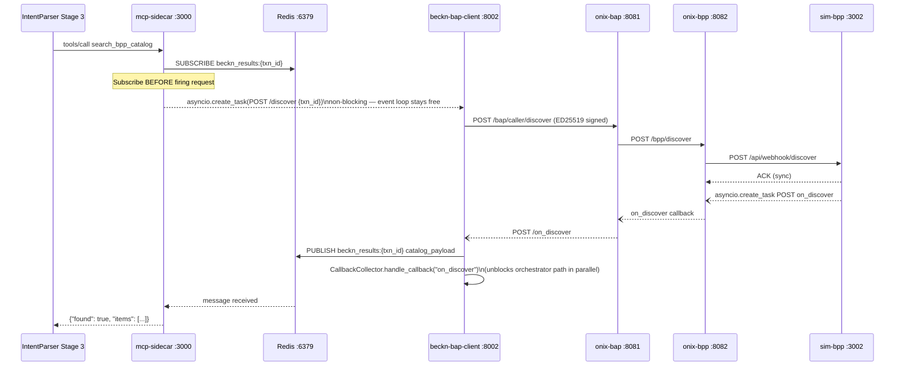
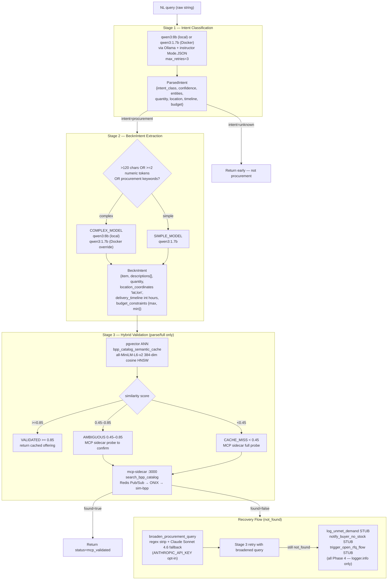
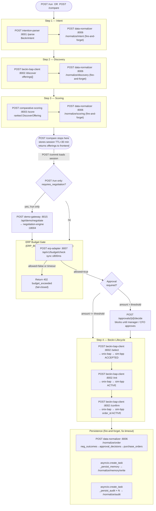
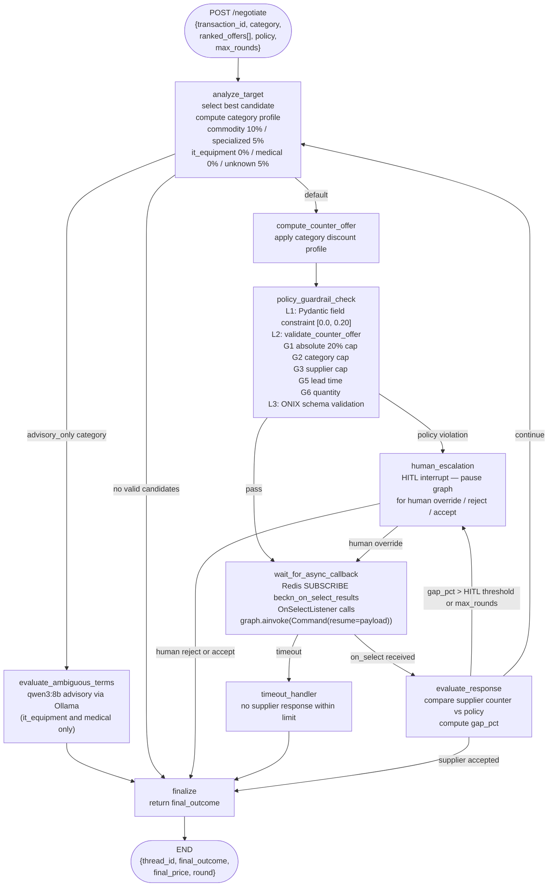

# Architecture

> **Audience:** Engineers joining the project. Read this document first; it is the system map. For per-service APIs and contracts see [Components](COMPONENTS.md). For full ADR rationale see [System Design](SYSTEM_DESIGN.md). For data schemas see [Database](DATABASE.md).

---

## 1. Architectural Pattern

The system is an **event-driven microservices monorepo** that translates natural-language purchase requests into validated Beckn Protocol v2.0.0 transactions.

Two Python services run outside Docker on the developer host (`IntentParser` on :8001, `mcp-sidecar` on :3000). Eighteen containers run on a bridged Docker network called `beckn_network`. Services communicate over HTTP and a Redis Pub/Sub broker.

**Why this pattern fits Beckn's async nature.** Beckn Protocol v2.0.0 defines discovery as inherently asynchronous: `POST /discover` returns only an ACK; the catalog arrives minutes later via an `on_discover` webhook. Holding an HTTP connection open to wait for that callback blocks the asyncio event loop and creates a deadlock. Redis Pub/Sub on per-transaction channels (`beckn_results:{transaction_id}`) decouples the fire-and-forget outbound probe from the inbound callback, eliminating the deadlock while keeping the microservices boundary intact. This is the foundational architectural decision — formalised in [ADR-0001](#4-async-discovery-decoupling-adr-0001) and also described in [System Design](SYSTEM_DESIGN.md).

The remaining major deviations from the original spec (pgvector replacing Qdrant, qwen3 replacing GPT-4o, sim-bpp replacing sandbox-2.0, PostgreSQL outbox replacing Kafka for ERP PO push, Docker Compose replacing Kubernetes for Phases 1–3) are documented with full rationale in [System Design](SYSTEM_DESIGN.md).

---

## 2. Component Map

All containers and local services, grouped by logical layer.

```mermaid
flowchart TD
    subgraph Presentation["Presentation"]
        FE["frontend :3000\nNext.js 13.5 + Radix UI + Tailwind\n(local, not Dockerized)"]
    end

    subgraph Orchestration["Orchestration"]
        ORCH["orchestrator :8004\nFastAPI + LangGraph\n(also published on :8000)"]
        DG["demo-gateway :8015\nFrontend BFF\n(scoring + negotiation demo)"]
    end

    subgraph Intelligence["Intelligence"]
        IP["intention-parser :8001\nStages 1+2 (Docker)\nAll 3 stages (local)"]
        CS["comparative-scoring :8003\nRankNet ML → heuristic fallback"]
        NE["negotiation-engine :18004\nLangGraph state machine"]
        ANA["analytics :8009\nReporting queries"]
    end

    subgraph BecknProtocol["Beckn Protocol"]
        BAP["beckn-bap-client :8002\nBeckn actions + dual-path callbacks"]
        CN["catalog-normalizer :8005\nFormat detection + DiscoverOffering mapping"]
        ONIXBAP["onix-bap :8081\nGo ED25519 signing + schema validation"]
        ONIXBPP["onix-bpp :8082\nGo BPP-side adapter"]
        SIMBPP["sim-bpp :3002\nNode.js BPP simulator\nreplaced sandbox-2.0"]
        MCP["mcp-sidecar :3000\nMCP SSE bridge\n(local, not Dockerized)"]
    end

    subgraph Integration["Integration"]
        EA["erp-adapter :8007\nSAP / Oracle / mock\noutbox + circuit breakers"]
        EM["erp-mock :8008\nLocal ERP stub"]
        ND["notification-dispatcher :8010\nKafka → Slack / Teams / Email"]
    end

    subgraph Data["Data"]
        PG[("PostgreSQL :5432\n+ pgvector 0.7.0\n(native host)")]
        REDIS[("Redis :6379\nPub/Sub + ONIX cache")]
        KAFKA[("Kafka :9092\npo.status.changed topic")]
        PGNE[("PostgreSQL :55432\nnegotiation checkpoints\n(Docker container)")]
    end

    subgraph Persistence["Persistence Layer"]
        DN["data-normalizer :8006\nSole write path to PostgreSQL"]
    end

    subgraph HostServices["Host Services (not Dockerized)"]
        PROXY["claude_openai_proxy :8012\nClaude CLI as OpenAI-compat endpoint\n(loopback + Docker bridge)"]
    end

    FE -->|wizard + audit| ORCH
    FE -->|analytics proxy| ANA
    FE -->|demo proxy| DG
    ORCH --> IP
    ORCH --> BAP
    ORCH --> CS
    ORCH --> DN
    ORCH --> EA
    ORCH --> DG
    DG --> NE
    DG --> PROXY
    NE --> PROXY
    NE -->|SUBSCRIBE beckn_on_select_results| REDIS
    IP -->|MCP SSE| MCP
    MCP -->|asyncio.create_task POST /discover| BAP
    MCP -->|SUBSCRIBE beckn_results:{txn_id}| REDIS
    BAP -->|all Beckn traffic| ONIXBAP
    BAP -->|PUBLISH beckn_results:{txn_id}| REDIS
    BAP --> CN
    ONIXBAP --> ONIXBPP
    ONIXBPP --> SIMBPP
    SIMBPP -->|on_discover callback| ONIXBPP
    ONIXBPP -->|on_*| ONIXBAP
    ONIXBAP -->|on_discover| BAP
    ONIXBAP -->|routing cache| REDIS
    EA --> EM
    EA --> KAFKA
    SIMBPP -->|auto-advance| KAFKA
    KAFKA --> ND
    DN --> PG
    NE --> PGNE
    ANA --> PG
    EA --> PG
    ORCH -->|fire-and-forget| DN
    BAP -->|normalize| CN
```

### Port Reference

| Service | Host port | Container port | Run mode |
|---|---|---|---|
| frontend | 3000 | — | local |
| mcp-sidecar | 3000 | — | local |
| IntentParser | 8001 | — | local |
| intention-parser (Docker) | 8001 | 8001 | Docker |
| beckn-bap-client | 8002 | 8002 | Docker |
| comparative-scoring | 8003 | 8003 | Docker |
| orchestrator | 8000, 8004 | 8004 | Docker |
| catalog-normalizer | 8005 | 8005 | Docker |
| data-normalizer | 8006 | 8006 | Docker |
| erp-adapter | 8007 | 8007 | Docker |
| erp-mock | 8008 | 8008 | Docker |
| analytics | 8009 | 8009 | Docker |
| notification-dispatcher | — | 8010 | Docker (no host port) |
| claude_openai_proxy | 8012 | — | host process |
| demo-gateway | 8015 | 8015 | Docker |
| sim-bpp | 3002 | 3002 | Docker |
| onix-bap | 8081 | 8081 | Docker |
| onix-bpp | 8082 | 8082 | Docker |
| negotiation-engine | 18004 | 8004 | Docker |
| PostgreSQL (main) | 5432 | — | native host |
| PostgreSQL (negotiation) | 55432 | 5432 | Docker |
| Redis | 6379 | 6379 | Docker |
| Kafka | 9092 | 9092 | Docker |

> **Port collision notes.** The orchestrator container maps both `:8000` and `:8004` on the host — `:8000` matches the Next.js frontend `BAP_URL` default and `:8004` is used for direct testing. The negotiation-engine uses `:18004` to avoid colliding with orchestrator's `:8004`. `discovery_engine` at `services/discovery_engine/` is fully implemented but has no entry in `docker-compose.yml` and is not called by any service; it is orphaned.

---

## 3. Beckn Protocol Integration

### 3.1 ONIX Adapter Pair

All Beckn traffic passes through two Go adapters built from the `fidedocker/onix-adapter` image. **No service ever POSTs directly to a BPP.** This rule is enforced by tests that assert `select_url` always contains `caller` in the path.

| Adapter | Host port | Role | Signing direction |
|---|---|---|---|
| `onix-bap` | 8081 | BAP-side | Signs outbound; validates inbound signatures |
| `onix-bpp` | 8082 | BPP-side | Mirrors onix-bap for the BPP direction |

Six YAML files in `config/` wire the routing. Each file configures one of: BAPCaller (outbound from BAP), BAPReceiver (inbound callbacks to BAP), BPPCaller (outbound from BPP), BPPReceiver (inbound requests to BPP).

**Critical routing rules:**

1. **Never include the action name in a target URL.** ONIX appends it automatically. `http://beckn-bap-client:8002` + action `on_discover` resolves to `http://beckn-bap-client:8002/on_discover`. Including `/on_discover` in the target produces a double-path 404.
2. **`on_discover` uses split routing.** It routes to `http://beckn-bap-client:8002` directly (not via the generic `/bap/receiver` base). All other `on_*` callbacks route to `http://beckn-bap-client:8002/bap/receiver`. This is required for the Redis Pub/Sub path — see [Section 4](#4-async-discovery-decoupling-adr-0001).
3. **DeDi registry is bypassed.** All routing YAMLs use `targetType: url` instead of `bap`/`bpp`, enabling a complete Beckn lifecycle entirely within the Docker network without an external registry. Switching to a live Beckn network requires only changing `targetType` and `registryUrl` in the YAMLs — no code changes.
4. **ONIX schema validator is pinned to commit `d43ec30d`.** A later commit introduced a `$ref` resolution bug in `SignatureHeader` that breaks ED25519 signature validation on every signed message. Do not upgrade the ONIX image without running a full end-to-end signing test across discover → select → init → confirm → status.

### 3.2 ED25519 Signing

onix-bap signs every outbound Beckn message using ED25519. The private key material is loaded at container start from the volume-mounted `config/` directory. The schema validator compiled into the `.so` plugin enforces Beckn v2 wire shapes on both request and response. See [System Design](SYSTEM_DESIGN.md) for the key-rotation procedure.

---

## 4. Async Discovery Decoupling (ADR-0001)

### The Deadlock Problem

IntentParser Stage 3 calls the mcp-sidecar tool `search_bpp_catalog`, which must fire a `POST /discover` request and return a synchronous catalog result. Beckn v2.0.0 returns only an ACK from `/discover`; the catalog arrives later via the `on_discover` webhook. If the mcp-sidecar `await`s the discover POST while the `on_discover` callback must be processed by the same asyncio event loop, the loop is blocked and the callback can never arrive — a deadlock.

### The Solution

Redis Pub/Sub on `beckn_results:{transaction_id}`. The subscriber is opened **before** the discover request is fired. The discover POST is dispatched as `asyncio.create_task(...)` — never `await`. When `beckn-bap-client` receives the `on_discover` callback, it publishes the normalized catalog payload to the Redis channel. The mcp-sidecar's subscriber unblocks and returns the catalog to IntentParser Stage 3.



**Timeout behaviour.** If no Redis message arrives within `REDIS_RESULT_TIMEOUT` (default 15 s), the mcp-sidecar returns `{"found": false, "items": [], "probe_latency_ms": 15000}`. `MCP_BAP_TIMEOUT` (default 8 s) is only a safety valve for the HTTP fire-and-forget task, not the end-to-end deadline. If Redis is unavailable, `beckn-bap-client` logs a warning and falls through to `CallbackCollector` only; the mcp-sidecar times out and returns `found=false`.

**The anti-pattern.** `await`-ing the `/discover` POST inside the mcp-sidecar reintroduces the deadlock. Always use `asyncio.create_task(...)`. This is an explicit hard rule in `CLAUDE.md`.

---

## 5. IntentParser 3-Stage Pipeline

Natural language is processed in three sequential stages. Stages 1 and 2 always execute. Stage 3 runs only on the `/parse/full` endpoint and only when the mcp-sidecar is reachable. The Docker-deployed `intention-parser` container exposes only Stages 1 and 2.



**Canonical field encodings enforced by `BecknIntent`** (defined in `shared/models.py`):

| Field | Encoding | Example |
|---|---|---|
| `delivery_timeline` | `int` hours | `72` (not `"P3D"`) |
| `location_coordinates` | `"lat,lon"` decimal string | `"12.9716,77.5946"` |
| `budget_constraints` | `BudgetConstraints(max, min)` typed object | `{"max": 200.0, "min": 0.0}` |

**Docker override.** `docker-compose.yml` sets both `COMPLEX_MODEL=qwen3:1.7b` and `SIMPLE_MODEL=qwen3:1.7b` for the `intention-parser` container, collapsing the complexity routing. The qwen3:8b model is only used when IntentParser runs locally outside Docker.

---

## 6. LangGraph State Machines

Two independent LangGraph `StateGraph` machines drive the orchestration and negotiation flows.

### 6.1 Orchestrator Pipeline

The orchestrator drives procurement from NL query to confirmed Beckn order. Two execution paths exist: `/run` (full 4-step pipeline including autonomous negotiation) and `/compare` + `/commit` (two-phase, no autonomous negotiation).



**Approval tiers:**
- `amount <= requester.approval_threshold` → auto-approved
- `amount > requester.threshold AND <= approver.threshold` → manager approval
- `amount > approver.threshold` → CFO approval
- `is_emergency = TRUE` → CFO with 60-minute deadline

**Autonomous negotiation path.** When `decision.requires_negotiation` is true on `/run`, the orchestrator calls `DEMO_GATEWAY_URL/api/demo/negotiate` (default `http://localhost:8015`). Note: the `frontend_demo_gateway` service README incorrectly documents port 8005; the docker-compose.yml and orchestrator env var both use port 8015. The `/compare` + `/commit` two-phase flow does not trigger autonomous negotiation.

### 6.2 Negotiation Engine LangGraph

A LangGraph `StateGraph` with five category discount profiles and three-layer guardrails. Maximum discount is 20%, enforced independently at all three layers. The engine is always reached via demo-gateway, never called directly by the orchestrator.



**Checkpointing.** When `NEGOTIATION_POSTGRES_DSN` is set, `AsyncPostgresSaver` writes durable LangGraph checkpoints to the negotiation PostgreSQL container (port 55432). Otherwise `MemorySaver` is used and state is lost on container restart. The negotiation database (container `postgres` on port 55432) is entirely separate from the main `procurement_agent` database on port 5432.

**Async supplier resume.** `OnSelectListener` subscribes to Redis channel `beckn_on_select_results`. When demo-gateway drives `SupplierAgent` (Claude Sonnet 4.6 via `claude_openai_proxy :8012`) to generate a counter-offer and publishes the result to that Redis channel, `OnSelectListener` calls `graph.ainvoke(Command(resume=payload))` to unpark the waiting graph node.

---

## 7. Data Stores

### PostgreSQL 16 + pgvector

The main procurement database runs natively on the developer host (port 5432) and is reached by containers via `host.docker.internal:5432`. A separate negotiation database runs inside the Docker stack (port 55432) for LangGraph checkpoints only.

The schema consists of 24 numbered SQL migration files in `database/sql/`. Files are applied in lexicographic order; the numeric prefix encodes the FK dependency chain. Never renumber existing files.

`data-normalizer :8006` is the **sole write path** for all production data. No other service writes directly to the main PostgreSQL database. Vector workloads use two HNSW cosine indexes:

| Table | Dimensions | Model | Use |
|---|---|---|---|
| `bpp_catalog_semantic_cache` | 384 | `all-MiniLM-L6-v2` (sentence-transformers) | IntentParser Stage 3 ANN validation (similarity thresholds: validated ≥ 0.85, ambiguous 0.45–0.85, cache miss < 0.45) |
| `agent_memory_vectors` | 384 | `BAAI/bge-small-en-v1.5` (fastembed ONNX) | Orchestrator supplier memory; time-decayed loyalty bonus `Σ [ 0.03 × exp(−days × ln(2)/90) ]` capped at ±0.10; retrieval threshold 0.75 |

Both models replaced the spec-era OpenAI `text-embedding-3-large` (3072-dim) to eliminate per-call cost and data egress. See [System Design](SYSTEM_DESIGN.md) for the full rationale.

### Redis 7

Redis serves three distinct purposes, each with its own key namespace:

| Purpose | Key pattern | Producer | Consumer |
|---|---|---|---|
| Async Beckn discovery (ADR-0001) | `beckn_results:{transaction_id}` | beckn-bap-client `/on_discover` handler | mcp-sidecar `bap_client.py` |
| Negotiation async resume | `beckn_on_select_results` | demo-gateway after SupplierAgent call | negotiation-engine `OnSelectListener` |
| ONIX routing cache | internal ONIX keys | onix-bap / onix-bpp | onix-bap / onix-bpp |

Redis is a **hard runtime dependency** for IntentParser Stage 3. If Redis is unavailable, the mcp-sidecar returns `{"found": false, "items": []}` after `REDIS_RESULT_TIMEOUT` (default 15 s) and the orchestrator path is unaffected (it uses `CallbackCollector` directly, which does not require Redis).

Audit records carry a `retention_until = NOW() + 7 years` field (SOX 404 / IT Act 2000). The ERP outbox uses `erp_sync_records` with `FOR UPDATE SKIP LOCKED` for safe concurrent worker execution and exponential backoff at `5, 30, 120, 600, 3600` seconds.

---

## 8. Architectural Decisions Summary

The eight most impactful decisions made during Phases 1–3. Full ADR rationale is in [System Design](SYSTEM_DESIGN.md).

| Decision | What was chosen | One-line rationale |
|---|---|---|
| **ADR-0001 — Redis Pub/Sub for async discovery** | Per-transaction `beckn_results:{txn_id}` channel; `asyncio.create_task` probe | Breaks the asyncio event-loop deadlock that arises when `on_discover` callback arrives on the same event loop that is blocking for it |
| **pgvector instead of Qdrant** | pgvector 0.7.0 HNSW cosine at 384 dims; no Qdrant container | Pilot corpus < 100K records; pgvector HNSW is computationally equivalent at this scale and eliminates a separate stateful service |
| **Local LLMs instead of GPT-4o** | qwen3:8b (complex) and qwen3:1.7b (simple) via Ollama; Claude Sonnet 4.6 as opt-in broadening fallback only | Zero per-call cost, offline capability, and full data sovereignty for procurement content |
| **PostgreSQL outbox instead of Kafka for ERP push** | `erp_sync_records` table, `FOR UPDATE SKIP LOCKED` worker, `kafka_offset` placeholder column | PO write and outbox row are atomic in a single PostgreSQL transaction; eliminates Kafka broker dependency for Phases 1–3 while keeping a migration path |
| **DeDi registry bypass (`targetType: url`)** | All four ONIX routing YAMLs use `targetType: url` | Full Beckn lifecycle testable offline inside the Docker bridge network; switching to a live network requires only YAML changes |
| **ONIX schema validator pinned to `d43ec30d`** | Image pinned; do not upgrade without an end-to-end signing test | A post-`d43ec30d` commit introduced a `$ref` resolution bug in `SignatureHeader` that breaks ED25519 validation on every signed message |
| **Vendor-neutral `ERPAdapter` typing.Protocol** | One Protocol, three implementations (SAP / Oracle / mock), factory by `ERP_VENDORS` env var | New ERP vendors require only a new six-method implementation class; no changes to orchestrator, budget-gate logic, or webhook routes |
| **Docker Compose instead of Kubernetes (Phases 1–3)** | 18-service `docker-compose.yml` on `beckn_network`; Kubernetes is Phase 4 scope | Single-command startup, sub-minute cold start, and sufficient isolation to prove the full Beckn lifecycle without cluster management overhead |
