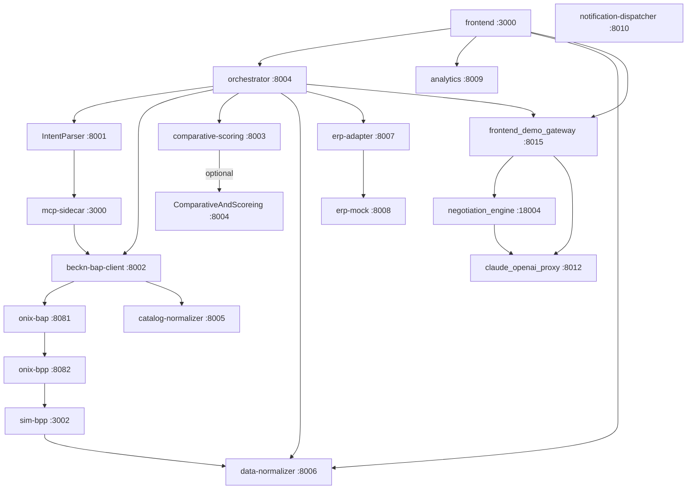

# Components Reference

The system consists of 21 named components across five logical layers. This document describes each one with its role, run mode, responsibilities, and notable implementation details. For the full request lifecycle and async-discovery design see [Architecture](ARCHITECTURE.md). For environment variable details see [Configuration](CONFIGURATION.md). For endpoint shapes see [API Reference](API_REFERENCE.md).

> **Note on claude_openai_proxy (:8012).** A host-only loopback service wraps the Claude Code CLI as an OpenAI-compatible endpoint. It is not in `docker-compose.yml` and is not listed as a named component, but `negotiation_engine` and `frontend_demo_gateway` both depend on it at runtime via `http://host.docker.internal:8012/v1`. It must be started manually (`uvicorn services.claude_openai_proxy.main:app --host 0.0.0.0 --port 8012`) or via the provided systemd unit before those services can function.

---

## Dependency Overview



---

## Components

### IntentParser (:8001, local)

- **Role:** Three-stage NL-to-BecknIntent pipeline that classifies buyer intent, extracts structured procurement parameters, and validates them against live BPP catalogs.
- **Run mode:** Local process (not Dockerized at this path); `uvicorn api:app --port 8001 --reload` inside `conda activate infosys_project`. A Docker wrapper exists as a separate component (`intention-parser`).
- **Language / framework:** Python 3.11, FastAPI, instructor + Ollama, sentence-transformers, asyncpg + pgvector.
- **Key responsibilities:**
  - Stage 1: LLM intent classification (`qwen3:8b` or `qwen3:1.7b`) — returns `ParsedIntent` with confidence score.
  - Stage 2: Structured `BecknIntent` extraction via instructor; complexity-routes to `COMPLEX_MODEL` (queries >120 chars, ≥2 numeric tokens, or procurement keywords) vs `SIMPLE_MODEL`.
  - Stage 3 (`/parse/full` only): Hybrid pgvector ANN cosine search against `bpp_catalog_semantic_cache` followed by MCP sidecar probe on cache miss (<0.45 similarity); thresholds `VALIDATED ≥ 0.85 / AMBIGUOUS 0.45–0.85 / CACHE_MISS < 0.45`.
  - Recovery flow: `broaden_procurement_query` → Stage 3 retry → stub handlers (`log_unmet_demand`, `notify_buyer_no_stock`, `trigger_open_rfq_flow`) — all three stubs are no-op logger calls as of Phase 3.
  - Enforces canonical `BecknIntent` encodings: `delivery_timeline` as int hours, `location_coordinates` as `"lat,lon"` decimal string, `budget_constraints` as typed `{max, min}`.
- **Upstream dependencies:** Ollama (qwen3:8b and qwen3:1.7b), PostgreSQL 16 + pgvector (`bpp_catalog_semantic_cache`), mcp-sidecar :3000 (Stage 3 only), Claude Sonnet 4.6 via `ANTHROPIC_API_KEY` (opt-in broadening fallback).
- **Downstream dependents:** orchestrator (via the `intention-parser` Docker wrapper), Bap-1 (via `intent_parser_facade`).
- **Notable behavior:** In Docker (`intention-parser` container) both `COMPLEX_MODEL` and `SIMPLE_MODEL` are overridden to `qwen3:1.7b`, silently collapsing two-tier routing — `qwen3:8b` is only exercised when running locally. The similarity thresholds (`VALIDATED_THRESHOLD=0.85`, `AMBIGUOUS_THRESHOLD=0.45`) are named constants in `config.py` but are not env-configurable.

---

### orchestrator (:8004)

- **Role:** Central pipeline state machine that drives the full procurement lifecycle from NL query to confirmed Beckn order.
- **Run mode:** Docker container; host ports `8000` and `8004` both map to container port `8004` (dual mapping so the frontend's `NEXT_PUBLIC_API_BASE_URL=http://localhost:8000` resolves correctly without configuration).
- **Language / framework:** Python 3.11, FastAPI, LangGraph, aiohttp.
- **Key responsibilities:**
  - Drives the 4-step pipeline: Step 1 intent parsing → Step 2 Beckn discovery → Step 3 comparative scoring → Step 4 select/init/confirm.
  - Exposes a two-phase `POST /compare` (steps 1–3, returns offerings) + `POST /commit` (loads session, runs ERP budget gate + steps 4a–4c) flow alongside the single-shot `POST /run`.
  - Manages approval workflow: auto-approval below `requester.approval_threshold`, manager/CFO routing above; `GET /approvals`, `POST /approvals/{id}/decide`.
  - Persists audit trail at 13 call sites via fire-and-forget `POST data-normalizer /normalize/audit`; all persistence uses `asyncio.create_task` with 5-second timeout, never raises on failure.
  - Routes autonomous negotiation (on `/run` only) through `DEMO_GATEWAY_URL/api/demo/negotiate`; polls `GET /api/demo/negotiate/{thread_id}` for result. The `/compare`+`/commit` path does not invoke negotiation.
- **Upstream dependencies:** intention-parser :8001, beckn-bap-client :8002, comparative-scoring :8003, data-normalizer :8006, erp-adapter :8007, analytics :8009, frontend_demo_gateway :8015.
- **Downstream dependents:** frontend :3000.
- **Notable behavior:** All in-memory state (`_sessions`, `_order_enrichments`, `_pending_approvals`, `_erp_state_cache`, `_run_id_index`) is lost on container restart — no `PostgresBackend` exists. In-flight `/compare` sessions TTL 1800 seconds. `ERP_BUDGET_CHECK_REQUIRED=false` in the default docker-compose stack (fail-open); must be `true` in production. `DEMO_GATEWAY_URL` defaults to `http://localhost:8015` in code; the service README incorrectly states port 8005.

---

### beckn-bap-client (:8002)

- **Role:** Beckn Protocol v2.0.0 BAP client that translates orchestrator/MCP sidecar requests into signed Beckn messages and collects asynchronous callbacks.
- **Run mode:** Docker container; host port 8002 → container port 8002.
- **Language / framework:** Python 3.11, FastAPI, aiohttp, asyncio.
- **Key responsibilities:**
  - Sends Beckn `discover`, `select`, `init`, `confirm`, and `status` actions to onix-bap :8081 (all outbound traffic must pass through ONIX; direct BPP POST is prohibited).
  - Receives `POST /on_discover` inbound callback from ONIX: publishes catalog payload to `beckn_results:{txn_id}` Redis channel AND enqueues to `CallbackCollector` — dual-path implements [ADR-0001](ARCHITECTURE.md#async-discovery--adr-0001).
  - Handles `POST /bap/receiver/{action}` for all other `on_*` callbacks (on_select, on_init, on_confirm, on_status) via `CallbackCollector` queues.
  - Delegates `on_discover` payload normalization to catalog-normalizer :8005.
  - Pre-propagates a caller-supplied `transaction_id` from the `/discover` body to ensure the Redis channel name matches across the full async flow.
- **Upstream dependencies:** onix-bap :8081, catalog-normalizer :8005, Redis :6379.
- **Downstream dependents:** orchestrator, mcp-sidecar (via Redis Pub/Sub).
- **Notable behavior:** `CALLBACK_TIMEOUT` defaults to 10 seconds for on_select/on_init/on_confirm. If Redis is unavailable, `/on_discover` logs a warning and falls through to `CallbackCollector` only — the mcp-sidecar will time out after `REDIS_RESULT_TIMEOUT` (default 15 s) and return `{"found": false}`. `REDIS_URL` must be set as a real environment variable (not just in `.env`), because it is read via `os.getenv()` in `handler.py`, not through the Pydantic Settings model.

---

### data-normalizer (:8006)

- **Role:** Sole write path into PostgreSQL for the entire stack; also serves audit trail read and agent memory endpoints.
- **Run mode:** Docker container; host port 8006 → container port 8006.
- **Language / framework:** Python 3.11, FastAPI, asyncpg, sentence-transformers (all-MiniLM-L6-v2).
- **Key responsibilities:**
  - Receives persistence payloads from all other services and writes into PostgreSQL via repository classes (`DataNormalizer/repositories/`).
  - Normalizes field types on write: `price_value` str → DECIMAL, `fulfillment_hours` None → 24, `composite_score` 0–1 → 0–100 (×100 clamped), unrecognized channel → `'web'`.
  - Builds the full FK chain on `POST /normalize/order`: negotiation_outcomes → approval_decisions → purchase_orders.
  - Manages agent memory: embeds content with all-MiniLM-L6-v2 (384-dim) and stores in `agent_memory_vectors`; exposes cosine ANN search at threshold 0.75.
  - Returns 201 + `{event_id}` on `POST /normalize/audit`; error middleware maps `UniqueViolation → 409`, FK violation → 409, Check constraint → 422.
- **Upstream dependencies:** PostgreSQL 16 + pgvector (all writes), sentence-transformers all-MiniLM-L6-v2 (memory embedding, downloaded from Hugging Face on first startup — allow 10–30 s cold start).
- **Downstream dependents:** orchestrator, sim-bpp, analytics, frontend (via proxy routes `/api/audit/*`, `/api/users/*`).
- **Notable behavior:** `SYSTEM_USER_ID` (default `00000000-0000-0000-0000-000000000001`) is auto-upserted as `system@procurement-agent.internal` with `approval_threshold=999999.99`; it is absent from `docker-compose.yml` so the hardcoded default is used in all Docker deployments. Memory embedding failures are silently skipped — the endpoint never returns an error on embedding failure.

---

### erp-adapter (:8007)

- **Role:** Vendor-neutral ERP integration layer providing synchronous budget gating, async PO push with outbox retry, and inbound HMAC-verified vendor webhooks.
- **Run mode:** Docker container; host port 8007 → container port 8007.
- **Language / framework:** Python 3.11, FastAPI, asyncpg, pybreaker.
- **Key responsibilities:**
  - `POST /api/v1/budget/check` — synchronous budget gate enforced in ≤800 ms; fail-closed when `ERP_BUDGET_CHECK_REQUIRED=true`.
  - `POST /api/v1/po/sync` — enqueues PO to PostgreSQL outbox; outbox worker uses `FOR UPDATE SKIP LOCKED`, per-vendor pybreaker circuit breakers (5 failures, 60 s reset), and exponential backoff at 5/30/120/600/3600 s.
  - `POST /api/v1/webhooks/{vendor}/po-status` — validates inbound HMAC-SHA256 signature; supports zero-downtime rotation via `{VENDOR}_WEBHOOK_HMAC_SECRET` primary + `_NEXT` secondary.
  - `POST /api/v1/policy/evaluate` — ERP policy gate returning `preferred_supplier_ids`, `approval_required`, and cost constraints.
  - Selects adapter implementation (SAP S/4HANA, Oracle ERP Cloud, or mock) via `ERP_VENDORS` env var through `factory.py`.
- **Upstream dependencies:** PostgreSQL (outbox), Redis :6379 (fallback state publishing), erp-mock :8008 (dev), Kafka :9092 (optional, `po.status.changed` topic), SAP/Oracle ERP (prod).
- **Downstream dependents:** orchestrator.
- **Notable behavior:** `ERP_BUDGET_CHECK_REQUIRED=false` in the docker-compose orchestrator env (fail-open) — must be `true` in production. Falls back to `InMemoryOutboxRepo` if DB schema is absent, making POs non-durable. The contract test (`tests/test_contracts.py`) is a standalone script, not pytest-discoverable.

---

### erp-mock (:8008)

- **Role:** In-memory local ERP stub simulating SAP S/4HANA and Oracle ERP Cloud surfaces for development and integration testing.
- **Run mode:** Docker container; host port 8008 → container port 8008. All state is non-durable.
- **Language / framework:** Python 3.11, FastAPI.
- **Key responsibilities:**
  - Exposes vendor-shaped budget check, PO creation, and OAuth2 token endpoints for mock, SAP, and Oracle surfaces.
  - Emits HMAC-signed webhook callbacks to erp-adapter after `WEBHOOK_DELAY_SECONDS` (default 2 s) on every PO creation.
  - Supports six named scenarios: `happy`, `budget_exhausted`, `po_create_fails`, `webhook_delayed`, `erp_approval_required`, `erp_preferred_supplier` — selectable via `MOCK_SCENARIO` env var or per-request `X-Mock-Scenario` header.
  - `Idempotency-Key` header honored on all PO create endpoints.
- **Upstream dependencies:** erp-adapter :8007 (receives outbound webhook callbacks via `WEBHOOK_TARGET_URL`).
- **Downstream dependents:** erp-adapter (calls erp-mock SAP/Oracle endpoints in dev).
- **Notable behavior:** The `po_create_fails` scenario triggers 10 sequential failures before succeeding, exercising erp-adapter outbox retry and DLQ logic. The Oracle HMAC signing env var exists but the mock webhook emitter currently only signs with `SAP_WEBHOOK_HMAC_SECRET`.

---

### negotiation_engine (:18004 host / :8004 container)

- **Role:** Automated price negotiation engine implemented as a LangGraph state machine with policy-bounded counter-offers and three-layer guardrails.
- **Run mode:** Docker container; host port **18004** (avoids collision with orchestrator at 8004) → container port 8004.
- **Language / framework:** Python 3.11, FastAPI, LangGraph, asyncio.
- **Key responsibilities:**
  - `POST /negotiate` — accepts `NegotiateRequest`; returns 202 `{thread_id, paused_at: "wait_for_async_callback"}` immediately; graph execution is asynchronous.
  - Runs a `StateGraph` with nodes: `analyze_target → compute_counter_offer → policy_guardrail_check → wait_for_async_callback ↔ evaluate_response → finalize`.
  - Enforces a hard 20% maximum discount cap at three independent layers: Pydantic field constraint (L1), `validate_counter_offer` policy shield (L2 — checks absolute cap, category cap, supplier cap, lead time, quantity), ONIX schema validation (L3).
  - Per-category discount profiles: commodity 10%, specialized 5%, it_equipment 0% advisory-only, medical 0% advisory-only, unknown 5%.
  - `OnSelectListener` subscribes to Redis channel `beckn_on_select_results` and calls `graph.ainvoke(Command(resume=payload))` to resume parked states.
  - Checkpoints graph state to PostgreSQL via `AsyncPostgresSaver` when `NEGOTIATION_POSTGRES_DSN` is set; falls back to `MemorySaver` (state lost on restart).
- **Upstream dependencies:** Redis :6379 (`beckn_on_select_results` channel), PostgreSQL (separate negotiation DB on port 55432 in Docker), claude_openai_proxy :8012 (via `NEGOTIATION_OPENAI_BASE_URL=http://host.docker.internal:8012/v1`), Kafka :9092 (audit topic, fail-open).
- **Downstream dependents:** frontend_demo_gateway (the only caller in the stack).
- **Notable behavior:** The orchestrator does not call negotiation_engine directly — all paths go through frontend_demo_gateway. The negotiation PostgreSQL container (port 55432) is a separate DB (`negotiation`) from the main `procurement_agent` DB (port 5432). `NEGOTIATION_OPENAI_BASE_URL` must be reachable at startup; if the claude_openai_proxy is not running, advisory LLM nodes return an error.

---

### comparative-scoring (:8003)

- **Role:** Thin scoring adapter that forwards offering lists to the Phase 2 ML RankNet backend and falls back to a cheapest-wins heuristic when unavailable.
- **Run mode:** Docker container; host port 8003 → container port 8003.
- **Language / framework:** Python 3.11, FastAPI, aiohttp.
- **Key responsibilities:**
  - `POST /score` — accepts `{offerings: [DiscoverOffering]}`; tries `POST {PREDICTION_API_URL}/score` (timeout 8 s); on failure or unavailability returns min-price heuristic result.
  - Maps field names for the prediction-api: `item_id→id`, `price_value→price`, `fulfillment_hours→delivery_time_hours`, `rating→risk_score`.
  - ML path response includes `model_version`, `pipeline: "phase2_ranknet"`, `ranking: [{bpp_id, item_id, score, rank}]`.
  - Returns `{selected: null}` for an empty offerings list without error.
- **Upstream dependencies:** prediction-api :8004 (ComparativeAndScoreing MLOps stack — started separately via `docker compose -f services/ComparativeAndScoreing/docker-compose.mlops.yaml up`).
- **Downstream dependents:** orchestrator.
- **Notable behavior:** `SCORING_FALLBACK_ENABLED` defaults to `true` so the service is always functional even without the MLOps stack running. The service decouples orchestrator from all MLOps concerns — the orchestrator does not know whether scoring is ML-powered or heuristic.

---

### ComparativeAndScoreing (MLOps)

- **Role:** Phase 2 MLOps stack providing a RankNet/LambdaRank learning-to-rank model for procurement offer scoring; managed via a separate `docker-compose.mlops.yaml`.
- **Run mode:** Not in the main `docker-compose.yml`. Started separately: `docker compose -f services/ComparativeAndScoreing/docker-compose.mlops.yaml up`. prediction-api host port 8004 (separate Compose network, no collision with orchestrator in practice). MLflow UI on port 5000.
- **Language / framework:** Python 3.11, FastAPI, PyTorch, MLflow.
- **Key responsibilities:**
  - `prediction-api` — `POST /score` accepts `{items: [CatalogItem]}` and returns `{recommended, ranked_list, model_version, pipeline: "phase2_ranknet"}`. Supports hot model reload via `POST /reload`. Falls back to static weights `[0.4, 0.3, 0.3]` when no Production MLflow model is registered.
  - Training pipeline — CLI tool; 200 epochs SGD/AdamW; RankNet pairwise loss; auto-promotes to MLflow Staging if `NDCG@5 ≥ 0.85`. Never auto-promotes to Production.
  - Validation service — CLI tool; loads Production model; computes NDCG@5 on 50-session holdout; exits 1 and writes `/tmp/model_drift_detected.flag` if drift > 0.05.
  - Feature vector (n, 3): `x_price` (inverted price), `x_speed` (inverted delivery hours), `x_risk` (rating) — all min-max scaled within session.
- **Upstream dependencies:** MLflow :5000 (model registry and artifact store), PostgreSQL (MLflow backend store).
- **Downstream dependents:** comparative-scoring :8003.
- **Notable behavior:** Production promotion is always manual: `mlflow models transition-stage ... --to-stage Production`. Phase 3 gate triggers when any of: NDCG@5 plateaus, >50K closed records, split-orders needed, or >15% regret gap vs oracle.

---

### discovery_engine

- **Role:** Multi-network Beckn discovery fan-out service that concurrently queries N configured Beckn network gateways with per-network circuit breakers and geographic deduplication.
- **Run mode:** **Orphaned** — code is complete at `services/discovery_engine/` but there is no entry in `docker-compose.yml` and no other service calls it. Configured for port 8006 (conflicts with data-normalizer's published host port).
- **Language / framework:** Python 3.11, FastAPI, aiohttp.
- **Key responsibilities:**
  - `POST /search/multi-network` — fans out to all configured networks via `asyncio.gather`; deduplicates by `provider_id:item_id:currency`; merges geographically proximate items within 0.5 km (`DISCOVERY_GEO_PROXIMITY_KM`).
  - Per-network circuit breaker (3 failures → OPEN, auto-probe after 30 s) in `src/resilience.py`.
  - Always returns HTTP 200; callers check `degraded` flag and `len(items)` for partial failures.
  - `GET /readyz` returns 503 if no networks are configured.
- **Upstream dependencies:** External Beckn network gateways configured via `DISCOVERY_NETWORKS_JSON` env var.
- **Downstream dependents:** None — no callers exist in the current codebase.
- **Notable behavior:** To co-deploy alongside data-normalizer a `DISCOVERY_API_PORT` override is required to avoid port 8006 collision. The multi-network capability is architecturally equivalent to beckn-bap-client's single-gateway discovery but was never plumbed into the orchestrator.

---

### catalog-normalizer (:8005)

- **Role:** Beckn catalog normalization bridge that maps raw `on_discover` payload variants deterministically to `DiscoverOffering` objects.
- **Run mode:** Docker container; host port 8005 → container port 8005. Source package bind-mounted from `./CatalogNormalizer` into `/app/CatalogNormalizer`.
- **Language / framework:** Python 3.11, FastAPI, instructor + Ollama (variant 5 fallback only).
- **Key responsibilities:**
  - `POST /normalize` — detects format variant (1–5) and maps to `[DiscoverOffering]`.
  - Five format variants: 1=`BECKN_V2_FLAT_RESOURCES` (`resources[]` non-empty), 2=`LEGACY_PROVIDERS_ITEMS` (`providers[].items[]`), 3=`BPP_CATALOG_V1` (`items[0].provider` is a string), 4=`ONDC_CATALOG` (`fulfillments[]` + `tags[]` both present, checked after ONDC to avoid false positive with providers[]), 5=`UNKNOWN` (LLM fallback).
  - Variants 1–4 use deterministic rule-based mapping; variant 5 invokes `LLMFallbackNormalizer` via instructor + OpenAI SDK pointed at Ollama.
- **Upstream dependencies:** Ollama (variant 5 only via `OLLAMA_URL`); called by beckn-bap-client :8002.
- **Downstream dependents:** beckn-bap-client.
- **Notable behavior:** The service README incorrectly states `OPENAI_API_KEY` is required for the LLM fallback — the actual implementation reads `OLLAMA_URL` and `NORMALIZER_MODEL` (default `qwen3:1.7b`, explicitly set in `docker-compose.yml`). `OPENAI_API_KEY` is never read.

---

### mcp-sidecar (:3000, local)

- **Role:** MCP SSE bridge that exposes a `search_bpp_catalog` tool to IntentParser Stage 3 via Model Context Protocol; implements the subscriber side of [ADR-0001](ARCHITECTURE.md#async-discovery--adr-0001).
- **Run mode:** Local process (not Dockerized); `BAP_API_KEY="<any-string>" uvicorn server:app --port 3000` inside `conda activate infosys_project`. Service refuses to start if `BAP_API_KEY` is absent.
- **Language / framework:** Python 3.11, FastMCP (SSE), sentence-transformers (all-MiniLM-L6-v2).
- **Key responsibilities:**
  - `GET /sse` — opens SSE stream; sends `endpoint` event with POST URL for JSON-RPC dispatch.
  - `search_bpp_catalog(item_name, descriptions[], domain, version, location?)` tool — pre-subscribes to `beckn_results:{txn_id}` on Redis, fires `POST beckn-bap-client/discover` as `asyncio.create_task` (never `await` — see below), waits up to `REDIS_RESULT_TIMEOUT` (default 15 s) for catalog payload.
  - Ranks returned items by all-MiniLM-L6-v2 cosine similarity in a `ThreadPoolExecutor`; items below `RANKING_MIN_SIMILARITY` (0.30) are filtered.
  - All failure paths return `{"found": false, "items": [], "probe_latency_ms": elapsed}` — never a JSON-RPC error object.
- **Upstream dependencies:** beckn-bap-client :8002, Redis :6379 (`REDIS_URL` and `REDIS_RESULT_TIMEOUT` must be real env vars, not just in `.env`).
- **Downstream dependents:** IntentParser Stage 3.
- **Notable behavior:** The discover POST **must** use `asyncio.create_task(...)`, never `await`. Awaiting re-introduces the event-loop deadlock ADR-0001 was written to fix: the `on_discover` callback can never arrive while the coroutine is blocked. `REDIS_RESULT_TIMEOUT` (15 s) is the primary latency ceiling; `MCP_BAP_TIMEOUT` (3 s) governs only the HTTP fire-and-forget safety valve. all-MiniLM-L6-v2 (~90 MB) downloads from Hugging Face Hub on first startup.

---

### sim-bpp (:3002)

- **Role:** Local Beckn BPP simulator (Node.js) that replaced `fidedocker/sandbox-2.0`; accepts all 10 Beckn actions, returns ACKs, and fires asynchronous `on_{action}` callbacks with hot-reloadable catalog.
- **Run mode:** Docker container (Node.js); host port 3002 → container port 3002. `SIM_BPP_AUTO_ADVANCE=true` is set in `docker-compose.yml`.
- **Language / framework:** Node.js (Express).
- **Key responsibilities:**
  - `POST /api/webhook/{action}` — inbound from onix-bpp; returns synchronous ACK; fires async `on_{action}` callback back to onix-bpp caller URL.
  - Discovery: tokenizes query and catalog entries; AND-token matching (all filtered query tokens must appear in item name + keywords); filler tokens with no catalog vocabulary match are discarded before matching to avoid false negatives on stop words.
  - Catalog: `catalog.json` bind-mounted at `./services/sim-bpp/catalog.json`; 9 providers, 31 items, 5 categories; re-read on every request — no restart required for catalog updates.
  - Auto-advance lifecycle (when `SIM_BPP_AUTO_ADVANCE=true`): transitions each confirmed order through `ACCEPTED → PACKED → SHIPPED → OUT_FOR_DELIVERY → DELIVERED` at `SIM_BPP_ADVANCE_INTERVAL_SECS` intervals; PATCHes `data-normalizer /normalize/po_status` at each step; publishes to Kafka `po.status.changed`.
- **Upstream dependencies:** onix-bpp :8082 (inbound from and outbound callback target), data-normalizer :8006 (auto-advance status updates), Kafka :9092 (optional lifecycle events).
- **Downstream dependents:** onix-bpp (receives callbacks), data-normalizer (receives status patches).
- **Notable behavior:** `SIM_BPP_AUTO_ADVANCE` defaults to `false` in code but is `true` in `docker-compose.yml` — developers running local-only (non-Docker) services will not see automatic lifecycle transitions unless the env var is explicitly set. The same `order_id` cannot be double-scheduled for auto-advance; the lifecycle is idempotent.

---

### intention-parser (Docker wrapper)

- **Role:** Thin Docker container that wraps the IntentParser Python package as a REST service exposing Stages 1 and 2 only — Stage 3 pgvector/MCP validation is disabled.
- **Run mode:** Docker container; host port 8001 → container port 8001. Volume-mounts `./IntentParser` and `./shared` into `/app/` with `PYTHONPATH=/app`.
- **Language / framework:** Python 3.11, FastAPI (imports from the mounted IntentParser package).
- **Key responsibilities:**
  - Exposes `POST /parse` (Stage 1+2 only) to the Dockerized orchestrator.
  - Provides intent-parsing capability inside the Docker stack without requiring a local Ollama setup outside the container.
  - `services/intention-parser/` contains only a `Dockerfile` and a `src/` shim that imports from `IntentParser/`.
- **Upstream dependencies:** Ollama at `http://host.docker.internal:11434/v1` (must be running on the Docker host).
- **Downstream dependents:** orchestrator.
- **Notable behavior:** Both `COMPLEX_MODEL` and `SIMPLE_MODEL` are overridden to `qwen3:1.7b` in `docker-compose.yml` (lines 14–15), collapsing complexity routing — `qwen3:8b` is never invoked from Docker. No test directory exists for the wrapper; the IntentParser package's own tests cover all pipeline logic.

---

### frontend_demo_gateway (:8015)

- **Role:** Demo Backend-for-Frontend (BFF) bridging the Next.js frontend to the Phase 2 PyTorch scoring model and the LangGraph negotiation engine; drives the browser-visible supplier-respond loop for negotiation demos.
- **Run mode:** Docker container as `demo-gateway`; host port **8015** → container port 8015. (The service's own README incorrectly states port 8005; `docker-compose.yml` and `DEMO_GATEWAY_URL` in the orchestrator both use 8015.)
- **Language / framework:** Python 3.11, FastAPI, PyTorch.
- **Key responsibilities:**
  - `POST /api/demo/score` — real `nn.Linear(3,1)` PyTorch forward pass; falls back to static weights `[0.50, 0.30, 0.20]` if no trained model is loaded.
  - `POST /api/demo/negotiate` → 202 `{thread_id}`; `GET /api/demo/negotiate/{thread_id}` → negotiation state.
  - `POST /api/demo/negotiate/{thread_id}/supplier-respond` — calls `SupplierAgent` (via claude_openai_proxy :8012) to generate a counter-offer; publishes result to Redis `beckn_on_select_results` channel, which resumes the parked LangGraph in negotiation_engine.
  - Uses `live_negotiate.py` for current wiring; `mock_negotiate.py` is legacy — do not add code there.
- **Upstream dependencies:** negotiation_engine :18004, Redis :6379, claude_openai_proxy :8012 (`OLLAMA_BASE_URL=http://host.docker.internal:8012/v1`).
- **Downstream dependents:** orchestrator (calls `POST /api/demo/negotiate` for autonomous negotiation on `/run`), frontend (calls `/api/demo/*` via proxy).
- **Notable behavior:** This is the only path through which the orchestrator's autonomous negotiation reaches negotiation_engine. `SUPPLIER_ACCEPTABLE_DISCOUNT_FLOOR=0.10` in `docker-compose.yml` (the service README example shows 0.08).

---

### analytics (:8009)

- **Role:** Procurement reporting service that queries PostgreSQL for aggregated KPIs, spend trends, cycle times, supplier metrics, and CPO benchmarks for the Next.js dashboard.
- **Run mode:** Docker container; host port 8009 → container port 8009.
- **Language / framework:** Python 3.11, FastAPI, asyncpg.
- **Key responsibilities:**
  - `GET /analytics?period=30d|90d|180d` — full dashboard payload: kpis, spend_over_time, request_volume, acceptance_rate, spend_by_category, cycle_time_by_category, negotiation_savings, supplier_metrics, recent_requests.
  - `GET /business-impact?period=...` — compact KPI set: monthly_savings, requests_this_month, avg_cycle_time_hours.
  - `GET /benchmark?period=...` — CPO benchmarking: contracted price vs best available market price, gap %, projected annual savings.
  - Returns HTTP 503 (not mock data) when the DB connection pool is unavailable.
  - Baseline cycle times are hardcoded: Office Supplies 72 h, IT Equipment 168 h, Lab Supplies 96 h, Furniture 120 h, Marketing 48 h.
- **Upstream dependencies:** PostgreSQL :5432.
- **Downstream dependents:** frontend (via Next.js proxy routes `/api/analytics/*`), orchestrator.
- **Notable behavior:** A `mock.py` exists for local development scripting but is not auto-served. No test directory exists for this service.

---

### notification-dispatcher (:8010)

- **Role:** Kafka consumer that fans order status change events out to Slack, Microsoft Teams, and email; each channel is independently optional.
- **Run mode:** Docker container; no host port published (container-internal service). Consumer loop never starts if `KAFKA_BOOTSTRAP` is empty.
- **Language / framework:** Python 3.11, AIOKafkaConsumer, Jinja2, smtplib.
- **Key responsibilities:**
  - Consumes `po.status.changed` Kafka topic with `auto_offset_reset="latest"`, `enable_auto_commit=True`.
  - Routing rules: `confirmed`/`delivered` → Slack + Teams + Email; `shipped`/`cancelled` → Slack + Teams only. `po_status` field checked first, `state` as fallback.
  - Email recipient resolved from PostgreSQL via purchase_orders FK chain → users.email; DB-unavailability silently skips email without affecting other channels.
  - `asyncio.gather(return_exceptions=True)` per event — one channel failure never blocks others.
  - Malformed Kafka messages are logged as WARNING and skipped (no dead-letter queue).
- **Upstream dependencies:** Kafka :9092 (required), PostgreSQL (optional, email recipient lookup), Slack webhook URL (optional), Teams webhook URL (optional), SMTP server (optional).
- **Downstream dependents:** None (leaf consumer).
- **Notable behavior:** `docker-compose.yml` pre-populates `SLACK_WEBHOOK_URL` with a hardcoded dev webhook URL. Kafka integration is deferred to Phase 4 in the main stack — `KAFKA_BOOTSTRAP` is empty by default in all services, so no notifications are sent in the default Docker stack.

---

### onix-bap (:8081, Go)

- **Role:** BAP-side Go ONIX adapter that validates Beckn message schemas, routes outbound requests, and signs/verifies ED25519 signatures on all BAP↔BPP traffic.
- **Run mode:** Docker container (`fidedocker/onix-adapter`, platform linux/amd64); host port 8081 → container port 8081. Requires Redis for ONIX routing cache.
- **Language / framework:** Go (fidedocker/onix-adapter image).
- **Key responsibilities:**
  - Receives Beckn action requests from beckn-bap-client; signs outbound messages with ED25519; routes to onix-bpp.
  - Receives `on_discover` callback and applies a split routing rule: routes directly to `http://beckn-bap-client:8002` (ONIX appends `/on_discover`) to satisfy ADR-0001. All other `on_*` callbacks route to `http://beckn-bap-client:8002/bap/receiver`.
  - Validates schemas on inbound messages using the pinned validator plugin (commit `d43ec30d`).
  - Loaded config files: `config/generic-bap.yaml`, `config/generic-routing-BAPCaller.yaml`, `config/generic-routing-BAPReceiver.yaml`.
- **Upstream dependencies:** Redis :6379 (ONIX routing cache), onix-bpp :8082.
- **Downstream dependents:** beckn-bap-client (receives callbacks), onix-bpp (receives forwarded requests).
- **Notable behavior:** All routing YAMLs use `targetType: url` instead of `bap/bpp`, bypassing the DeDi registry and enabling full Beckn flow inside the Docker network. Target URLs must NOT include the action name — ONIX appends it automatically (e.g., `http://sim-bpp:3002/api/webhook` + action `discover` → `http://sim-bpp:3002/api/webhook/discover`; including it causes a 404). The schema validator is pinned to commit `d43ec30d`; later commits introduced a `$ref` resolution bug in `SignatureHeader` — do not upgrade without an end-to-end signing test.

---

### onix-bpp (:8082, Go)

- **Role:** BPP-side Go ONIX adapter mirroring onix-bap's functionality in the inbound direction: routes Beckn action requests from onix-bap to sim-bpp and callbacks from sim-bpp back to onix-bap.
- **Run mode:** Docker container (`fidedocker/onix-adapter`, platform linux/amd64); host port 8082 → container port 8082.
- **Language / framework:** Go (fidedocker/onix-adapter image).
- **Key responsibilities:**
  - Receives action requests forwarded by onix-bap → routes to sim-bpp :3002 (appends action to target URL).
  - Receives `on_{action}` callbacks from sim-bpp → routes back to onix-bap.
  - Loaded config files: `config/generic-bpp.yaml`, `config/generic-routing-BPPCaller.yaml`, `config/generic-routing-BPPReceiver.yaml`.
- **Upstream dependencies:** Redis :6379, sim-bpp :3002.
- **Downstream dependents:** onix-bap (receives callbacks), sim-bpp (receives forwarded actions).
- **Notable behavior:** Shares the same pinned schema validator as onix-bap (commit `d43ec30d`). A `networkId` vs `domain` inconsistency in `config/generic-routing-BPPReceiver.yaml` is flagged in `config/README.md` as unresolved and may cause routing issues if the field is checked by ONIX at runtime.

---

### frontend (Next.js, :3000)

- **Role:** Buyer-facing Next.js 13.5 (App Router) web application providing the procurement wizard, order tracking, approvals, analytics dashboard, agent reasoning panel, and audit trail viewer.
- **Run mode:** Local dev (`npm run dev` on port 3000). Not Dockerized in the current stack.
- **Language / framework:** Node.js, Next.js 13.5, Tailwind CSS, shadcn/ui (Radix + CVA), recharts, NextAuth 4, Keycloak OIDC.
- **Key responsibilities:**
  - Procurement wizard: query → compare (calls `POST /api/orchestrator/compare`) → review offerings → commit (calls `POST /api/orchestrator/commit`).
  - Order list, order detail (`/request/[id]`), audit trail viewer (`/request/[id]/audit`), approvals management (`/approvals`), analytics dashboard (`/analytics`), demo negotiation page (`/demo`).
  - All backend calls are proxied through Next.js API routes: `/api/orchestrator/*` → orchestrator :8004, `/api/analytics/*` → analytics :8009, `/api/audit/*` and `/api/users/*` → data-normalizer :8006, `/api/demo/*` → frontend_demo_gateway :8015.
  - Authentication via NextAuth 4 with `KeycloakProvider` only; no stub credentials mode — requires a live Keycloak/Phase Two OIDC instance with realm `procurement-agent`, client `procurement-frontend`, and role claims at `realm_access.roles`.
- **Upstream dependencies:** orchestrator :8004, analytics :8009, data-normalizer :8006, frontend_demo_gateway :8015, Keycloak/Phase Two OIDC (mandatory).
- **Downstream dependents:** None (entry point for users).
- **Notable behavior:** No frontend tests (Jest/Vitest/Playwright), no App Router error boundaries, no ARIA support on recharts SVGs, and `AuthGuard.tsx` is dead code. All recharts charts must be wrapped in `dynamic(..., { ssr: false })` — never imported at the top level of a page. Geist fonts are not registered; body falls back to Arial. There is no local stub credentials provider — even local development requires a live OIDC tenant.

#### SelectionExplanationCard (internal component)

- **File:** `src/components/procurement/RunView.tsx` — not exported; defined and consumed within the same module.
- **Purpose:** Renders a natural-language explanation from `qwen3:1.7b` describing why the ML scoring model recommended a specific supplier over the alternatives.
- **Renders when:** `recommendedItemId` is non-null and the current stage is `awaiting_selection` or `awaiting_approval`.
- **Data flow:** On mount, fires `explainSelection()` exactly once (guarded by a `useRef(false)` call flag to survive React Strict Mode double-invocations) → `POST /api/procurement/explain-selection` → returns `{ explanation: string }`.
- **States:**
  - Loading: three animated `<Skeleton>` lines with `role="status"`.
  - Success: single `<p>` containing the LLM-generated 2–3 sentence explanation.
  - Error: advisory text with instructions to restart IntentParser.
- **Placement:** Below `<ComparisonTable>` inside the `lg:col-span-2` grid column.
- **Styling:** Card with `border-emerald-200 bg-emerald-50/30` border/background and a Sparkles icon inside an emerald icon container.

#### OrderView (updated)

- Now fetches `raw_input_text` from `getOrderDetail()` in both the live-session path and the historical (DB-read) path.
- Displays the original procurement request text below the transaction hash as a `MessageSquare`-icon card with `border-primary/20 bg-primary/5` background and a "Your request" label.

#### useNavigationGuard (hook)

- **File:** `src/hooks/useNavigationGuard.ts`
- **Purpose:** Intercepts navigation away from an active procurement run and shows a confirmation modal before allowing the transition.
- **Event coverage:** browser back/forward (`popstate`), tab close (`beforeunload`), in-app `<a>` clicks (DOM capture phase).
- **`trigger(href)` function (added in Phase 4):** Allows programmatic modal activation from buttons (e.g. the Cancel button in RunView). Sets `intendedHref` and calls `setShowModal(true)` without waiting for a DOM navigation event.
- **Returns:** `{ showModal, confirming, dismiss, confirmLeave, trigger }`
- **Usage pattern in RunView:**
  ```tsx
  onClick={() => guardEnabled ? triggerLeave("/request/new") : router.push("/request/new")}
  ```

---

### shared/ (cross-service models)

- **Role:** Anti-corruption layer Python package providing canonical Pydantic v2 models shared across all Python services to prevent field-name drift across async message boundaries.
- **Run mode:** Python package; not a service. Volume-mounted into Docker containers at `/app/shared`. Import path: `from shared.models import BecknIntent, DiscoverOffering, BudgetConstraints` (`shared/__init__.py` is intentionally empty).
- **Language / framework:** Python 3.11, Pydantic v2 (`field_validator` decorators only — no deprecated `@validator`).
- **Key responsibilities:**
  - `BecknIntent` — canonical NL-derived intent; `delivery_timeline` is int hours, `location_coordinates` is `"lat,lon"` decimal string, `budget_constraints` is typed `BudgetConstraints`; validation: `quantity > 0`, `delivery_timeline > 0`.
  - `BudgetConstraints` — `max: float` (required), `min: float` (default 0.0).
  - `DiscoverOffering` — canonical catalog item; `price_value` is `str` (coerced to float by data-normalizer on write).
- **Upstream dependencies:** None.
- **Downstream dependents:** Every Python service that handles procurement intent or offering data.
- **Notable behavior:**

| Field | Canonical encoding | Common wrong form |
|---|---|---|
| `delivery_timeline` | `72` (int hours) | `"P3D"` (ISO 8601) |
| `location_coordinates` | `"12.9716,77.5946"` | `"Mumbai"` (city name) |
| `budget_constraints` | `BudgetConstraints(max=200.0, min=0.0)` | `"max 200 INR"` (raw string) |

`BecknIntent` is re-exported from `Bap-1/src/beckn/models.py` for the Bap-1 monolith layer; the canonical source remains `shared/models.py`.

---

## Dependency Matrix

Checkmarks indicate that the row service makes HTTP, Redis, or Kafka calls to the column service. Infrastructure (PostgreSQL, Redis, Kafka, Ollama) is shown as additional columns. A dash means no dependency.

| Caller \ Called | orchestrator | IntentParser / i-p | beckn-bap-client | data-normalizer | erp-adapter | erp-mock | negotiation_engine | comparative-scoring | C&S prediction-api | catalog-normalizer | mcp-sidecar | sim-bpp | frontend_demo_gateway | analytics | onix-bap | onix-bpp | claude_openai_proxy | PostgreSQL | Redis | Kafka | Ollama |
|---|:---:|:---:|:---:|:---:|:---:|:---:|:---:|:---:|:---:|:---:|:---:|:---:|:---:|:---:|:---:|:---:|:---:|:---:|:---:|:---:|:---:|
| **frontend** | ✓ | | | ✓ | | | | | | | | | ✓ | ✓ | | | | | | | |
| **orchestrator** | | ✓ | ✓ | ✓ | ✓ | | | ✓ | | | | | ✓ | ✓ | | | | | | | |
| **IntentParser (local)** | | | | | | | | | | | ✓ | | | | | | | ✓ | | | ✓ |
| **beckn-bap-client** | | | | | | | | | | ✓ | | | | | ✓ | | | | ✓ | | |
| **data-normalizer** | | | | | | | | | | | | | | | | | | ✓ | | | ✓ |
| **erp-adapter** | | | | | | ✓ | | | | | | | | | | | | ✓ | ✓ | ✓ | |
| **erp-mock** | | | | | ✓ | | | | | | | | | | | | | | | | |
| **negotiation_engine** | | | | | | | | | | | | | | | | | ✓ | ✓ | ✓ | ✓ | ✓ |
| **comparative-scoring** | | | | | | | | | ✓ | | | | | | | | | | | | |
| **ComparativeAndScoreing** | | | | | | | | | | | | | | | | | | ✓ | | | |
| **discovery_engine** | | | | | | | | | | | | | | | | | | | | | |
| **catalog-normalizer** | | | | | | | | | | | | | | | | | | | | | ✓ |
| **mcp-sidecar** | | | ✓ | | | | | | | | | | | | | | | | ✓ | | |
| **sim-bpp** | | | | ✓ | | | | | | | | | | | | ✓ | | | | ✓ | |
| **intention-parser (Docker)** | | | | | | | | | | | | | | | | | | | | | ✓ |
| **frontend_demo_gateway** | | | | | | | | | | | | | | | | | ✓ | | ✓ | | |
| **frontend_demo_gateway → NE** | | | | | | | ✓ | | | | | | | | | | | | | | |
| **analytics** | | | | | | | | | | | | | | | | | | ✓ | | | |
| **notification-dispatcher** | | | | | | | | | | | | | | | | | | ✓ | | ✓ | |
| **onix-bap** | | | | | | | | | | | | | | | | ✓ | | | ✓ | | |
| **onix-bpp** | | | | | | | | | | | | ✓ | | | | | | | ✓ | | |
| **shared/** | | | | | | | | | | | | | | | | | | | | | |

> **Key:** ✓ = service in that row calls the service in that column over the network. `discovery_engine` has no active callers or callees in the deployed stack (orphaned). `shared/` has no runtime dependencies (it is an imported library).
