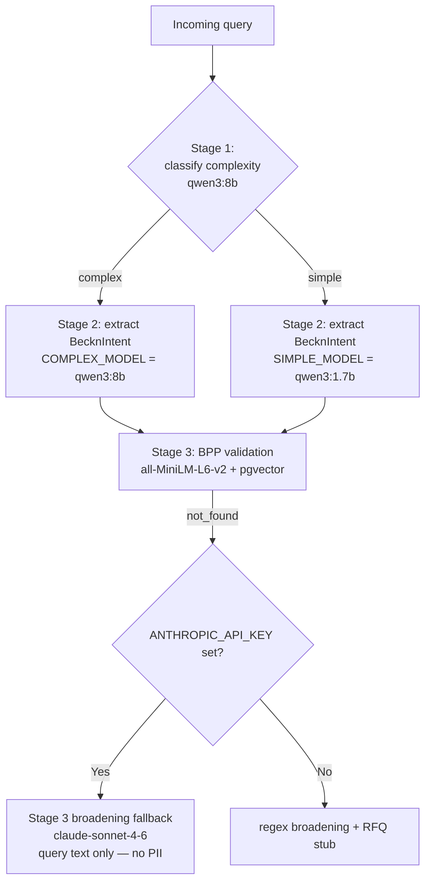
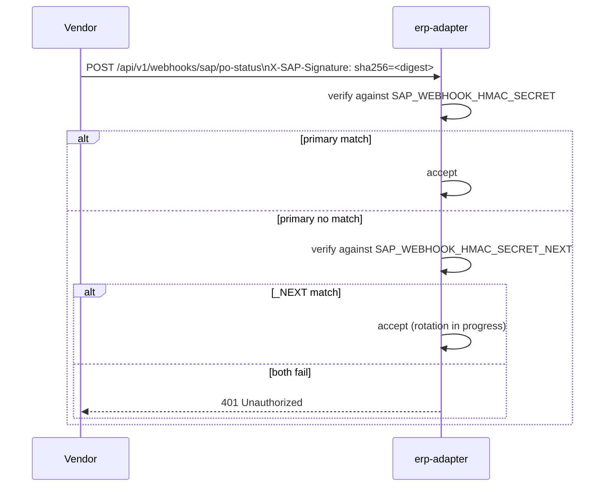
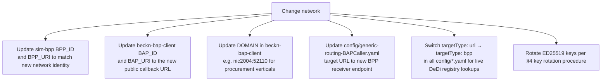

# Configuration Guide

This guide covers every configuration surface in the Procurement Agent: environment variables, `.env` files, ONIX routing YAMLs, LLM model selection, ERP vendor wiring, and Beckn network parameters. For the architecture that these variables serve see [Architecture](ARCHITECTURE.md); for the runtime topology that consumes them see [System Design](SYSTEM_DESIGN.md).

---

## 1. Configuration Philosophy

Configuration in the Procurement Agent follows four rules:

1. **Env-var driven throughout.** Every tuneable value is read from the environment. No service embeds connection strings or credentials in application code.
2. **Module-level `config.py` per service.** Each Python service owns a single `config.py` that imports all `os.getenv()` calls and exposes a typed Pydantic `Settings` object. Application code imports from `config` — never from `os` directly. Two documented exceptions exist in `beckn-bap-client` and `mcp-sidecar` (see §2).
3. **Separate `.env` files per environment.** `docker-compose.yml` injects variables into containers via `environment:` blocks; local services read from shell exports or a root `.env` file. Never commit secrets.
4. **Safe dev defaults, unsafe-by-design production gaps.** Variables that cannot have a safe universal default (secrets, BAP identifiers, public URLs) are set to obvious placeholder values such as `dev-internal-token-CHANGE_ME`. These are documented in §2 and the production checklist is in §6 of [System Design](SYSTEM_DESIGN.md).

---

## 2. Configuration Files

### How It Works

```
repo root
├── .env                  ← loaded by docker-compose.yml; sets defaults for all containers
├── IntentParser/
│   └── config.py         ← Pydantic BaseSettings; reads env vars at import time
├── services/
│   ├── orchestrator/src/config.py
│   ├── beckn-bap-client/src/config.py
│   ├── mcp-sidecar/config.py
│   └── ...               ← every service has its own config.py
└── frontend/
    └── .env.local        ← Next.js convention; never committed (git-ignored)
```

**Docker deployments:** `docker-compose.yml` reads the root `.env` file and passes variables into each container's `environment:` block. All containers share the same `.env` but each service only reads the variables it declares in its own `config.py`.

**Local services (IntentParser, mcp-sidecar):** These run outside Docker and must have variables exported into the shell before starting:

```bash
# Inside conda activate infosys_project
export $(grep -v '^#' .env | xargs)
cd IntentParser && uvicorn api:app --port 8001 --reload
cd services/mcp-sidecar && BAP_API_KEY="any-dev-string" uvicorn server:app --port 3000
```

### File Map

| File | Purpose | Read by |
|---|---|---|
| `.env` (repo root) | Primary local dev secrets — DB credentials, `CLAUDE_PROXY_BINARY_PATH` | `database/setup_database.py`; shell `export $(...)`; `docker-compose.yml` via `env_file:` |
| `.env.example` (repo root) | Checked-in template with safe placeholder values | Developers — copy to `.env` and edit |
| `docker-compose.yml` | Canonical runtime config for all 18 Docker services; overrides code defaults | Docker Compose; CI/CD |
| `IntentParser/config.py` | IntentParser Pydantic Settings: Ollama URLs, model names, DB pool, MCP params | IntentParser API and pipeline stages |
| `services/*/src/config.py` | Per-service Pydantic Settings (orchestrator, erp-adapter, beckn-bap-client, etc.) | Each service at startup |
| `services/mcp-sidecar/config.py` | MCP sidecar Pydantic Settings | mcp-sidecar SSE server |
| `config/*.yaml` | ONIX routing YAMLs for onix-bap and onix-bpp | ONIX Go adapter at container startup |
| `frontend/.env.local` | Next.js secrets: Keycloak OIDC client, NextAuth session secret | Next.js build and runtime |
| `frontend/.env.example` | Checked-in frontend template | Developers |

### Root `.env` Template

```bash
# Copy and adjust for your machine
cp .env.example .env

# PostgreSQL reached by Docker containers via host.docker.internal
DB_HOST=host.docker.internal
DB_PORT=5432
DB_NAME=procurement_agent
DB_USER=postgres
DB_PASSWORD=postgres123          # change in production

# Claude OpenAI Proxy (only needed for negotiation demo)
CLAUDE_PROXY_BINARY_PATH=/home/<user>/.local/bin/claude   # update per machine
CLAUDE_PROXY_KEY=                # any non-empty string enables auth
```

### The Two `os.getenv()` Exceptions

`REDIS_URL` and `REDIS_RESULT_TIMEOUT` in `services/mcp-sidecar/bap_client.py`, and `REDIS_URL` in `services/beckn-bap-client/src/handler.py`, are read via bare `os.getenv()` rather than through the Pydantic Settings model. These two variables **must** be present in the process environment — setting them only in a `.env` file that is not sourced into the shell will silently give them their code defaults.

---

## 3. Complete Environment Variable Reference

### orchestrator (`:8004`, host ports `8000` and `8004`)

The orchestrator is dual-mapped: host port `8000` exists because `NEXT_PUBLIC_API_BASE_URL=http://localhost:8000` is the frontend default; `8004` is exposed for direct testing.

| Variable | Default | Required | Purpose |
|---|---|---|---|
| `INTENTION_PARSER_URL` | `http://localhost:8001` | Yes | Step 1: NL intent parsing service |
| `BECKN_BAP_URL` | `http://localhost:8002` | Yes | Steps 2 and 4: Beckn BAP client |
| `COMPARATIVE_SCORING_URL` | `http://localhost:8003` | Yes | Step 3: comparative scoring adapter |
| `DATA_NORMALIZER_URL` | `http://localhost:8006` | Yes | Persistence layer for all DB writes |
| `DEMO_GATEWAY_URL` | `http://localhost:8015` | Yes (negotiation) | LangGraph negotiation demo gateway — must be port `8015`, not `8005` as some README versions state |
| `ANALYTICS_URL` | `http://localhost:8009` | No | Analytics dashboard data |
| `ERP_ADAPTER_URL` | `http://localhost:8007` | No | ERP budget gate and PO push |
| `ERP_INTERNAL_TOKEN` | `dev-internal-token-CHANGE_ME` | **Yes (production)** | Bearer token sent to erp-adapter; rotate before any external deployment |
| `ERP_BUDGET_CHECK_ENABLED` | `true` | No | Enables the budget check call to erp-adapter |
| `ERP_BUDGET_CHECK_REQUIRED` | `false` | No | `true` = fail-closed; `false` = fail-open. docker-compose default is `false` — **set `true` in production** |
| `ERP_BUDGET_CHECK_TIMEOUT_MS` | `800` | No | Hard timeout for the synchronous budget gate call |
| `ERP_SYNC_ENABLED` | `true` | No | Enables async PO outbox sync to ERP |
| `ERP_DEFAULT_COST_CENTER` | `CC-IND-PROC-01` | No | Default cost-centre code in PO payloads |
| `SELLER_WEBHOOK_HMAC_SECRET` | `dev-seller-hmac-CHANGE_ME` | **Yes (production)** | HMAC-SHA256 secret for inbound seller push webhooks |
| `BUYER_NAME` | `Procurement Agent` | No | Buyer display name in Beckn init/confirm contracts |
| `BUYER_EMAIL` | `procurement@example.com` | No | Buyer contact email in Beckn contracts |
| `BUYER_PHONE` | `+91-0000000000` | No | Buyer phone for Beckn contracts |
| `BUYER_ADDRESS_CITY` | `Bangalore` | No | Buyer city |
| `BUYER_ADDRESS_STATE` | `Karnataka` | No | Buyer state |
| `BUYER_ADDRESS_COUNTRY` | `IND` | No | Buyer country (ISO 3166-1 alpha-3) |
| `KAFKA_BOOTSTRAP` | `""` (disabled) | No | Kafka broker; empty disables the consumer. Deferred to Phase 4. |
| `KAFKA_TOPIC` | `po.status.changed` | No | Kafka topic for order status events |

### IntentParser (`:8001`, runs locally or as `intention-parser` container)

IntentParser has two execution modes. When run locally (`uvicorn api:app --port 8001 --reload`) it uses the code defaults below and runs all three pipeline stages. The `intention-parser` Docker container applies the overrides in the third column and only runs Stages 1 and 2.

| Variable | Code Default | Docker Override | Required | Purpose |
|---|---|---|---|---|
| `OLLAMA_URL` | `http://localhost:11434/v1` | `http://host.docker.internal:11434/v1` | Yes | Ollama API base URL |
| `COMPLEX_MODEL` | `qwen3:8b` | `qwen3:1.7b` | No | LLM for Stage 1 classification and complex Stage 2 extraction. **Docker override collapses two-tier routing** — both model paths use qwen3:1.7b in the container. |
| `SIMPLE_MODEL` | `qwen3:1.7b` | `qwen3:1.7b` | No | LLM for simple/short Stage 2 queries |
| `EMBEDDING_MODEL` | `all-MiniLM-L6-v2` | (not set) | No | sentence-transformers model for Stage 3 semantic cache |
| `ANTHROPIC_API_KEY` | `""` (disabled) | (not set) | No | Enables Claude Sonnet 4.6 as last-resort Stage 3 broadening fallback. Empty = Claude fallback disabled. See §4. |
| `CLAUDE_MODEL` | `claude-sonnet-4-6` | (not set) | No | Claude model name when `ANTHROPIC_API_KEY` is set |
| `MCP_SSE_URL` | `http://localhost:3000/sse` | (not set) | No | MCP sidecar SSE endpoint for Stage 3 BPP validation |
| `MCP_PROBE_TIMEOUT` | `8.0` | (not set) | No | Timeout in seconds for MCP tool calls |
| `BECKN_DOMAIN` | `procurement` | (not set) | No | Beckn domain identifier passed to `search_bpp_catalog` |
| `BECKN_VERSION` | `1.1.0` | (not set) | No | Beckn protocol version passed to the sidecar |
| `DB_HOST` | `localhost` | `host.docker.internal` | Yes | PostgreSQL host for Stage 3 pgvector semantic cache |
| `DB_PORT` | `5432` | (not set) | No | PostgreSQL port |
| `DB_NAME` | `procurement_agent` | (not set) | No | Database name |
| `DB_USER` | `postgres` | (not set) | No | Database user |
| `DB_PASSWORD` | `""` | (not set) | **Yes (production)** | Database password |
| `DB_MIN_POOL` | `5` | (not set) | No | asyncpg minimum connection pool size |
| `DB_MAX_POOL` | `20` | (not set) | No | asyncpg maximum connection pool size |
| `DB_CMD_TIMEOUT` | `5.0` | (not set) | No | asyncpg command timeout in seconds |
| `HNSW_EF_SEARCH` | `100` | (not set) | No | pgvector HNSW ef_search parameter for ANN queries |

`VALIDATED_THRESHOLD` (0.85) and `AMBIGUOUS_THRESHOLD` (0.45) are named constants in `IntentParser/config.py` but are **not env-configurable** — overriding them requires a code change.

### beckn-bap-client (`:8002`)

| Variable | Default | Required | Purpose |
|---|---|---|---|
| `BAP_ID` | `bap.example.com` | **Yes (production)** | Beckn Application Platform identifier registered on the network |
| `BAP_URI` | `http://localhost:8000/beckn` | **Yes (production)** | Public callback URI for ONIX to route `on_*` callbacks. Do not include a trailing action name — ONIX appends `/{action}`. |
| `ONIX_URL` | `http://localhost:8081` | Yes | Base URL of the onix-bap Go adapter |
| `DOMAIN` | `nic2004:52110` | No | Beckn domain code; docker-compose sets `beckn.one/testnet` |
| `COUNTRY` | `IND` | No | Buyer country for Beckn context |
| `CITY` | `std:080` | No | Buyer city code for Beckn context |
| `CORE_VERSION` | `2.0.0` | No | Beckn core spec version sent in all request contexts |
| `REQUEST_TIMEOUT` | `30` | No | HTTP request timeout in seconds for outbound Beckn calls |
| `CALLBACK_TIMEOUT` | `10.0` | No | Seconds the `CallbackCollector` waits for on_select / on_init / on_confirm / on_status |
| `CATALOG_NORMALIZER_URL` | `http://localhost:8005` | Yes | URL of catalog-normalizer for on_discover payload normalisation |
| `REDIS_URL` | `redis://localhost:6379` | Yes | Redis URL for Pub/Sub. **Must be a real env var** (not only in `.env`) — read via `os.getenv()` in `handler.py`. |

### mcp-sidecar (`:3000`, runs locally only)

| Variable | Default | Required | Purpose |
|---|---|---|---|
| `BAP_API_KEY` | (none) | **Yes — service refuses to start** | Bearer token for the BAP client API. Any non-empty string works in dev; never commit. |
| `BAP_CLIENT_URL` | `http://localhost:8002` | Yes | URL of beckn-bap-client's `/discover` endpoint |
| `REDIS_URL` | `redis://localhost:6379` | **Yes** | Redis Pub/Sub URL. **Must be a real env var** — read via `os.getenv()` in `bap_client.py`. |
| `REDIS_RESULT_TIMEOUT` | `15` | **Yes** | Seconds to wait on the Redis channel before returning `found:false`. **Must be a real env var.** This is the primary latency ceiling for discovery probes. |
| `MCP_BAP_TIMEOUT` | `3.0` | No | HTTP safety valve for the fire-and-forget POST to beckn-bap-client |
| `RANKING_MIN_SIMILARITY` | `0.30` | No | Cosine similarity floor; items below this are filtered from results |

Start command: `cd services/mcp-sidecar && BAP_API_KEY="any-string" uvicorn server:app --port 3000` (inside `conda activate infosys_project`).

### erp-adapter (`:8007`)

See §5 for ERP vendor selection and HMAC rotation details.

| Variable | Default | Required | Purpose |
|---|---|---|---|
| `ERP_INTERNAL_TOKEN` | `dev-internal-token-CHANGE_ME` | **Yes (production)** | Bearer token validated on all `/api/v1/*` routes from the orchestrator |
| `ERP_VENDORS` | `mock` | Yes | Comma-separated vendor list: `mock`, `sap`, `oracle`, or `sap,oracle` |
| `DB_HOST` | `procurement-postgres` | Yes | PostgreSQL host for the outbox table |
| `DB_PASSWORD` | `postgres123` | **Yes (production)** | Database password |
| `SAP_CLIENT_ID` | `mock-sap-client` | **Yes (SAP)** | SAP OAuth2 client ID |
| `SAP_CLIENT_SECRET` | `mock-sap-secret` | **Yes (SAP production)** | SAP OAuth2 client secret |
| `SAP_WEBHOOK_HMAC_SECRET` | `dev-sap-hmac-CHANGE_ME` | **Yes (production)** | Primary HMAC-SHA256 key for `X-Sap-Signature` |
| `SAP_WEBHOOK_HMAC_SECRET_NEXT` | `""` (disabled) | No | Rotation key — both primary and next are accepted simultaneously |
| `ORACLE_CLIENT_ID` | `mock-oracle-client` | **Yes (Oracle)** | Oracle OAuth2 client ID |
| `ORACLE_CLIENT_SECRET` | `mock-oracle-secret` | **Yes (Oracle production)** | Oracle OAuth2 client secret |
| `ORACLE_WEBHOOK_HMAC_SECRET` | `dev-oracle-hmac-CHANGE_ME` | **Yes (production)** | Primary HMAC-SHA256 key for Oracle webhook verification |
| `ORACLE_WEBHOOK_HMAC_SECRET_NEXT` | `""` (disabled) | No | Oracle HMAC rotation key |
| `BUDGET_CHECK_TOTAL_TIMEOUT_MS` | `800` | No | Hard timeout for the synchronous budget gate |
| `BREAKER_FAIL_MAX` | `5` | No | Per-vendor circuit breaker consecutive failure threshold |
| `BREAKER_RESET_TIMEOUT_SECS` | `60` | No | Seconds in OPEN state before auto-probe (half-open) |
| `LOG_PAYLOADS` | `false` | No | When `true`, full request/response bodies are logged. **Never set `true` in production** — full PO and budget payloads contain PII. |

### data-normalizer (`:8006`)

| Variable | Default | Required | Purpose |
|---|---|---|---|
| `DB_HOST` | `localhost` | Yes | PostgreSQL host; `host.docker.internal` in Docker |
| `DB_PASSWORD` | `postgres123` | **Yes (production)** | Database password |
| `SYSTEM_USER_ID` | `00000000-0000-0000-0000-000000000001` | No | UUID for the fallback system user upserted into `users` when no `requester_id` is provided. Not in docker-compose.yml — hardcoded default is used in all deployments unless explicitly overridden. |

The all-MiniLM-L6-v2 model (~90 MB) is downloaded from Hugging Face on first startup of the memory write endpoint. Cold start for this download is 10–30 seconds.

### sim-bpp (`:3002`)

| Variable | Default | Required | Purpose |
|---|---|---|---|
| `BPP_ID` | `bpp.example.com` | No | BPP identifier embedded in all response contexts |
| `BPP_URI` | `http://onix-bpp:8082/bpp/receiver` | No | BPP receiver URI sent in catalog responses |
| `ONIX_BPP_CALLER` | `http://onix-bpp:8082/bpp/caller` | Yes | Base URL of the onix-bpp caller module |
| `CATALOG_PATH` | `/app/catalog.json` | No | Path to the catalog JSON file; bind-mounted at `./services/sim-bpp/catalog.json`. Re-read on every request — no rebuild needed to update the catalog. |
| `SIM_BPP_AUTO_ADVANCE` | `false` (code) / `true` (docker-compose) | No | When enabled, automatically transitions a confirmed order through `ACCEPTED → PACKED → SHIPPED → OUT_FOR_DELIVERY → DELIVERED` |
| `SIM_BPP_ADVANCE_INTERVAL_SECS` | `5` | No | Seconds between each auto-advance lifecycle step |
| `DATA_NORMALIZER_URL` | `http://data-normalizer:8006` | Yes (auto-advance) | URL for PATCHing `purchase_orders.status` during lifecycle transitions |

**Important:** `SIM_BPP_AUTO_ADVANCE` defaults to `false` in code but is set to `true` in `docker-compose.yml`. A developer running sim-bpp outside Docker will not see automatic lifecycle transitions unless the variable is explicitly exported.

### frontend (`:3000`)

| Variable | Default | Required | Purpose |
|---|---|---|---|
| `NEXTAUTH_URL` | `http://localhost:3000` | **Yes** | Public URL of this Next.js app; must match the Keycloak redirect URI exactly |
| `NEXTAUTH_SECRET` | (none) | **Yes** | Signs and verifies session JWTs. Generate with `openssl rand -base64 32`. |
| `KEYCLOAK_ISSUER` | `https://euc1.auth.ac/auth` | **Yes** | OIDC issuer URL. Phase Two cloud: `https://app.phasetwo.io/auth/realms/<realm>`. Self-hosted: `https://<host>/realms/<realm>`. |
| `KEYCLOAK_CLIENT_ID` | `procurement-frontend` | **Yes** | Client ID in the Keycloak realm |
| `KEYCLOAK_CLIENT_SECRET` | (none) | **Yes** | Client secret (confidential client) — copy from the Keycloak dashboard |
| `NEXT_PUBLIC_API_BASE_URL` | `http://localhost:8000` | Yes | Orchestrator base URL; matches the orchestrator's `8000` host port in docker-compose |

The frontend has no stub credentials provider. Even local development requires a live Keycloak-compatible instance. The development tenant used by this project is Phase Two at `euc1.auth.ac`, realm `procurement-agent`.

### Secrets That Must Be Rotated Before Production

| Variable | Service | Risk if left at default |
|---|---|---|
| `NEXTAUTH_SECRET` | frontend | Session JWTs are unsigned; any JWT is accepted |
| `KEYCLOAK_CLIENT_SECRET` | frontend | OIDC flow breaks |
| `ERP_INTERNAL_TOKEN` | orchestrator, erp-adapter | Default is public knowledge; any caller can hit `/api/v1/*` on erp-adapter |
| `SELLER_WEBHOOK_HMAC_SECRET` | orchestrator | Forged seller webhooks accepted |
| `SAP_WEBHOOK_HMAC_SECRET` | erp-adapter, erp-mock | Forged SAP webhooks accepted |
| `ORACLE_WEBHOOK_HMAC_SECRET` | erp-adapter, erp-mock | Forged Oracle webhooks accepted |
| `DB_PASSWORD` | data-normalizer, analytics, erp-adapter | Default `postgres123` grants full DB access |
| `BAP_ID` | beckn-bap-client | Placeholder; must be the registered BAP identifier on the target network |
| `BAP_URI` | beckn-bap-client | Must be a publicly reachable URL for ONIX to route callbacks |

---

## 4. ONIX Routing Configuration

The six YAML files in `config/` control how the onix-bap and onix-bpp Go adapters route, sign, and validate Beckn traffic. Both containers bind-mount the `config/` directory at `/app/config`.

### File Map

| File | Adapter | Pipeline role | Purpose |
|---|---|---|---|
| `generic-routing-BAPCaller.yaml` | onix-bap | Outbound from BAP | Signs outbound BAP requests with ED25519 and routes them to the BPP receiver |
| `generic-routing-BAPReceiver.yaml` | onix-bap | Inbound to BAP | Validates inbound `on_*` callback signatures and routes to beckn-bap-client |
| `generic-routing-BPPCaller.yaml` | onix-bpp | Outbound from BPP | Signs and routes `on_*` responses from sim-bpp back to the BAP receiver |
| `generic-routing-BPPReceiver.yaml` | onix-bpp | Inbound to BPP | Validates inbound Beckn action requests and routes to sim-bpp |
| `specific-routing-BAPCaller.yaml` | onix-bap | Override entries | Action-level overrides for the caller pipeline |
| `specific-routing-BAPReceiver.yaml` | onix-bap | Override entries | Action-level overrides for the receiver pipeline |

### Pipeline Stages

The **caller** pipeline (outbound from BAP): `addRoute → sign → validateSchema`

The **receiver** pipeline (inbound to BAP): `validateSign → addRoute → validateSchema`

### `targetType: url` — DeDi Registry Bypass

All routing YAMLs use `targetType: url` rather than `targetType: bpp` / `targetType: bap`. This routes directly to the configured URLs without consulting the Beckn DeDi registry, enabling a full Beckn protocol flow inside the Docker `beckn_network` bridge without a public registry subscription.

```yaml
# Example entry from generic-routing-BAPCaller.yaml
routes:
  - action: discover
    target:
      type: url
      url: http://onix-bpp:8082/bpp/receiver   # Docker DNS name; ONIX appends /discover
```

**Do not include the action name in target URLs.** ONIX appends `/{action}` automatically. Including it duplicates the path and causes 404 errors.

When connecting to a live Beckn network, change `targetType: url` to `targetType: bpp` / `targetType: bap` and register real BAP/BPP identifiers in the target network's registry.

### Schema Validator Pin

The `schemav2validator.so` binary inside the `fidedocker/onix-adapter` image is **pinned to commit `d43ec30d`**. Later commits of this binary introduced a `$ref` resolution bug in `SignatureHeader` and `AckSignatureHeader` that causes all signed requests to fail schema validation.

> Do not upgrade the ONIX schema validator without running a full end-to-end signing test (`discover → select → init → confirm → status`) first.

### ED25519 Key Rotation

The current `config/*.yaml` files contain **testnet sandbox ED25519 key pairs** from the Beckn Developer Program. To rotate keys before production:

1. Generate a new ED25519 key pair using the Beckn key generation utility.
2. Register the new public key in the target Beckn network's registry.
3. Update the `privateKey` and `keyId` fields in `config/generic-routing-BAPCaller.yaml`.
4. Restart the `onix-bap` container. The new key takes effect immediately; no rolling restart is needed.

---

## 5. LLM Configuration

IntentParser uses a two-tier routing scheme based on query complexity. The same Ollama endpoint serves both tiers.



### Switching Models

To change the primary LLM, set these variables in the shell before starting IntentParser locally:

```bash
export COMPLEX_MODEL="qwen3:8b"     # default; handles complex procurement requests
export SIMPLE_MODEL="qwen3:1.7b"    # default; handles short/simple queries
ollama pull qwen3:8b
ollama pull qwen3:1.7b
```

The `docker-compose.yml` overrides `COMPLEX_MODEL=qwen3:1.7b`, collapsing both routing branches to the smaller model inside the `intention-parser` container. Restore `qwen3:8b` for both models on a GPU host to enable full two-tier routing.

### ANTHROPIC_API_KEY — Stage 3 Broadening Fallback

`ANTHROPIC_API_KEY` is **unset by default**. When unset, the Claude fallback is skipped entirely and the recovery flow falls through to stub functions (`log_unmet_demand`, `notify_buyer_no_stock`, `trigger_open_rfq_flow`).

When set:

- Only the broadening prompt is sent to the Anthropic API.
- The prompt contains the original procurement query text but **no buyer identity, pricing, or supplier data**.
- The model is `claude-sonnet-4-6` (configurable via `CLAUDE_MODEL`).

This is an opt-in feature. All LLMs are local by default — no data leaves the host unless `ANTHROPIC_API_KEY` is exported.

### negotiation_engine LLM (`:8004`)

The negotiation engine routes through the local `claude_openai_proxy` service rather than Ollama directly:

| Variable | Default | Purpose |
|---|---|---|
| `NEGOTIATION_OPENAI_BASE_URL` | `http://host.docker.internal:8012/v1` | Points at `claude_openai_proxy` on the host |
| `NEGOTIATION_OPENAI_MODEL` | `claude-3-5-sonnet` | OpenAI alias mapped to `sonnet` by the proxy |
| `NEGOTIATION_OPENAI_TIMEOUT_S` | `30.0` | LLM call timeout |
| `NEGOTIATION_ADVISORY_MAX_TOKENS` | `512` | Max token budget for advisory LLM node responses |

The proxy must be running (`uvicorn services.claude_openai_proxy.main:app --host 0.0.0.0 --port 8012`) and `CLAUDE_PROXY_BINARY_PATH` must point to the installed `claude` CLI binary on the host.

---

## 6. ERP Configuration

### Vendor Selection

The `ERP_VENDORS` variable in `erp-adapter` selects which ERP backend is active:

| `ERP_VENDORS` value | Effect |
|---|---|
| `mock` (default) | Routes all ERP calls to `erp-mock:8008`. No external connectivity required. |
| `sap` | Activates the SAP S/4HANA adapter. Requires `SAP_CLIENT_ID`, `SAP_CLIENT_SECRET`, `SAP_BASE_URL`, and `SAP_OAUTH_TOKEN_URL`. |
| `oracle` | Activates the Oracle ERP Cloud adapter. Requires `ORACLE_CLIENT_ID`, `ORACLE_CLIENT_SECRET`, `ORACLE_BASE_URL`, and `ORACLE_OAUTH_TOKEN_URL`. |
| `sap,oracle` | Both vendors active simultaneously (multi-vendor mode). |

### Switching from Mock to SAP

1. Set `ERP_VENDORS=sap` in the orchestrator and erp-adapter environment.
2. Replace `SAP_BASE_URL` with the real SAP S/4HANA OData base URL (remove the `erp-mock:8008` default).
3. Replace `SAP_OAUTH_TOKEN_URL` with the real SAP OAuth2 token endpoint.
4. Set `SAP_CLIENT_ID` and `SAP_CLIENT_SECRET` with the production OAuth2 credentials.
5. Set `SAP_WEBHOOK_HMAC_SECRET` to the key that SAP will use to sign inbound webhooks.
6. Restart erp-adapter.

The same pattern applies for Oracle, substituting the `ORACLE_*` equivalents.

### Budget Gate Flags

| Variable | Service | Dev default | Production recommendation |
|---|---|---|---|
| `ERP_BUDGET_CHECK_ENABLED` | orchestrator | `true` | `true` |
| `ERP_BUDGET_CHECK_REQUIRED` | orchestrator | `false` (fail-open) | `true` (fail-closed — prevents budget overruns even if erp-adapter is unreachable) |
| `ERP_BUDGET_CHECK_TIMEOUT_MS` | orchestrator | `800` | `800` (matches `BUDGET_CHECK_TOTAL_TIMEOUT_MS` in erp-adapter) |

Setting `ERP_BUDGET_CHECK_REQUIRED=false` means the orchestrator's `/commit` path proceeds even when erp-adapter returns an error. This is the docker-compose default for development convenience.

### HMAC Dual-Secret Rotation

The erp-adapter accepts inbound vendor webhooks signed with HMAC-SHA256. The dual-secret pattern enables zero-downtime key rotation.



Step-by-step rotation procedure:

1. Generate a new secret: `openssl rand -hex 32`
2. Set `SAP_WEBHOOK_HMAC_SECRET_NEXT=<new-secret>` in erp-adapter and restart the container.
3. Update the SAP system to sign outbound webhooks with the new secret.
4. Confirm that new signatures are arriving and being accepted (check erp-adapter logs).
5. Move the new secret to the primary: `SAP_WEBHOOK_HMAC_SECRET=<new-secret>`.
6. Clear `SAP_WEBHOOK_HMAC_SECRET_NEXT=""` and restart erp-adapter.

The same procedure applies for `ORACLE_WEBHOOK_HMAC_SECRET` / `ORACLE_WEBHOOK_HMAC_SECRET_NEXT` and for `SELLER_WEBHOOK_HMAC_SECRET` in the orchestrator (single-secret; no `_NEXT` variant).

---

## 7. Beckn Network Configuration

### Pointing the Stack at a Different Beckn Network



The key variables to change when switching networks:

| Variable | Service | What to set |
|---|---|---|
| `BAP_ID` | beckn-bap-client | Registered BAP identifier on the target network |
| `BAP_URI` | beckn-bap-client | Publicly reachable callback URL (ONIX appends `/{action}`) |
| `BPP_ID` | sim-bpp | BPP identifier for this simulator on the target network |
| `DOMAIN` | beckn-bap-client | Beckn domain code for the target vertical (e.g. `nic2004:52110`) |

### Testnet vs Production Keys

The `config/*.yaml` files currently contain testnet ED25519 key pairs from the Beckn Developer Program. These keys are checked into the repository and are known to the sandbox environment — they provide no security guarantee. Follow the key rotation procedure in §4 before connecting to any non-sandbox network.

---

## 8. sim-bpp Catalog Configuration

The BPP catalog is served from `services/sim-bpp/catalog.json`. Docker Compose bind-mounts this file into the container at `/app/catalog.json`:

```yaml
# docker-compose.yml (sim-bpp volumes section)
volumes:
  - ./services/sim-bpp/catalog.json:/app/catalog.json
```

sim-bpp re-reads `catalog.json` on every inbound request. **You can edit the catalog and see the changes immediately without rebuilding or restarting the container.**

### Catalog Hot-Reload

```bash
# Edit catalog.json directly
vim services/sim-bpp/catalog.json

# Verify the update
curl -s http://localhost:3002/api/catalog | python -m json.tool | head -40
```

The catalog JSON structure follows the Beckn v2.0.0 `on_discover` payload shape: a top-level `catalogs[]` array with `providers[]`, `items[]`, `fulfillments[]`, and `payments[]` as flat resources.

### Automated Lifecycle Progression

`SIM_BPP_AUTO_ADVANCE=true` (the docker-compose default) causes sim-bpp to advance a confirmed order through the following states automatically at `SIM_BPP_ADVANCE_INTERVAL_SECS` (default 5 seconds):

```
ACCEPTED → PACKED → SHIPPED → OUT_FOR_DELIVERY → DELIVERED
```

Set `SIM_BPP_AUTO_ADVANCE=false` to freeze the order lifecycle and inspect intermediate states during testing. When running sim-bpp locally (outside Docker), `SIM_BPP_AUTO_ADVANCE` defaults to `false` in code — set it explicitly if you want auto-advance:

```bash
SIM_BPP_AUTO_ADVANCE=true SIM_BPP_ADVANCE_INTERVAL_SECS=10 \
  uvicorn services.sim-bpp.src.main:app --port 3002
```

---

## 9. Adding a New Configuration Variable

Follow these steps to add a configurable parameter to any service. The procedure is the same whether you are adding to IntentParser, a dockerised service, or the mcp-sidecar.

### Step 1 — Add to the module-level `config.py`

Open the service's `config.py` (e.g. `services/orchestrator/src/config.py`) and add the field to the Pydantic `Settings` class:

```python
# services/orchestrator/src/config.py
from pydantic_settings import BaseSettings

class Settings(BaseSettings):
    # ... existing fields ...
    MY_NEW_TIMEOUT_MS: int = 500   # safe default for development

settings = Settings()
```

Use Pydantic v2 types with `@field_validator` decorators for any value that needs normalisation. Never use bare `os.getenv()` in application code — that would bypass the Settings model.

### Step 2 — Add to `.env.example` with a safe placeholder

```bash
# .env.example
# Description of what this variable controls and its units
MY_NEW_TIMEOUT_MS=500
```

If the variable has no safe default (a secret or a host-specific path), leave the value empty and add a comment marking it as required:

```bash
# Required before production deployment
MY_WEBHOOK_SECRET=CHANGE_ME
```

### Step 3 — Add to `docker-compose.yml` if a different value is needed in Docker

```yaml
# docker-compose.yml (inside the relevant service's environment block)
services:
  orchestrator:
    environment:
      MY_NEW_TIMEOUT_MS: "800"   # override for containerised environment
```

### Step 4 — Document in this file

Add the new variable to the relevant table in §3, including: variable name, default value, whether it is required in production, and a one-line purpose description.

### Step 5 — Document in ENVIRONMENT.md

If the project maintains an `ENVIRONMENT.md` file, add a row to the relevant service's section there as well. Keeping both documents consistent ensures the configuration reference and the deployment guide stay in sync.
