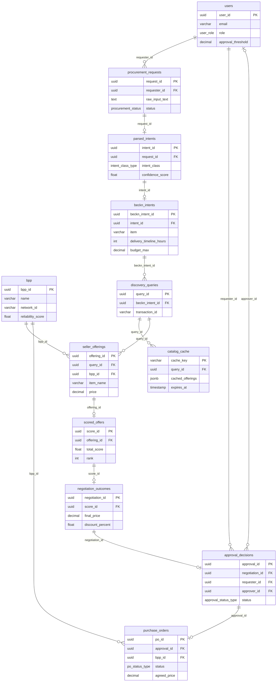
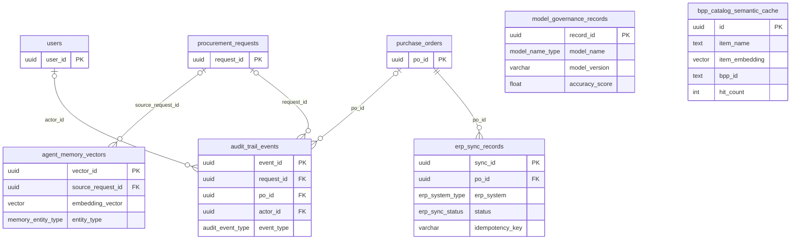
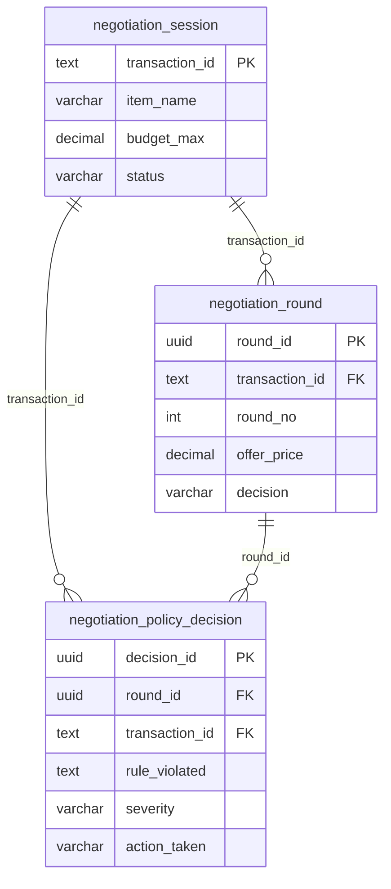
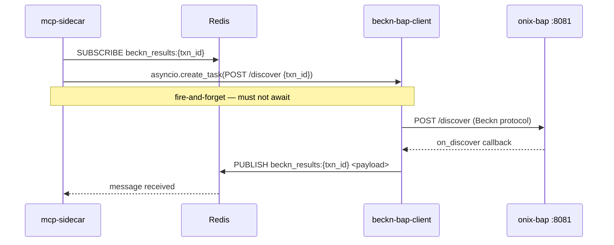

<title>Database Reference — Procurement Agent</title>

# Database Reference

PostgreSQL 16 + pgvector persistence layer for the Procurement Agent. All schema objects are defined in numbered migration scripts under `database/sql/`. Redis 7 is used alongside PostgreSQL for ephemeral async coordination.

For architectural context on why Redis Pub/Sub is used for async Beckn discovery, see [ADR-0001](../docs/architecture/decisions/0001-use-redis-pubsub-for-async-beckn-responses.md). For the full service topology, see [ARCHITECTURE.md](ARCHITECTURE.md).

---

## 1. Overview

| Aspect | Detail |
|---|---|
| Engine | PostgreSQL 16 |
| Vector extension | pgvector 0.7.0 (`vector` type, HNSW indexes) |
| UUID extensions | uuid-ossp (`uuid_generate_v4()`) and pgcrypto (`gen_random_uuid()`) |
| Primary database | `procurement_agent` (container `procurement-postgres`, host port 5432) |
| Secondary database | `negotiation` (same container, host port 55432) — negotiation engine LangGraph checkpoints |
| Migration files | 24 numbered SQL scripts in `database/sql/` (`NN_` prefix; lexicographic order = FK dependency order) |
| Migration strategy | Idempotent — all DDL uses `IF NOT EXISTS` / `IF EXISTS` / `DO $$ … $$` guards |
| ENUM types | 20 custom types (defined in `00_extensions_and_types.sql`; 2 receive additive values via migrations 19 and 22a) |
| Named indexes | 22 B-tree/partial indexes in `17_indexes.sql` + 8 additional indexes defined inline in later migrations |
| Schema setup | `python database/setup_database.py [--create-db] [--drop-all] [--continue-on-exists]` |

The `procurement_agent` database holds all 16 primary application tables. The `negotiation` database (port 55432) holds the three negotiation audit tables from `20_negotiation_schema.sql` plus LangGraph checkpoint tables created at engine startup by `AsyncPostgresSaver.setup()`.

---

## 2. Schema by Domain

### 2.1 Core Procurement

**Figure 1 — Main procurement pipeline (`procurement_agent` database)**



**Figure 2 — Supporting and observability tables**



#### `users` (migration `01_users.sql`)

| Column | Type | Notes |
|---|---|---|
| `user_id` | UUID PK | `uuid_generate_v4()` default |
| `email` | VARCHAR(255) UNIQUE NOT NULL | — |
| `name` | VARCHAR(255) NOT NULL | — |
| `role` | `user_role` ENUM | `requester \| approver \| admin` |
| `department` | VARCHAR(100) | — |
| `approval_threshold` | DECIMAL(15,2) | Maximum PO value this user may self-approve |
| `keycloak_id` | VARCHAR(255) UNIQUE | JWT `sub` claim; Keycloak is source of truth for identity |
| `idp_provider` | `idp_provider_type` ENUM | `keycloak \| okta \| azure_ad` |

#### `procurement_requests` (migration `03_procurement_requests.sql`, extended by `22b`)

| Column | Type | Notes |
|---|---|---|
| `request_id` | UUID PK | — |
| `requester_id` | UUID FK → `users` | `ON DELETE RESTRICT` |
| `raw_input_text` | TEXT NOT NULL | Original natural-language query |
| `channel` | `channel_type` ENUM | `web \| slack \| teams` |
| `urgency_flag` | BOOLEAN DEFAULT FALSE | — |
| `category` | VARCHAR(100) | Top-level commodity class |
| `status` | `procurement_status` ENUM | State machine: `draft → parsing → discovering → scoring → negotiating → pending_approval → confirmed \| cancelled` |
| `pending_chosen_item_id` | VARCHAR(255) | Added by migration 22b — survives session TTL expiry for approval resumption |
| `pending_transaction_id` | VARCHAR(255) | Added by migration 22b — Beckn transaction ID preserved across session boundary |

Root anchor of every purchase request. All downstream tables reference this row.

#### `parsed_intents` (migration `04_parsed_intents.sql`)

1:1 with `procurement_requests` (UNIQUE FK). Stores Stage 1 IntentParser output.

| Column | Type | Notes |
|---|---|---|
| `intent_id` | UUID PK | — |
| `request_id` | UUID FK → `procurement_requests` | UNIQUE, `ON DELETE CASCADE` |
| `intent_class` | `intent_class_type` ENUM | `procurement \| query \| support \| out_of_scope` |
| `confidence_score` | FLOAT | `[0, 1]` |
| `model_version` | VARCHAR(50) | e.g. `qwen3:8b-v1` |
| `parsed_at` | TIMESTAMP | — |

#### `beckn_intents` (migration `05_beckn_intents.sql`)

1:1 with `parsed_intents`. Anti-corruption layer — canonical structured intent used by all downstream services.

| Column | Type | Notes |
|---|---|---|
| `beckn_intent_id` | UUID PK | — |
| `intent_id` | UUID FK → `parsed_intents` | UNIQUE, `ON DELETE CASCADE` |
| `item` | VARCHAR(255) NOT NULL | Commodity name |
| `descriptions` | JSONB[] | Spec attributes array |
| `quantity` | INT | — |
| `unit` | VARCHAR(50) | e.g. `meters`, `units` |
| `location_coordinates` | VARCHAR(50) | Format: `"lat,lon"` decimal — never city names |
| `delivery_timeline_hours` | INT | Always integer hours — never ISO 8601 |
| `budget_min` / `budget_max` | DECIMAL(15,2) | Typed bounds — never raw strings |
| `currency` | CHAR(3) | ISO 4217 |
| `compliance_requirements` | JSONB[] | Regulatory / certification constraints |

#### `bpp` (migration `02_bpp.sql`)

Defined early (before `seller_offerings` and `purchase_orders`) because both reference it.

| Column | Type | Notes |
|---|---|---|
| `bpp_id` | UUID PK | — |
| `name` | VARCHAR(255) NOT NULL | — |
| `network_id` | VARCHAR(100) NOT NULL | Beckn network identifier |
| `endpoint_url` | VARCHAR(500) NOT NULL | Must route through `onix-bap:8081` — never call BPP directly |
| `reliability_score` | FLOAT | `[0, 1]` |
| `on_time_delivery_rate` | FLOAT | `[0, 1]` |
| `last_seen_at` | TIMESTAMP | Updated on each on_discover callback |

#### `discovery_queries` (migration `06_discovery_queries.sql`)

Many per `beckn_intents` row — one row per `POST /discover` call.

| Column | Type | Notes |
|---|---|---|
| `query_id` | UUID PK | — |
| `beckn_intent_id` | UUID FK → `beckn_intents` | `ON DELETE RESTRICT` |
| `network_id` | VARCHAR(100) | Beckn network targeted |
| `cache_hit` | BOOLEAN | TRUE = response served from Redis (15-min TTL) |
| `results_count` | INT | Number of offerings returned |
| `queried_at` | TIMESTAMP | — |

#### `catalog_cache` (migration `07_catalog_cache.sql`)

PostgreSQL-layer cache of raw `on_discover` catalog payloads. A cache entry is keyed by a hash of the query parameters so that identical intents within the TTL window skip a live Beckn network round-trip. Distinct from the Redis 15-minute short-lived cache — this table stores the normalised catalog payload for audit and replay.

| Column | Type | Notes |
|---|---|---|
| `cache_key` | VARCHAR(500) PK | SHA-256 hash of the BecknIntent parameters (item, location, budget, timeline) |
| `query_id` | UUID FK → `discovery_queries` | `ON DELETE CASCADE` |
| `cached_offerings` | JSONB NOT NULL | Full `on_discover` catalog payload at time of caching |
| `created_at` | TIMESTAMP | — |
| `expires_at` | TIMESTAMP | Cache row considered stale after this timestamp; eviction job removes expired rows |

#### `seller_offerings` (migrations `08_seller_offerings.sql` + `21_order_detail_fidelity.sql`)

| Column | Type | Notes |
|---|---|---|
| `offering_id` | UUID PK | — |
| `query_id` | UUID FK → `discovery_queries` | `ON DELETE RESTRICT` |
| `bpp_id` | UUID FK → `bpp` | `ON DELETE RESTRICT` |
| `item_id` | VARCHAR(255) NOT NULL | Beckn catalog item ID |
| `item_name` | VARCHAR(255) | Added by migration 21 |
| `price` | DECIMAL(15,2) CHECK > 0 | — |
| `currency` | CHAR(3) | — |
| `delivery_eta_hours` | INT CHECK > 0 | — |
| `quality_rating` | FLOAT | `[0, 5]` |
| `certifications` | JSONB | — |
| `inventory_count` | INT | — |
| `format_variant` | INT | `[1–5]` — original catalog format before normalization (1=BECKN_V2_FLAT_RESOURCES … 5=UNKNOWN/LLM) |
| `is_normalized` | BOOLEAN | — |

### 2.2 Scoring and Approval

#### `scored_offers` (migration `09_scored_offers.sql`)

1:1 with `seller_offerings`. Comparative Scoring Engine output.

| Column | Type | Notes |
|---|---|---|
| `score_id` | UUID PK | — |
| `offering_id` | UUID FK → `seller_offerings` | UNIQUE, `ON DELETE CASCADE` |
| `rank` | INT CHECK > 0 | Ordinal rank among competing offers |
| `total_score` | FLOAT | `[0, 100]` — `composite_score × 100` |
| `price_score` / `delivery_score` / `quality_score` / `compliance_score` | FLOAT | Each `[0, 100]` |
| `tco_value` | DECIMAL(15,2) | Total Cost of Ownership estimate |
| `explanation_text` | TEXT | Human-readable scoring rationale |
| `user_overridden` | BOOLEAN | TRUE feeds the override-rate calibration metric in `model_governance_records` |
| `model_version` | VARCHAR(50) | Scoring model version |

#### `negotiation_outcomes` (migration `10_negotiation_outcomes.sql`)

1:1 with `scored_offers`.

| Column | Type | Notes |
|---|---|---|
| `negotiation_id` | UUID PK | — |
| `score_id` | UUID FK → `scored_offers` | UNIQUE, `ON DELETE CASCADE` |
| `strategy_applied` | `negotiation_strategy_type` ENUM | `aggressive \| accept_margin \| advisory \| escalate \| skipped` |
| `initial_price` | DECIMAL(15,2) | — |
| `counter_offer_price` | DECIMAL(15,2) | NULL when strategy is `skipped` or `advisory` |
| `final_price` | DECIMAL(15,2) | — |
| `discount_percent` | FLOAT | `[0, 20]` — CHECK constraint enforces hard cap at 20.0; not bypassable |
| `acceptance_status` | `acceptance_status_type` ENUM | `accepted \| rejected \| advisory \| escalated \| skipped` |

A `strategy=skipped` row is auto-created when negotiation is bypassed to maintain referential integrity.

#### `approval_decisions` (migration `11_approval_decisions.sql`)

1:1 with `negotiation_outcomes`. Approval state machine.

| Column | Type | Notes |
|---|---|---|
| `approval_id` | UUID PK | — |
| `negotiation_id` | UUID FK → `negotiation_outcomes` | UNIQUE, `ON DELETE RESTRICT` |
| `requester_id` | UUID FK → `users` | `ON DELETE RESTRICT` |
| `approver_id` | UUID FK → `users` | SET NULL on delete; NULL for auto approvals |
| `approval_level` | `approval_level_type` ENUM | Routing: `amount_total <= requester.threshold` → `auto`; `<= approver.threshold` → `manager`; else → `cfo` |
| `amount_total` | DECIMAL(15,2) CHECK > 0 | — |
| `status` | `approval_status_type` ENUM | `pending \| approved \| rejected \| escalated \| auto_approved` |
| `is_emergency` | BOOLEAN | TRUE sets `deadline_at = NOW() + 60min` |
| `deadline_at` | TIMESTAMP | — |
| `notification_channel` | `notification_channel_type` ENUM | `slack \| teams \| email` |
| `decided_at` | TIMESTAMP | — |

#### `purchase_orders` (migrations `12_purchase_orders.sql` + `21_order_detail_fidelity.sql`)

Created only after `approval_decisions.status IN ('approved', 'auto_approved')` and ERP budget check passes.

| Column | Type | Notes |
|---|---|---|
| `po_id` | UUID PK | — |
| `approval_id` | UUID FK → `approval_decisions` | UNIQUE, `ON DELETE RESTRICT` |
| `bpp_id` | UUID FK → `bpp` | `ON DELETE RESTRICT` |
| `item_id` | VARCHAR(255) | Beckn catalog item ID |
| `quantity` | INT CHECK > 0 | — |
| `unit` | VARCHAR(50) | — |
| `agreed_price` | DECIMAL(15,2) | — |
| `currency` | CHAR(3) | — |
| `beckn_confirm_ref` | VARCHAR(255) UNIQUE | Beckn `/confirm` protocol reference |
| `erp_po_ref` | VARCHAR(255) UNIQUE | NULL until ERP sync completes |
| `status` | `po_status_type` ENUM | `pending \| confirmed \| shipped \| delivered \| cancelled` |
| `fulfillment_eta` | TIMESTAMPTZ | Added by migration 21 |

### 2.3 ERP Synchronisation

#### `erp_sync_records` (migrations `13_erp_sync_records.sql` + `19_erp_enum_extensions.sql` + `19b_erp_sync_records_outbox.sql`)

ERP sync operations against SAP S/4HANA or Oracle ERP Cloud. Migration 19b promotes the table into a retryable outbox with pessimistic locking via `FOR UPDATE SKIP LOCKED`.

**Core columns:**

| Column | Type | Notes |
|---|---|---|
| `sync_id` | UUID PK | — |
| `po_id` | UUID FK → `purchase_orders` | RESTRICT; nullable post-19b (outbox row may be enqueued before the PO row exists) |
| `erp_system` | `erp_system_type` ENUM | `sap_s4hana \| oracle_erp_cloud \| mock` |
| `sync_type` | `erp_sync_type` ENUM | `budget_check \| po_creation \| goods_receipt \| invoice_matching` |
| `status` | `erp_sync_status` ENUM | `success \| failed \| pending \| in_progress` |
| `erp_reference_id` | VARCHAR(255) | Vendor-assigned reference for the synced object |
| `budget_available` | BOOLEAN | NOT NULL when `sync_type='budget_check'` (CHECK constraint) — blocking prerequisite before `/confirm` |
| `synced_at` | TIMESTAMP | — |

**Outbox columns added by migration 19b:**

| Column | Type | Purpose |
|---|---|---|
| `idempotency_key` | VARCHAR(128) UNIQUE | `sha256(transaction_id \| vendor \| sync_type)` — forwarded as `Idempotency-Key` header to SAP/Oracle |
| `attempts` | INT DEFAULT 0 | Total push attempts; row moves to DLQ when `status='failed' AND attempts >= MAX_ATTEMPTS` |
| `next_attempt_at` | TIMESTAMPTZ DEFAULT NOW() | Earliest wall-clock for retry; bumped by exponential backoff (5 → 30 → 120 → 600 → 3600 s) |
| `lease_until` | TIMESTAMPTZ | Set by worker on claim; another worker may reclaim if expired |
| `worker_id` | VARCHAR(64) | `hostname:pid` or Kubernetes pod name; diagnostic only |
| `last_error` | TEXT | Last exception message from a failed push attempt |
| `payload` | JSONB | `NormalizedPO` JSON snapshot at enqueue time; enables stateless retry by any worker replica |
| `updated_at` | TIMESTAMPTZ DEFAULT NOW() | Outbox row mutation timestamp |

### 2.4 Audit and Observability

#### `audit_trail_events` (migration `14_audit_trail_events.sql`)

Complete agent decision log. SOX 404 / GDPR / IT Act 2000 compliant.

| Column | Type | Notes |
|---|---|---|
| `event_id` | UUID PK | — |
| `request_id` | UUID FK → `procurement_requests` | SET NULL on delete; nullable |
| `po_id` | UUID FK → `purchase_orders` | SET NULL on delete; nullable |
| `actor_id` | UUID FK → `users` | SET NULL; NULL for all autonomous agent actions — this is by design |
| `event_type` | `audit_event_type` ENUM NOT NULL | `discover \| normalize \| score \| negotiate \| approve \| confirm \| override \| erp_sync \| notification` |
| `agent_action` | TEXT NOT NULL | Human-readable description of the action |
| `reasoning_payload` | JSONB DEFAULT '{}' | LLM chain-of-thought; will carry LangSmith trace IDs when wired in Phase 4 |
| `kafka_offset` | BIGINT NOT NULL | **Placeholder** — hardcoded to `0` (Kafka not deployed in Phases 1-3) |
| `splunk_indexed` | BOOLEAN DEFAULT FALSE | **Placeholder** — never set to TRUE; SIEM exporter not deployed |
| `event_timestamp` | TIMESTAMP | — |
| `retention_until` | TIMESTAMP DEFAULT NOW() + 7 years | Populated correctly; archival deletion job deferred to Phase 4 |

#### `model_governance_records` (migration `16_model_governance_records.sql`)

Weekly AI model evaluation registry. Not yet populated (governance pipeline deferred to Phase 4).

| Column | Type | Notes |
|---|---|---|
| `record_id` | UUID PK | — |
| `model_name` | `model_name_type` ENUM NOT NULL | `intent_parsing \| comparison_scoring \| negotiation_strategy \| memory_retrieval` |
| `model_version` | VARCHAR(50) | — |
| `provider` | `ai_provider_type` ENUM NOT NULL | `openai \| anthropic` (note: `ollama` missing from ENUM — see §3) |
| `accuracy_score` | FLOAT `[0, 1]` | Review thresholds: intent_parsing < 0.95, comparison_scoring < 0.85, negotiation_strategy < 0.80 |
| `override_rate` | FLOAT `[0, 1]` | Override thresholds: comparison_scoring > 30%, negotiation_strategy > 25% |
| `evaluation_date` | DATE | UNIQUE with `(model_name, model_version, evaluation_date)` |
| `status` | `governance_status_type` ENUM | `active \| review_triggered \| deprecated` |

### 2.5 AI Memory

See [§6 — pgvector Similarity Search](#6-pgvector-similarity-search) for query patterns and thresholds.

#### `agent_memory_vectors` (migrations `15_agent_memory_vectors.sql` + `22_agent_memory_vector_dim.sql`)

pgvector similarity store for agent learning and supplier loyalty scoring.

| Column | Type | Notes |
|---|---|---|
| `vector_id` | UUID PK | — |
| `source_request_id` | UUID FK → `procurement_requests` | SET NULL; nullable |
| `entity_type` | `memory_entity_type` ENUM NOT NULL | `transaction \| negotiation \| seasonal \| supplier \| override` |
| `embedding_vector` | `vector(384)` NOT NULL | Corrected from 3072 by migration 22a |
| `metadata` | JSONB DEFAULT '{}' | Structured context for retrieval |
| `embedding_model` | `embedding_model_type` ENUM | DEFAULT `'text-embedding-3-large'` (stale — actual inserts use `all-MiniLM-L6-v2`; see §3) |
| `indexed_at` | TIMESTAMP | — |

#### `bpp_catalog_semantic_cache` (migration `18_bpp_catalog_semantic_cache.sql`)

Stage 3 BPP item existence validation cache, populated by IntentParser.

| Column | Type | Notes |
|---|---|---|
| `id` | UUID PK | — |
| `item_name` | TEXT NOT NULL | — |
| `item_embedding` | `vector(1536)` NOT NULL | spec dimension; actual model (all-MiniLM-L6-v2) produces 384 dims |
| `descriptions` | TEXT[] | Spec attributes |
| `bpp_id` | TEXT | — |
| `bpp_uri` | TEXT | BPP endpoint |
| `provider_id` | TEXT | — |
| `category_tag` | TEXT | — |
| `source` | TEXT CHECK IN ('bpp_publish', 'mcp_feedback') | Write path identifier |
| `embedding_strategy` | TEXT CHECK IN ('item_name_only', 'item_name_and_specs') | — |
| `hit_count` | INT DEFAULT 0 | Updated on cache hit for eviction heuristics |
| `last_seen_at` / `created_at` | TIMESTAMPTZ | — |
| UNIQUE | `(item_name, bpp_id)` | One entry per item per BPP |

### 2.6 Negotiation Engine (`negotiation` database, port 55432)

These three tables live in the separate `negotiation` database, not in `procurement_agent`. They are provisioned by `20_negotiation_schema.sql`, which is bind-mounted as a Docker init script. LangGraph checkpoint tables (`checkpoints`, `checkpoint_writes`, `checkpoint_blobs`) are created at engine startup by `AsyncPostgresSaver.setup()`.

| Table | PK | Purpose |
|---|---|---|
| `negotiation_session` | `transaction_id TEXT` | One row per negotiation lifecycle. `status CHECK IN ('active','completed','escalated','failed','timed_out')`. Root of the FK chain. |
| `negotiation_round` | `round_id UUID` | One row per round per session. UNIQUE `(transaction_id, round_no)`. `decision CHECK IN ('counter','accept','reject','escalate','timeout')`. |
| `negotiation_policy_decision` | `decision_id UUID` | Guardrail audit log. `rule_violated TEXT` (G1–G12), `severity CHECK IN ('LOW','MEDIUM','HIGH')`, `action_taken CHECK IN ('CLAMP','ESCALATE','LOG','BLOCK')`. Mirrors the Kafka `procurement.negotiation.policy_violations.v1` topic when Kafka is available. |



---

## 3. ENUMs

All ENUM types are defined in `database/sql/00_extensions_and_types.sql`. Two ENUMs receive additive values via later migrations.

| ENUM Type | Values | Used By | Migration |
|---|---|---|---|
| `user_role` | `requester`, `approver`, `admin` | `users.role` | 00 |
| `idp_provider_type` | `keycloak`, `okta`, `azure_ad` | `users.idp_provider` | 00 |
| `channel_type` | `web`, `slack`, `teams` | `procurement_requests.channel` | 00 |
| `procurement_status` | `draft`, `parsing`, `discovering`, `scoring`, `negotiating`, `pending_approval`, `confirmed`, `cancelled` | `procurement_requests.status` | 00 |
| `intent_class_type` | `procurement`, `query`, `support`, `out_of_scope` | `parsed_intents.intent_class` | 00 |
| `negotiation_strategy_type` | `aggressive`, `accept_margin`, `advisory`, `escalate`, `skipped` | `negotiation_outcomes.strategy_applied` | 00 |
| `acceptance_status_type` | `accepted`, `rejected`, `advisory`, `escalated`, `skipped` | `negotiation_outcomes.acceptance_status` | 00 |
| `approval_level_type` | `auto`, `manager`, `cfo` | `approval_decisions.approval_level` | 00 |
| `approval_status_type` | `pending`, `approved`, `rejected`, `escalated`, `auto_approved` | `approval_decisions.status` | 00 |
| `notification_channel_type` | `slack`, `teams`, `email` | `approval_decisions.notification_channel` | 00 |
| `po_status_type` | `pending`, `confirmed`, `shipped`, `delivered`, `cancelled` | `purchase_orders.status` | 00 |
| `erp_system_type` | `sap_s4hana`, `oracle_erp_cloud` (base); **`mock`** added by migration 19 | `erp_sync_records.erp_system` | 00 + 19 |
| `erp_sync_type` | `budget_check`, `po_creation`, `goods_receipt`, `invoice_matching` | `erp_sync_records.sync_type` | 00 |
| `erp_sync_status` | `success`, `failed`, `pending` (base); **`in_progress`** added by migration 19 | `erp_sync_records.status` | 00 + 19 |
| `audit_event_type` | `discover`, `normalize`, `score`, `negotiate`, `approve`, `confirm`, `override`, `erp_sync`, `notification` | `audit_trail_events.event_type` | 00 |
| `memory_entity_type` | `transaction`, `negotiation`, `seasonal`, `supplier`, `override` | `agent_memory_vectors.entity_type` | 00 |
| `embedding_model_type` | `text-embedding-3-large`, `e5-large-v2` (base); **`all-MiniLM-L6-v2`** added by migration 22a | `agent_memory_vectors.embedding_model` | 00 + 22a |
| `model_name_type` | `intent_parsing`, `comparison_scoring`, `negotiation_strategy`, `memory_retrieval` | `model_governance_records.model_name` | 00 |
| `ai_provider_type` | `openai`, `anthropic` | `model_governance_records.provider` | 00 |
| `governance_status_type` | `active`, `review_triggered`, `deprecated` | `model_governance_records.status` | 00 |

**Known schema discrepancies:**

- `embedding_model_type` does not include `BAAI/bge-small-en-v1.5`, which is the actual model used by data-normalizer for agent memory writes. Any INSERT that stores the actual model name will fail at the DB constraint unless the column type is changed to TEXT.
- `ai_provider_type` does not include `ollama`, which is the primary LLM provider in development.
- The DEFAULT on `agent_memory_vectors.embedding_model` remains `'text-embedding-3-large'` even after migration 22a — it was not updated to `'all-MiniLM-L6-v2'`.

---

## 4. Indexes

### 4.1 Named B-tree / Partial Indexes (`17_indexes.sql`)

| Index Name | Table | Column(s) | Type | Purpose |
|---|---|---|---|---|
| `idx_procurement_requests_requester` | `procurement_requests` | `(requester_id, created_at DESC)` | B-tree | Fast lookup of all requests by user, newest first |
| `idx_procurement_requests_status` | `procurement_requests` | `(status)` — partial: `status NOT IN ('confirmed','cancelled')` | B-tree partial | Filter active-only requests |
| `idx_audit_events_request` | `audit_trail_events` | `(request_id, event_timestamp)` — partial: `request_id IS NOT NULL` | B-tree partial | Primary traceability query: full audit chain for a request |
| `idx_audit_events_type` | `audit_trail_events` | `(event_type, event_timestamp)` | B-tree | SOX reporting queries by event type and time window |
| `idx_audit_events_po` | `audit_trail_events` | `(po_id, event_timestamp)` — partial: `po_id IS NOT NULL` | B-tree partial | Audit events linked to a specific PO |
| `idx_audit_events_splunk_pending` | `audit_trail_events` | `(splunk_indexed, event_timestamp)` — partial: `splunk_indexed = FALSE` | B-tree partial | Batch SIEM push job — un-indexed events |
| `idx_seller_offerings_query` | `seller_offerings` | `(query_id)` | B-tree | All offerings returned by a discovery query |
| `idx_seller_offerings_bpp` | `seller_offerings` | `(bpp_id)` | B-tree | All offerings from a given BPP |
| `idx_scored_offers_overridden` | `scored_offers` | `(user_overridden, scored_at)` — partial: `user_overridden = TRUE` | B-tree partial | 30-day override-rate calibration query |
| `idx_purchase_orders_bpp` | `purchase_orders` | `(bpp_id, status)` — partial: `status NOT IN ('delivered','cancelled')` | B-tree partial | Active orders per BPP for operations dashboard |
| `idx_purchase_orders_status` | `purchase_orders` | `(status, created_at DESC)` | B-tree | Status-filtered order listing |
| `idx_model_governance_name` | `model_governance_records` | `(model_name, evaluation_date DESC)` | B-tree | Latest evaluation per model name |
| `idx_model_governance_status` | `model_governance_records` | `(status)` — partial: `status <> 'deprecated'` | B-tree partial | Active / under-review models only |
| `idx_bpp_network` | `bpp` | `(network_id)` | B-tree | Lookup BPPs by Beckn network ID |
| `idx_erp_sync_po` | `erp_sync_records` | `(po_id, sync_type)` | B-tree | ERP sync history for a PO grouped by operation |
| `idx_erp_sync_pending` | `erp_sync_records` | `(status, synced_at)` — partial: `status = 'pending'` | B-tree partial | ERP outbox retry queue |
| `idx_discovery_queries_intent` | `discovery_queries` | `(beckn_intent_id, queried_at DESC)` | B-tree | All queries triggered by a beckn_intent, newest first |
| `idx_approval_decisions_status` | `approval_decisions` | `(status)` — partial: `status IN ('pending','escalated')` | B-tree partial | Approval dashboard — actionable decisions only |
| `idx_approval_decisions_approver` | `approval_decisions` | `(approver_id, status)` — partial: `approver_id IS NOT NULL` | B-tree partial | Approver inbox — open decisions per user |
| `idx_agent_memory_entity_type` | `agent_memory_vectors` | `(entity_type)` | B-tree | RAG retrieval routing by entity type |
| `idx_agent_memory_request` | `agent_memory_vectors` | `(source_request_id)` — partial: `source_request_id IS NOT NULL` | B-tree partial | Vectors from a specific request |

### 4.2 Migration-Added Indexes

| Index Name | Migration | Table | Column(s) | Type | Purpose |
|---|---|---|---|---|---|
| `hnsw_bpp_catalog_embedding_cosine` | `18_bpp_catalog_semantic_cache.sql` | `bpp_catalog_semantic_cache` | `(item_embedding vector_cosine_ops)` | HNSW m=16, ef_construction=64 | Cosine ANN search for Stage 3 item validation |
| `uq_erp_sync_idempotency` | `19b_erp_sync_records_outbox.sql` | `erp_sync_records` | `(idempotency_key)` | Unique partial: `WHERE idempotency_key IS NOT NULL` | At-most-once enqueue per (txn, vendor, operation) |
| `idx_erp_sync_due` | `19b_erp_sync_records_outbox.sql` | `erp_sync_records` | `(next_attempt_at)` | B-tree partial: `WHERE status IN ('pending','in_progress')` | Outbox worker hot-path claim query |
| `idx_neg_round_txn` | `20_negotiation_schema.sql` | `negotiation_round` | `(transaction_id, round_no)` | B-tree | Replay access for negotiation rounds |
| `idx_neg_policy_txn` | `20_negotiation_schema.sql` | `negotiation_policy_decision` | `(transaction_id, decided_at)` | B-tree | Compliance queries by transaction |
| `idx_neg_policy_rule` | `20_negotiation_schema.sql` | `negotiation_policy_decision` | `(rule_violated, severity)` | B-tree | Compliance queries by guardrail rule |
| `idx_agent_memory_hnsw` | `22_agent_memory_vector_dim.sql` | `agent_memory_vectors` | `(embedding_vector vector_cosine_ops)` | HNSW m=16, ef_construction=64 | Sub-linear cosine ANN search for memory retrieval (<100ms target) |
| `idx_agent_memory_entity` | `22_agent_memory_vector_dim.sql` | `agent_memory_vectors` | `(entity_type)` | B-tree | Entity-type pre-filter before ANN search |

---

## 5. Running Migrations

### Applying migrations

```bash
# First-time setup (creates the procurement_agent database)
cd database
export $(grep -v '^#' .env | xargs)
python setup_database.py --create-db

# Idempotent re-run (safe to run on an existing database)
python setup_database.py

# Drop everything and recreate from scratch
python setup_database.py --drop-all --create-db

# Continue past already-existing objects without error
python setup_database.py --continue-on-exists
```

The setup script executes all `.sql` files in `database/sql/` in lexicographic order (the `NN_` numeric prefix is the dependency ordering). No migration framework (e.g. Alembic) is used; idempotency is achieved at the SQL level.

### Adding a new migration

1. Find the next free `NN_` prefix. Never skip or reorder existing numbers — the FK dependency chain is implicit in lexicographic order.
2. Name the file `NN_descriptive_name.sql` (underscores, lowercase).
3. Write all DDL as `CREATE TABLE IF NOT EXISTS`, `CREATE INDEX IF NOT EXISTS`, `ALTER TABLE … ADD COLUMN IF NOT EXISTS`, or inside a `DO $$ … $$` guard.
4. Run `python setup_database.py` to apply. The script is safe to re-run against an existing database.

**Never renumber or reorder existing files.** The FK chain depends on execution order. Breaking it causes `relation does not exist` errors during a fresh setup.

### Verification

```bash
# Run database integration tests
cd database
pytest test_database.py -v --tb=short -q
```

---

## 6. pgvector Similarity Search

### 6.1 Agent Memory (`agent_memory_vectors`)

The orchestrator uses agent memory to apply a time-decayed loyalty delta to composite scores. The write path is fire-and-forget; the read path has a 5-second timeout.

| Parameter | Value |
|---|---|
| Vector dimension | 384 |
| Embedding model | BAAI/bge-small-en-v1.5 (fastembed ONNX, ~65 MB, no PyTorch dependency) |
| Index type | HNSW cosine, m=16, ef_construction=64 |
| ef_search at query time | 100 (set per session) |
| Similarity threshold | >= 0.75 (results below this score are excluded) |
| Top-k | 3 per query |
| Text stored per row | `"{item} ordered from {provider} at {price} {currency} delivery in {hours}h"` |

**Write path:**
```
orchestrator._persist_memory()  (fire-and-forget asyncio.create_task)
  → POST /normalize/memory/write  (data-normalizer :8006)
  → fastembed embed text
  → INSERT INTO agent_memory_vectors
```

**Read path:**
```
orchestrator._fetch_memory_context(raw_query, limit=3, timeout=5s)
  → POST /normalize/memory/search  (data-normalizer :8006)
  → pgvector HNSW ANN cosine query
  → return top-3 results above threshold
```

**Example similarity query:**

```sql
-- Set ANN search beam width for this session
SET hnsw.ef_search = 100;

-- Retrieve the top-3 most similar past transactions for a query embedding
SELECT
    vector_id,
    entity_type,
    metadata,
    1 - (embedding_vector <=> $1::vector) AS cosine_similarity
FROM agent_memory_vectors
WHERE entity_type = 'transaction'
  AND 1 - (embedding_vector <=> $1::vector) >= 0.75
ORDER BY embedding_vector <=> $1::vector
LIMIT 3;
-- $1 = float array of length 384 produced by BAAI/bge-small-en-v1.5
```

**Memory delta formula** applied to composite scores after retrieval:

```
memory_delta(provider) = sum[ 0.03 × exp(−days_old × ln(2) / 90) ]
                         for each past PO from this provider
                         (max 5 orders considered, capped at ±0.10)
```

New providers receive delta = 0. Half-life is 90 days. This keeps the scoring bias bounded and time-decayed.

### 6.2 BPP Catalog Semantic Cache (`bpp_catalog_semantic_cache`)

Used by Stage 3 of the IntentParser pipeline to validate that a queried item actually exists in a known BPP catalog before committing to a discovery call.

| Parameter | Value |
|---|---|
| Vector dimension | 1536 (spec); actual model all-MiniLM-L6-v2 produces 384 dims |
| Embedding model | all-MiniLM-L6-v2 (sentence-transformers) |
| Index type | HNSW cosine, m=16, ef_construction=64 |
| ef_search at query time | 100 (set per session) |

**Three-zone decision boundary:**

| Cosine similarity | Zone | Action |
|---|---|---|
| >= 0.92 | VALIDATED | Item confirmed to exist in BPP catalog |
| 0.75 – 0.91 | AMBIGUOUS | Accept with lower confidence; may trigger MCP sidecar probe |
| < 0.75 | CACHE_MISS | Falls through to mcp-sidecar probe at `:3000` |

Note: IntentParser runtime code uses VALIDATED >= 0.85 and AMBIGUOUS >= 0.45. The runtime values take precedence over the SQL comment values.

**Two write paths:**

```
Path A — CatalogCacheWriter (on_discover callback):
  embed(item_name)  →  INSERT source='bpp_publish', strategy='item_name_only'

Path B — MCPResultAdapter (successful MCP probe):
  embed(item_name + " | " + join(descriptions))  →  INSERT source='mcp_feedback', strategy='item_name_and_specs'
```

Path B entries carry richer embedding context. `hit_count` and `last_seen_at` are updated on cache hit for eviction heuristics.

---

## 7. Redis Schema

Redis 7 is used for two distinct purposes: async Beckn discovery coordination (see [ADR-0001](../docs/architecture/decisions/0001-use-redis-pubsub-for-async-beckn-responses.md)) and ONIX adapter response caching. All entries are ephemeral — no persistent data model.

### 7.1 Beckn Discovery Pub/Sub

```
Channel pattern:  beckn_results:{transaction_id}
```

| Property | Value |
|---|---|
| Type | Pub/Sub channel (not a key — no TTL, no persistence) |
| Publisher | `beckn-bap-client` `/on_discover` handler — publishes the raw `on_discover` ONIX callback payload |
| Subscribers | `mcp-sidecar` (`bap_client.py` subscribes before firing `POST /discover`); orchestrator `CallbackCollector` |
| Message format | Raw JSON of the Beckn `on_discover` callback payload (`message.catalogs[]` in Beckn v2 flat-resource wire format) |
| Lifetime | Until the subscriber reads the message; no explicit TTL |
| Timeout | `REDIS_RESULT_TIMEOUT` env var (default 15 s); sidecar returns `{"found": false, ...}` on timeout |
| Key reuse | Never — `transaction_id` must be unique per request. Channels are derived from it; reuse delivers one transaction's catalog to a stale subscriber. |

**Five-step sequence (ADR-0001):**



The SUBSCRIBE must be created before the POST /discover is fired. Reversing the order introduces a race between PUBLISH and SUBSCRIBE where the catalog payload is lost.

### 7.2 Negotiation Engine Channel

```
Channel pattern:  beckn_on_select_results
```

| Property | Value |
|---|---|
| Type | Pub/Sub channel |
| Publisher | `demo-gateway` (:8015) — publishes after SupplierAgent (Claude proxy :8012) returns a supplier response |
| Subscriber | `negotiation_engine` (:8004) — `OnSelectListener` resumes the parked LangGraph buyer graph via `graph.ainvoke(Command(resume=payload))` |
| Purpose | Async resume of a LangGraph negotiation state machine parked at `wait_for_async_callback` |
| Env var | `BECKN_ON_SELECT_CHANNEL` (negotiation_engine) and `REDIS_ON_SELECT_CHANNEL` (demo-gateway) — both default to `beckn_on_select_results` |

### 7.3 ONIX Adapter Response Cache

| Property | Value |
|---|---|
| Purpose | Avoids redundant Beckn network calls; caches `on_discover` responses |
| TTL | 15 minutes |
| Publisher / Manager | `onix-bap` Go process (internal to the `fidedocker/onix-adapter` image) |
| Key format | Internal to the ONIX adapter image — not directly accessible |

### 7.4 Redis Connection Reference

| Service | Env var | Docker Compose value |
|---|---|---|
| `beckn-bap-client` | `REDIS_URL` | `redis://redis:6379` |
| `mcp-sidecar` (local, not dockerised) | `REDIS_URL` | `redis://localhost:6379` — must be set as a real shell env var, not only in `.env` |
| `onix-bap` / `onix-bpp` | `REDIS_ADDR` | `redis:6379` |
| `erp-adapter` | `REDIS_URL` | `redis://redis:6379` |
| `negotiation_engine` | `REDIS_URL` | `redis://redis:6379/0` |
| `demo-gateway` | `REDIS_URL` | `redis://redis:6379/0` |
| `orchestrator` | `REDIS_URL` | `""` (disabled by default; enable for WebSocket push tracking) |
