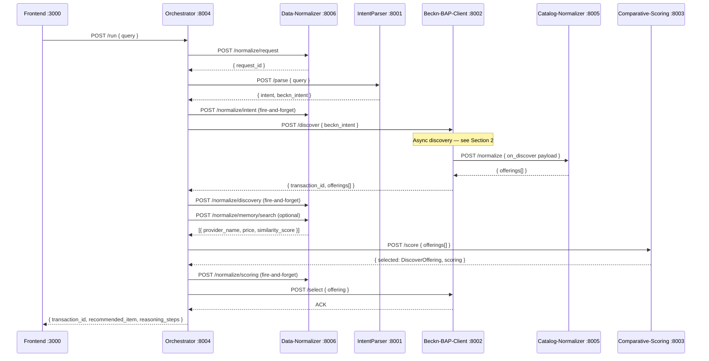
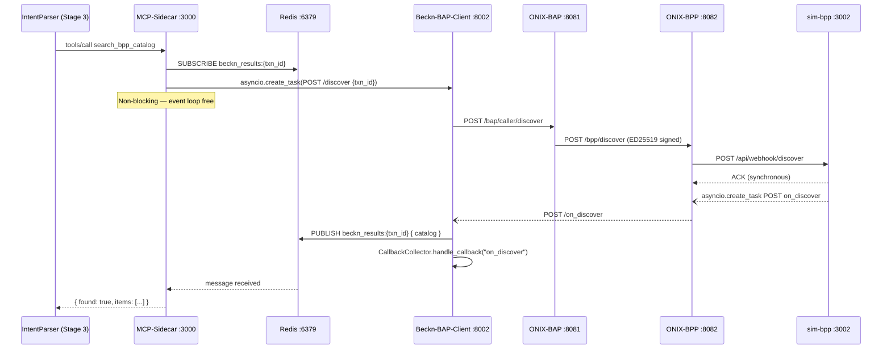
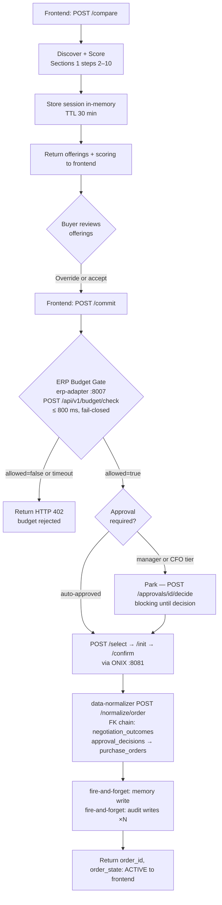
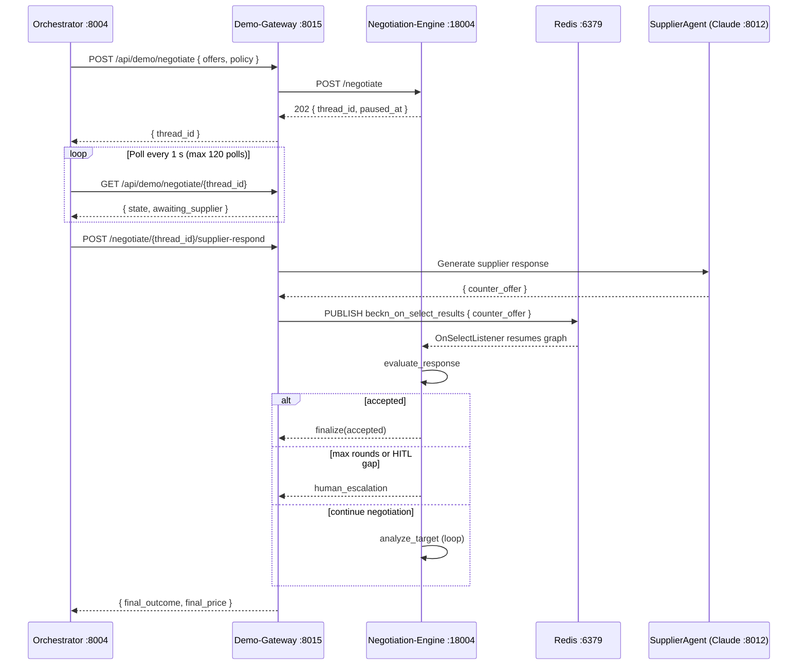
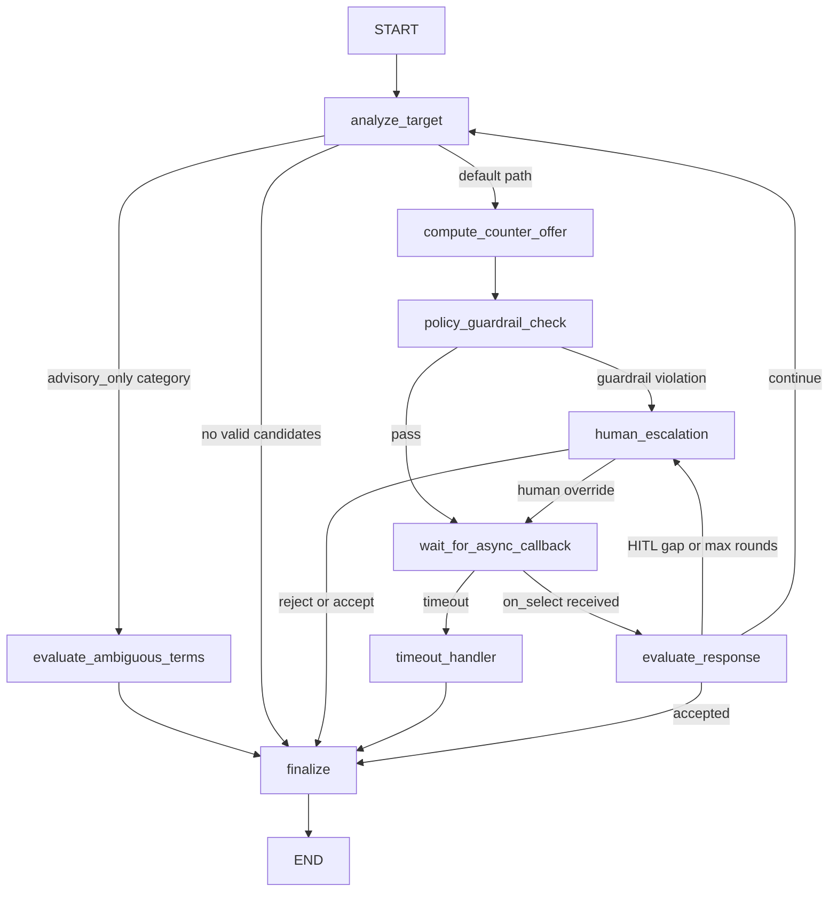
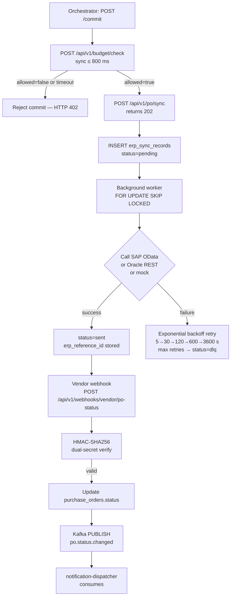
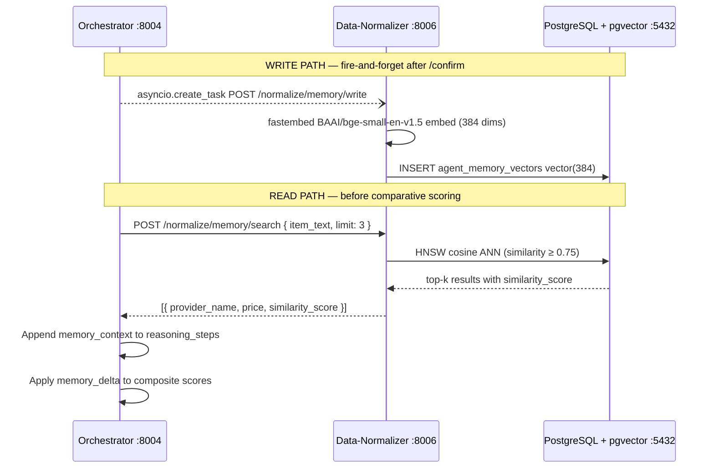
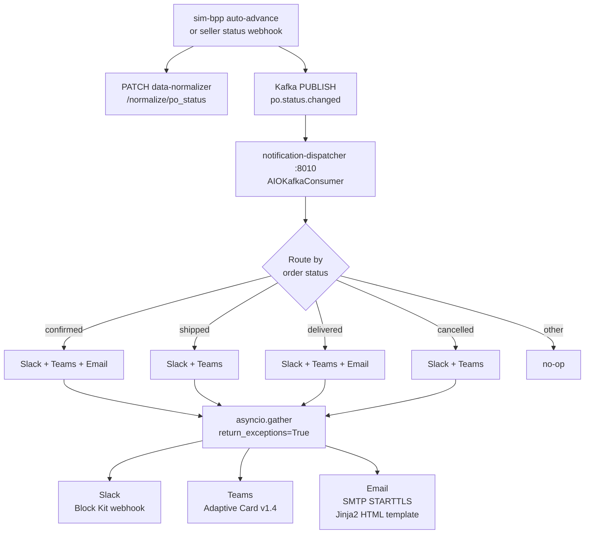

# Data Flow Reference

This document describes every major data flow in the Procurement Agent system. Each section is self-contained: a developer new to the project can read any section without having read the others first. Numbered steps map directly to the accompanying Mermaid diagram.

**Related documents**

| Document | Covers |
|---|---|
| [ARCHITECTURE.md](ARCHITECTURE.md) | Service topology, logical layers, port map |
| [PROJECT_OVERVIEW.md](PROJECT_OVERVIEW.md) | Goals, phases, and stakeholder context |
| [GLOSSARY.md](GLOSSARY.md) | Term definitions used throughout |

**Key invariants that apply to every flow**

- `transaction_id` is a UUID generated once and propagated through every layer. Reuse is prohibited — Beckn pub/sub channels are keyed on it, and a reused ID delivers one transaction's catalog to a stale subscriber.
- All Beckn traffic passes through `onix-bap :8081`. No service posts directly to `sim-bpp :3002` or any external BPP.
- `data-normalizer :8006` is the sole write path into PostgreSQL. All `_persist_*` calls in the orchestrator use `asyncio.create_task` (fire-and-forget, 5 s timeout) and never raise on failure.
- `Contract.status.code` on `/confirm` must be `ACTIVE`. The valid enum is `DRAFT | ACTIVE | CANCELLED | COMPLETE`. ONIX rejects `CONFIRMED` and all other values.

---

## 1. Main Procurement Happy Path

The full end-to-end sequence from a buyer's natural-language query to a confirmed purchase order. This is the `/run` path in the orchestrator (see also the two-phase `/compare` + `/commit` variant in [Section 3](#3-compare--commit-two-phase-flow)).

### Steps

1. The frontend posts `{ query: "300 meters Cat6 UTP cable Mumbai 5 days" }` to `orchestrator :8004 POST /run`.
2. The orchestrator calls `data-normalizer :8006 POST /normalize/request` to create a `procurement_requests` row and obtain a `request_id`. This is a fire-and-forget call; the pipeline continues immediately.
3. The orchestrator calls `intention-parser :8001 POST /parse` with the raw query.
   - **Stage 1 — Intent classification:** `qwen3:8b` (local) or `qwen3:1.7b` (Docker override) classifies intent as `procurement`, `unknown`, or `emergency`. Non-procurement queries return `intent=unknown` and the pipeline halts.
   - **Stage 2 — BecknIntent extraction:** `qwen3:8b` (complex queries) or `qwen3:1.7b` (simple queries) extracts a `BecknIntent` with fields `item`, `quantity`, `location_coordinates` (`"lat,lon"` decimal), `delivery_timeline` (int hours), and `budget_constraints` (`{max, min}`).
   - Stage 3 validation runs only on `/parse/full`; see [Section 2](#2-beckn-async-discovery-flow-adr-0001) for the sub-flow.
4. The orchestrator calls `data-normalizer :8006 POST /normalize/intent` to persist `parsed_intents` and `beckn_intents`.
5. The orchestrator calls `beckn-bap-client :8002 POST /discover` with the `BecknIntent`. Discovery is asynchronous — the Beckn protocol returns only an ACK; see [Section 2](#2-beckn-async-discovery-flow-adr-0001) for how the catalog arrives.
6. `beckn-bap-client` calls `catalog-normalizer :8005 POST /normalize` to translate the raw `on_discover` catalog payload into a list of `DiscoverOffering` objects.
7. The orchestrator calls `data-normalizer :8006 POST /normalize/discovery` to persist `discovery_queries` and `seller_offerings`.
8. The orchestrator optionally calls `data-normalizer :8006 POST /normalize/memory/search` to fetch up to three similar past transactions from `agent_memory_vectors` (cosine ANN, threshold ≥ 0.75). Results inject `memory_context` into `reasoning_steps`. See [Section 6](#6-agent-memory-learning-flywheel) for the full memory sub-system.
9. The orchestrator calls `comparative-scoring :8003 POST /score` with the offering list. The service forwards to `prediction-api :8004` (RankNet ML, Phase 2 MLOps stack); on failure or when `SCORING_FALLBACK_ENABLED=true`, falls back to cheapest-wins heuristic.
10. The orchestrator calls `data-normalizer :8006 POST /normalize/scoring` to persist `scored_offers`.
11. The orchestrator calls `beckn-bap-client :8002 POST /select` with the chosen offering. ONIX routes `/select` to `sim-bpp :3002`, which returns `ACCEPTED`.
12. The orchestrator returns the full result to the frontend including `transaction_id`, `recommended_item`, and `reasoning_steps`.
13. On buyer approval (or automatically in `autonomous` mode), the orchestrator executes the commit phase — see [Section 3](#3-compare--commit-two-phase-flow).



> **Docker LLM routing note:** Inside the `intention-parser` container, `docker-compose.yml` sets both `COMPLEX_MODEL` and `SIMPLE_MODEL` to `qwen3:1.7b`, silently disabling complexity routing. The `qwen3:8b` model is only used when IntentParser runs locally outside Docker.

---

## 2. Beckn Async Discovery Flow (ADR-0001)

Beckn Protocol v2.0.0 makes discovery inherently asynchronous: `POST /discover` to ONIX returns only an ACK, and the catalog arrives later via an `on_discover` webhook callback. This section documents why a naïve implementation deadlocks and how ADR-0001 solves it.

### The deadlock problem

If the MCP sidecar `await`s the `POST /discover` HTTP call while also waiting for the `on_discover` webhook to arrive, the asyncio event loop is blocked. The webhook handler — which runs in the same loop — can never be scheduled, so the catalog never arrives, and the `await` never resolves.

### The solution — Redis Pub/Sub on per-transaction channels

The subscriber is opened **before** the discovery request is fired. The Redis channel name pattern is `beckn_results:{transaction_id}`. The five-step protocol:

1. Generate a UUID `transaction_id`.
2. **Subscribe** to `beckn_results:{transaction_id}` before sending anything.
3. Fire `asyncio.create_task(POST /discover { transaction_id, ... })` — **not** `await`. The task is non-blocking; the event loop remains free.
4. The `on_discover` handler in `beckn-bap-client` publishes the catalog payload to `REDIS PUBLISH beckn_results:{transaction_id}`.
5. The sidecar's Redis subscriber receives the message and returns the catalog to IntentParser Stage 3.

### Full sequence (MCP sidecar path)



### Dual unblock path

The `/on_discover` handler unblocks two independent waiters:

| Waiter | Mechanism | Used by |
|---|---|---|
| MCP sidecar (Stage 3) | `REDIS PUBLISH beckn_results:{txn_id}` | IntentParser pgvector + probe path |
| Orchestrator (`/run`) | `CallbackCollector.handle_callback("on_discover")` | Main happy-path (Section 1) |

### Timeout behaviour

| Env var | Default | Governs |
|---|---|---|
| `REDIS_RESULT_TIMEOUT` | 15 s | Primary latency ceiling for the MCP sidecar SUBSCRIBE wait |
| `MCP_BAP_TIMEOUT` | 8 s | Safety valve on the HTTP fire-and-forget task only |

If no Redis message arrives within `REDIS_RESULT_TIMEOUT`, the sidecar returns `{ found: false, items: [], probe_latency_ms: 15000 }`. If Redis is unavailable entirely, `beckn-bap-client` logs a warning and falls through to `CallbackCollector` only; the MCP sidecar still times out and returns `found: false`.

---

## 3. Compare / Commit Two-Phase Flow

The frontend separates discovery and scoring (Phase 1 — advisory) from the binding confirm action (Phase 2 — commit), enabling a human review step before spending is committed.

### Phase 1 — Compare

1. The frontend posts `{ beckn_intent }` (or a raw query) to `orchestrator :8004 POST /compare`.
2. The orchestrator executes Steps 2–10 from [Section 1](#1-main-procurement-happy-path): persist request, parse intent, discover, score.
3. The orchestrator stores the session under `transaction_id` with a 30-minute TTL in an in-memory dict (`_sessions`, `_session_times`). This state is not durable — a container restart clears all pending sessions.
4. Returns `{ transaction_id, offerings[], recommended_item_id, scoring, reasoning_steps }` to the frontend.

### Phase 2 — Commit

1. The buyer reviews the ranked offerings and may override `recommended_item_id` with `chosen_item_id`.
2. The frontend posts `{ transaction_id, chosen_item_id }` to `orchestrator :8004 POST /commit`.
3. **ERP Budget Gate (synchronous, ≤ 800 ms, fail-closed):** The orchestrator calls `erp-adapter :8007 POST /api/v1/budget/check`. If `ERP_BUDGET_CHECK_REQUIRED=true` (default) and the gate returns `allowed: false` or times out, the commit is rejected with HTTP 402. In Docker dev stacks, `docker-compose.yml` sets `ERP_BUDGET_CHECK_REQUIRED=false` to keep the pipeline unblocked. See [Section 5](#5-erp-integration-flow) for the full ERP flow.
4. The orchestrator loads the session and resolves the chosen offering.
5. The orchestrator calls `beckn-bap-client :8002 POST /select` → ONIX → `sim-bpp` (returns `ACCEPTED`).
6. The orchestrator calls `beckn-bap-client :8002 POST /init` with buyer billing and fulfillment details → ONIX → `sim-bpp` (returns `ACTIVE`).
7. The orchestrator calls `beckn-bap-client :8002 POST /confirm` with payment terms → ONIX → `sim-bpp` (returns `ACTIVE`, `order_id`).
8. The orchestrator calls `data-normalizer :8006 POST /normalize/order` to persist the full FK chain: `negotiation_outcomes (strategy=skipped)` → `approval_decisions (auto_approved)` → `purchase_orders`.
9. Fire-and-forget: `asyncio.create_task(_persist_memory(...))` — writes the confirmed transaction to `agent_memory_vectors`. See [Section 6](#6-agent-memory-learning-flywheel).
10. Fire-and-forget: multiple `_persist_audit(...)` calls write events to `audit_trail_events`. The `confirm` and `order_confirmed` event types are written here.
11. Returns `{ transaction_id, order_id, order_state: "ACTIVE", status: "live" }`.



### Approval routing thresholds

| Condition | Route |
|---|---|
| `amount ≤ requester.approval_threshold` | Auto-approved |
| `amount > requester.threshold AND ≤ approver.threshold` | Manager approval |
| `amount > approver.threshold` | CFO approval |
| `is_emergency = TRUE` | CFO approval + 60-minute deadline |

---

## 4. Automated Negotiation Flow

Autonomous price negotiation is a LangGraph state machine inside `negotiation_engine :18004`. It runs only on the `POST /run` path when `decision.requires_negotiation=True`; the `/compare` + `/commit` two-phase flow does not invoke it.

### Routing chain

The orchestrator does **not** call `negotiation_engine` directly. The call chain is:

```
orchestrator :8004
  → demo-gateway :8015  POST /api/demo/negotiate
    → negotiation_engine :18004  POST /negotiate
      → Redis channel beckn_on_select_results  (async resume)
```

The `claude_openai_proxy :8012` (a host-local process, not Dockerized) backs the `SupplierAgent` inside `demo-gateway`. Containers reach it via `host.docker.internal:8012`. If the proxy is not running, negotiation fails silently.

### Steps

1. Orchestrator calls `DEMO_GATEWAY_URL /api/demo/negotiate` (env var default `http://localhost:8015`) with `{ ranked_offers, policy: { max_discount_pct: 0.20 }, max_rounds: 3 }`.
2. `demo-gateway` forwards to `negotiation_engine :18004 POST /negotiate`. The engine returns `202 { thread_id, paused_at: "wait_for_async_callback" }` immediately.
3. The LangGraph state machine runs inside `negotiation_engine`:
   - **`analyze_target`**: determines category (`commodity / it_equipment / specialized / medical / unknown`) and base discount profile.
   - **`compute_counter_offer`**: calculates a counter-offer price. Three independent guardrail layers apply:
     - L1 Pydantic field constraint: `discount_pct ∈ [0.0, 0.20]`.
     - L2 `validate_counter_offer()`: G1 (20% absolute cap), G2 (category cap), G3 (supplier cap), G5 (lead time), G6 (quantity).
     - L3 ONIX schema validation.
   - **`policy_guardrail_check`**: routes to `human_escalation` (HITL interrupt) on any violation; otherwise parks at `wait_for_async_callback`.
4. The orchestrator polls `GET {DEMO_GATEWAY_URL}/api/demo/negotiate/{thread_id}` every 1 s (up to 120 polls).
5. When `state.paused_at == "wait_for_async_callback"` and `state.awaiting_supplier == True`, the orchestrator calls `POST {DEMO_GATEWAY_URL}/api/demo/negotiate/{thread_id}/supplier-respond`.
6. `demo-gateway` invokes the `SupplierAgent` (Claude via `claude_openai_proxy :8012`) to generate a supplier counter-offer response.
7. `demo-gateway` publishes the supplier response to Redis channel `beckn_on_select_results`.
8. `OnSelectListener` in `negotiation_engine` receives the Redis message and calls `graph.ainvoke(Command(resume=payload))`, resuming the parked LangGraph graph.
9. **`evaluate_response`**: if gap ≤ threshold → `finalize (accepted)`; if gap > HITL threshold or max rounds reached → `human_escalation`; otherwise → loop back to `analyze_target`.
10. On `finalize`, the orchestrator receives the negotiated price and proceeds to the commit step in [Section 3](#3-compare--commit-two-phase-flow).



### LangGraph node graph



### Category discount profiles

| Category | Base discount | Mode |
|---|---|---|
| `commodity` | 10% | Negotiate |
| `specialized` | 5% | Negotiate |
| `unknown` | 5% | Negotiate |
| `it_equipment` | 0% | Advisory only |
| `medical` | 0% | Advisory only |

> **Audit gap:** No `_persist_audit` call exists inside `_run_autonomous_negotiation`. The `negotiate` audit event type is never written by the orchestrator. Negotiation outcomes are recorded only in the `negotiation_outcomes` table via the order persistence chain.

---

## 5. ERP Integration Flow

The ERP integration has two sub-flows that run at different points in the commit path: a synchronous budget gate that blocks the commit, and an asynchronous PO push via an outbox pattern that does not.

### 5a. Budget Gate (synchronous, ≤ 800 ms)

1. The orchestrator (commit path, Step 3 in [Section 3](#3-compare--commit-two-phase-flow)) calls `erp-adapter :8007 POST /api/v1/budget/check` with `{ amount_total, cost_center, currency }`.
2. `erp-adapter` routes to the configured ERP vendor (`mock / SAP / Oracle`) via the `ERPAdapter` Protocol (selected by `ERP_VENDORS` env var).
3. In production SAP mode: OAuth2 `client_credentials` token fetch → OData `API_PURCHASEORDER_PROCESS_SRV` budget check endpoint.
4. Per-vendor `pybreaker` circuit breaker trips to OPEN after 5 consecutive failures and auto-probes after 60 s.
5. Hard wall: `BUDGET_CHECK_TOTAL_TIMEOUT_MS=800`. If ERP is unreachable and `ERP_BUDGET_CHECK_REQUIRED=true`, the gate returns `allowed: false` (fail-closed). Set `ERP_BUDGET_CHECK_REQUIRED=false` for a fail-open dev environment.
6. Returns `{ allowed: bool, available_balance, hold_id }`.

### 5b. PO Push (asynchronous outbox)

1. The orchestrator calls `erp-adapter :8007 POST /api/v1/po/sync` with `{ transaction_id, po_details }`. Returns `202` immediately.
2. `erp-adapter` inserts a row into `erp_sync_records` with `status=pending`.
3. Background worker polls `erp_sync_records` using `FOR UPDATE SKIP LOCKED` (concurrency-safe), picks up `pending` rows.
4. Worker calls the ERP vendor REST/OData API to create the PO.
5. On success: updates `erp_sync_records.status=sent`, stores `erp_reference_id`.
6. On failure: increments `retry_count`, applies exponential backoff (`WORKER_BACKOFF_CSV=5,30,120,600,3600` seconds). After max retries: `status → dlq` (dead-letter queue). If the database schema is absent, falls back to `InMemoryOutboxRepo` — POs are not durable in that mode.
7. Vendor webhook arrives at `erp-adapter POST /api/v1/webhooks/{vendor}/po-status`.
8. HMAC-SHA256 dual-secret verification: tries `{VENDOR}_WEBHOOK_HMAC_SECRET` first, then `{VENDOR}_WEBHOOK_HMAC_SECRET_NEXT` for zero-downtime rotation.
9. On a valid webhook: updates `purchase_orders.status`, publishes to Kafka topic `po.status.changed` (primary) or Redis key `po.status_changed:{txn_id}` (fallback when Kafka is unavailable).
10. `notification-dispatcher :8010` consumes the Kafka event — see [Section 7](#7-notification-dispatch-flow).



---

## 6. Agent Memory Learning Flywheel

The agent memory system enables time-decayed supplier loyalty adjustments in scoring. The pattern is **write on confirm, read before score**: past transactions are embedded and stored at purchase time, then retrieved by ANN search before comparative scoring to influence the recommendation.

### Write path (triggered after `/confirm`)

1. After a successful `POST /confirm`, the orchestrator calls `asyncio.create_task(_persist_memory(...))` — fire-and-forget; never awaited; never raises.
2. `_persist_memory` posts to `data-normalizer :8006 POST /normalize/memory/write` with `{ item, provider_name, price, currency, delivery_hours, request_id }`.
3. `data-normalizer` embeds the text summary `"{item} ordered from {provider} at {price} {currency} delivery in {hours}h"` using `BAAI/bge-small-en-v1.5` (fastembed ONNX, 384 dimensions). The first call triggers a ~65 MB model download from HuggingFace (10–30 s cold start).
4. Inserts `vector(384)` into `agent_memory_vectors` with `entity_type='transaction'`, `indexed_at=NOW()`, `source_request_id`.
5. Returns `{ stored: true }`. Embedding failures are silently swallowed — the endpoint never errors due to embedding failure.

> **Database migration note:** The `embedding_model_type` ENUM in `database/sql/00_extensions_and_types.sql` does not include `BAAI/bge-small-en-v1.5`. Migration `22_agent_memory_vector_dim.sql` adds it. Without this migration applied, the INSERT will fail. The column default remains `text-embedding-3-large` even after migration 22.

### Read path (triggered before scoring)

1. After discovery, before scoring (Step 8 in [Section 1](#1-main-procurement-happy-path)), the orchestrator calls `_fetch_memory_context(raw_query, limit=3)` with a 5 s timeout.
2. Posts to `data-normalizer :8006 POST /normalize/memory/search` with `{ item_text, limit: 3 }`.
3. `data-normalizer` performs a pgvector HNSW cosine ANN search against `agent_memory_vectors`. Items with similarity < 0.75 are filtered out.
4. Returns up to three past transactions with `similarity_score`, `provider_name`, and `price`.
5. The orchestrator appends `reasoning_steps += [{ node: "memory_context", role: "observe", content: [...hits] }]`.
6. If the top recommendation changes after memory adjustments, an additional `{ node: "memory_adjustment", role: "reason" }` step is appended.

### Scoring delta formula

For each provider found in the memory results, a loyalty bonus is added to the composite score:

```
memory_delta(provider) = Σ [ 0.03 × exp(−days_old × ln(2) / 90) ]
                         over past POs for this provider (max 5 past orders)
                         capped at ± 0.10
```

New providers receive `delta = 0`. The half-life is 90 days. The volume cap of five past orders prevents runaway loyalty bias.



---

## 7. Notification Dispatch Flow

After a purchase order is confirmed, status changes flow through sim-bpp auto-advance simulation (or a real seller webhook), Kafka, and the notification dispatcher. Each channel operates independently; one channel's failure never blocks the others.

### Order lifecycle (sim-bpp auto-advance)

When `SIM_BPP_AUTO_ADVANCE=true` (the default in `docker-compose.yml`), `sim-bpp :3002` automatically advances confirmed orders through a lifecycle every `SIM_BPP_ADVANCE_INTERVAL_SECS` seconds (default 5 s):

```
ACCEPTED → PACKED → SHIPPED → OUT_FOR_DELIVERY → DELIVERED
```

For each transition, `sim-bpp`:

1. Patches `data-normalizer :8006 PATCH /normalize/po_status` with the new status.
2. Publishes to Kafka topic `po.status.changed`.

### Notification routing rules

| Order status | Slack | Teams | Email |
|---|---|---|---|
| `confirmed` | yes | yes | yes |
| `shipped` | yes | yes | no |
| `delivered` | yes | yes | yes |
| `cancelled` | yes | yes | no |
| anything else | no | no | no |

### Fan-out steps

1. `notification-dispatcher :8010` `AIOKafkaConsumer` receives an event from `po.status.changed`. Malformed messages are logged as `WARNING` and skipped; there is no dead-letter queue.
2. Normalises the status field: tries `po_status` key first; `state` key as fallback.
3. Determines the channel set from the routing table above.
4. Calls `asyncio.gather([slack_task, teams_task, email_task], return_exceptions=True)` — channels are fully independent.
5. **Slack:** Block Kit message with header (emoji by status) + section (order_id, transaction_id, source, observed_at), posted to `SLACK_WEBHOOK_URL`.
6. **Teams:** Adaptive Card v1.4, posted to `TEAMS_WEBHOOK_URL`. Colour: `good` for `confirmed/delivered`, `accent` for `shipped`, `attention` for `cancelled`.
7. **Email:** Jinja2 HTML template (`email_confirmed.html`, `email_delivered.html`, or `email_generic.html`) sent via SMTP STARTTLS. Recipient is resolved from the database: `purchase_orders.beckn_confirm_ref = order_id` → FK chain → `users.email`. If the database is unavailable or no match is found, the email channel is silently skipped without affecting Slack or Teams.



---

## Known Data Flow Anomalies

The following discrepancies between documentation and as-built behaviour are confirmed by code inspection and affect operational understanding of the flows above.

| Anomaly | Affected flow | Impact |
|---|---|---|
| `COMPLEX_MODEL=qwen3:1.7b` in `docker-compose.yml` overrides the local default of `qwen3:8b` | Section 1 (IntentParser Stage 2) | Complexity routing is silently disabled in Docker; all queries use the smaller model regardless of classification |
| `negotiate` audit event type is never written by the orchestrator | Section 4 (Negotiation) | Negotiation decisions are absent from the audit trail; SOX reconstruction is incomplete for negotiated orders |
| `catalog-normalizer` LLM fallback uses Ollama at `OLLAMA_URL`, not OpenAI | Section 1 (catalog normalization) | `OPENAI_API_KEY` is irrelevant; operators who set it expecting LLM fallback via OpenAI will see no effect |
| `claude_openai_proxy :8012` is a host-local process absent from `docker-compose.yml` | Section 4 (Negotiation) | Demo and negotiation flows fail silently if the proxy is not started manually |
| `DEMO_GATEWAY_URL` defaults to `http://localhost:8015` in `workflow.py`; the service README states port 8005 | Section 4 (Negotiation) | Autonomous negotiation fails unless `DEMO_GATEWAY_URL` is explicitly set to the correct port |
| `embedding_model_type` ENUM missing `all-MiniLM-L6-v2` and `BAAI/bge-small-en-v1.5` until migration `22_agent_memory_vector_dim.sql` is applied | Section 6 (Memory) | INSERT into `agent_memory_vectors.embedding_model` fails on a fresh database that has not run migration 22 |
| `discovery_engine :8006` is fully implemented but absent from `docker-compose.yml` and has no callers | Not active in any flow | Multi-network discovery fan-out is not operational; port 8006 conflicts with `data-normalizer` |
