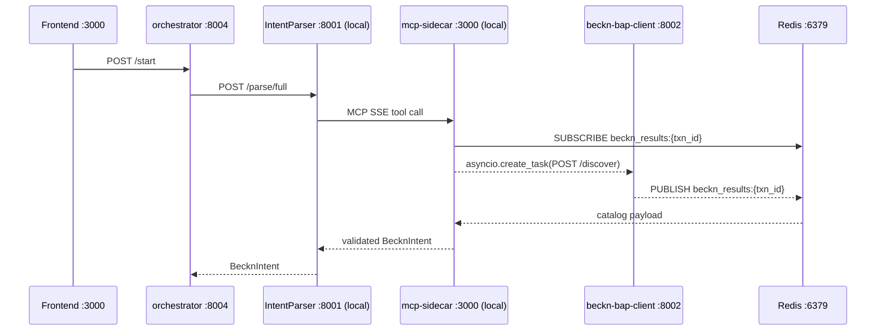

# Installation Guide

This guide walks a developer through setting up the Procurement Agent from scratch on a local machine. It covers all prerequisites, the Python and LLM environment, the PostgreSQL database, the Docker stack, and the two local services that run outside Docker. Follow the sections in order — later steps depend on earlier ones.

For a map of how all services relate to each other, see [Architecture](ARCHITECTURE.md). For an explanation of every environment variable across all services, see [Environment Reference](ENVIRONMENT.md).

---

## 1. Prerequisites

Install and verify each tool before proceeding.

| Requirement | Minimum version | Purpose | Notes |
|---|---|---|---|
| Docker Engine + Compose v2 | Latest stable | Runs the 18-service `beckn_network` stack | `docker compose version` must show v2.x — the legacy `docker-compose` binary is not supported |
| Conda (Miniconda or Anaconda) | Any current release | Manages the Python environment for the two local services | [Miniconda installer](https://docs.conda.io/en/latest/miniconda.html) |
| Ollama | Latest | Serves qwen3:8b and qwen3:1.7b locally at `:11434` | Must be running as a background daemon; `ollama list` should return without error |
| Git | 2.x | Repository checkout | — |
| Python | 3.11+ | Installed through conda — do not use a system Python | Managed via the `infosys_project` conda environment created in §3 |
| Node.js | 18+ | Frontend only (`npm run dev` in `frontend/`) | Optional if you are not running the Next.js frontend |

---

## 2. Clone and Prepare the Repository

```bash
git clone <repository-url> Procurement-Agent
cd Procurement-Agent
```

The working directory after cloning has this top-level layout:

```
Procurement-Agent/
├── IntentParser/          # Stage 1+2+3 NL → BecknIntent pipeline (local, :8001)
├── services/              # Dockerised microservices + mcp-sidecar (local, :3000)
├── database/              # 24 SQL migrations + setup_database.py
├── config/                # ONIX routing YAMLs for onix-bap / onix-bpp
├── frontend/              # Next.js 13 buyer-facing app
├── shared/                # Cross-service Pydantic models (BecknIntent, etc.)
├── .env.example           # Root environment template
└── docker-compose.yml     # 18-service stack
```

All commands in this guide run from the repository root unless a `cd` is shown.

---

## 3. Python Environment Setup

Both local services (IntentParser and mcp-sidecar) share the `infosys_project` conda environment.

**Create and activate the environment:**

```bash
conda create -n infosys_project python=3.11 -y
conda activate infosys_project
```

**Install IntentParser dependencies:**

```bash
pip install -r IntentParser/requirements.txt
```

**Install mcp-sidecar dependencies:**

```bash
pip install -r services/mcp-sidecar/requirements.txt
```

You must activate this environment in every terminal where you start IntentParser or mcp-sidecar. The Docker containers manage their own dependencies independently and do not use the conda environment.

---

## 4. Pull LLM Models with Ollama

IntentParser uses two models for the intent classification and extraction pipeline: `qwen3:8b` for complex queries and `qwen3:1.7b` for simpler ones. Both must be present before starting the service.

```bash
ollama pull qwen3:8b
ollama pull qwen3:1.7b
```

These are large downloads (qwen3:8b is approximately 5 GB). Run the pulls before continuing.

**Verify that both models are available:**

```bash
ollama list
```

Expected output includes both model names in the `NAME` column:

```
NAME           ID              SIZE    MODIFIED
qwen3:8b       ...             5.2 GB  ...
qwen3:1.7b     ...             1.1 GB  ...
```

> **Docker note:** The `intention-parser` container reaches Ollama at `http://host.docker.internal:11434/v1`. The full three-stage pipeline (Stage 3 pgvector + MCP sidecar validation) only runs when IntentParser is started locally, not in its Docker wrapper. Stage 3 requires qwen3:8b for complex-query routing — the Docker override collapses both tiers to qwen3:1.7b.

---

## 5. Environment Variables

**Copy the root template:**

```bash
cp .env.example .env
```

Edit `.env` and set these values for a working development setup:

| Variable | Example value | Required for | Notes |
|---|---|---|---|
| `DB_HOST` | `localhost` | Database setup and local services | Use `localhost` when connecting from the host; Docker containers use `host.docker.internal` (set automatically by docker-compose) |
| `DB_PORT` | `5432` | Database | Default PostgreSQL port |
| `DB_NAME` | `procurement_agent` | Database | Main procurement database name |
| `DB_USER` | `postgres` | Database | PostgreSQL superuser |
| `DB_PASSWORD` | `postgres123` | Database | Change before any production deployment |
| `BAP_API_KEY` | `dev-key` | mcp-sidecar | Any non-empty string works in development; the sidecar refuses to start without it |
| `REDIS_URL` | `redis://localhost:6379` | mcp-sidecar | Must also be exported as a real shell variable (see §8) |
| `REDIS_RESULT_TIMEOUT` | `15` | mcp-sidecar | Seconds to wait for a Beckn discovery callback; must also be a real shell variable |

The `ANTHROPIC_API_KEY` is optional. When set, it enables Claude Sonnet 4.6 as a last-resort Stage 3 query-broadening fallback in IntentParser. Without it, Stage 3 uses regex-only broadening.

For the complete list of environment variables across all 18 services — including production-required secrets, ERP integration variables, and Keycloak OIDC configuration — see [Environment Reference](ENVIRONMENT.md).

---

## 6. Database Initialization

The main `procurement_agent` database runs outside the Docker stack (on the host, or in a standalone named container). Docker containers reach it via `host.docker.internal:5432`.

### 6.1 Start a PostgreSQL container with pgvector

```bash
docker run -d \
  --name procurement-postgres \
  -e POSTGRES_USER=postgres \
  -e POSTGRES_PASSWORD=postgres123 \
  -e POSTGRES_DB=procurement_agent \
  -p 5432:5432 \
  pgvector/pgvector:pg16
```

This container must be running before `setup_database.py` is executed and must remain running whenever any service queries the database.

### 6.2 Apply all migrations

```bash
cd database
export $(grep -v '^#' .env | xargs)
python setup_database.py --create-db
```

The `--create-db` flag creates `procurement_agent` if it does not exist (requires the `CREATEDB` privilege held by the `postgres` superuser). Without the flag, the script assumes the database already exists.

`setup_database.py` reads every `.sql` file in `database/sql/` in lexicographic order and executes them against the database. The 24 files are numbered with a `NN_` prefix that matches the foreign-key dependency chain:

| Phase | Files | What is created |
|---|---|---|
| Extensions and types | `00_extensions_and_types.sql` | `uuid-ossp`, `pgcrypto`, `vector` extensions; 20 ENUM types |
| Core tables | `01_` through `16_` | All 16 primary tables: users, requests, intents, discovery, scoring, negotiation, approval, orders, ERP, audit, and vector stores |
| Indexes | `17_indexes.sql` | 22 named B-tree and partial indexes |
| Cache and outbox | `18_`, `19_`, `19b_` | BPP semantic cache table (HNSW index); ERP outbox columns |
| Negotiation schema | `20_negotiation_schema.sql` | Negotiation audit tables (also used by the `postgres` Docker service) |
| Fidelity and corrections | `21_`, `22_`, `22b_` | Order detail columns; agent memory vector dimension correction (3072 → 384); approval-resumption columns |

All migrations are idempotent (`IF NOT EXISTS` / `IF EXISTS` guards). Re-running `setup_database.py` without `--create-db` is safe and applies any new migrations:

```bash
python setup_database.py --continue-on-exists
```

### 6.3 Verify the schema

```bash
pytest test_database.py -v --tb=short -q
```

The test suite runs 67 assertions across 8 test classes covering connection, extensions, ENUM types, tables, indexes, workflow rows, end-to-end queries, and constraints. All 67 should pass on a clean setup.

---

## 7. Start the Docker Stack

Return to the repository root and bring up all 18 services:

```bash
docker compose up -d
```

Check that all containers reach a healthy or running state:

```bash
docker compose ps
```

Expected healthy state — every service should show `running` or `healthy`, not `restarting` or `exited`:

| Service | Host port | Expected status |
|---|---|---|
| `redis` | 6379 | running |
| `onix-bap` | 8081 | healthy (waits for redis) |
| `onix-bpp` | 8082 | healthy (waits for redis) |
| `sim-bpp` | 3002 | running (waits for kafka) |
| `kafka` | 9092 | healthy |
| `beckn-bap-client` | 8002 | running |
| `catalog-normalizer` | 8005 | running |
| `comparative-scoring` | 8003 | running |
| `data-normalizer` | 8006 | running |
| `analytics` | 8009 | running (waits for postgres healthy) |
| `orchestrator` | 8000, 8004 | running |
| `erp-adapter` | 8007 | running |
| `erp-mock` | 8008 | running |
| `negotiation-engine` | 18004 | healthy |
| `demo-gateway` | 8015 | running |
| `postgres` | 55432 | healthy |
| `intention-parser` | 8001 | running |
| `notification-dispatcher` | (none) | running |

> The `postgres` service on host port 55432 holds only the `negotiation` database used by the negotiation engine. It is distinct from the `procurement-postgres` container started in §6 which holds `procurement_agent`.

If only Beckn discovery infrastructure is needed (for IntentParser development without the full pipeline), a lighter subset suffices:

```bash
docker compose up -d redis onix-bap onix-bpp sim-bpp
```

Tail logs for a specific service:

```bash
docker compose logs -f beckn-bap-client
```

---

## 8. Start Local Services

Two services run outside Docker and must be started in separate terminals with the conda environment active. They implement parts of the pipeline that require direct access to the host's Ollama daemon and local Redis.



### Terminal 1 — IntentParser

```bash
conda activate infosys_project
cd IntentParser
uvicorn api:app --port 8001 --reload
```

IntentParser runs the full three-stage pipeline: LLM intent classification (Stage 1), BecknIntent extraction (Stage 2), and pgvector ANN + MCP sidecar validation (Stage 3). The `--reload` flag restarts the server automatically when source files change. Ollama must be running before this starts.

### Terminal 2 — mcp-sidecar

`REDIS_URL` and `REDIS_RESULT_TIMEOUT` must be exported as real shell variables, not only present in `.env`. The sidecar reads them with `os.getenv()` in `bap_client.py`, bypassing the Pydantic Settings loader.

```bash
conda activate infosys_project
cd services/mcp-sidecar
export BAP_API_KEY="dev-key"
export REDIS_URL="redis://localhost:6379"
export REDIS_RESULT_TIMEOUT="15"
uvicorn server:app --port 3000
```

The sidecar will refuse to start if `BAP_API_KEY` is empty or unset. Any non-empty string is valid in development.

---

## 9. Smoke Test

With all services running, send a natural-language procurement query to IntentParser:

```bash
curl -X POST http://localhost:8001/parse/full \
  -H "Content-Type: application/json" \
  -d '{"query": "300 meters Cat6 UTP cable Mumbai 5 days"}'
```

**Healthy response shape:**

```json
{
  "status": "success",
  "intent": {
    "item": "Cat6 UTP cable",
    "quantity": 300,
    "unit": "meters",
    "location_coordinates": "19.0760,72.8777",
    "delivery_timeline": 120,
    "budget_constraints": {
      "max": null,
      "min": null
    },
    "currency": "INR",
    "compliance_requirements": []
  },
  "validation_result": {
    "status": "VALIDATED",
    "confidence": 0.91
  }
}
```

Key fields to check:

| Field | Expected | If wrong |
|---|---|---|
| `status` | `"success"` | A `"error"` with a stack trace points to an Ollama connectivity or model-not-found error |
| `intent.delivery_timeline` | An integer (hours, not a string like `"5 days"`) | IntentParser is using an old `BecknIntent` model; check `shared/models.py` |
| `intent.location_coordinates` | `"lat,lon"` decimal pair | Stage 2 extraction defaulted; Ollama may be under load |
| `validation_result.status` | `"VALIDATED"`, `"AMBIGUOUS"`, or `"CACHE_MISS"` | `"CACHE_MISS"` on the first run is normal — the semantic cache is empty |

A `503` or connection-refused response from `:8001` means IntentParser is not running or crashed on startup.

---

## 10. Troubleshooting Installation

| Symptom | Likely cause | Fix |
|---|---|---|
| `docker compose ps` shows a service in `restarting` | Missing env var or upstream dependency not yet healthy | Run `docker compose logs <service>` to see the startup error; check that all `depends_on` targets are healthy |
| `onix-bap` or `onix-bpp` crashes immediately | Redis not ready at startup | Run `docker compose up -d redis` first, wait for it to show `running`, then `docker compose up -d onix-bap onix-bpp` |
| `setup_database.py` fails with `FATAL: database "procurement_agent" does not exist` | `--create-db` flag omitted on first run | Re-run with `python setup_database.py --create-db` |
| `setup_database.py` fails with `could not connect to server` | `procurement-postgres` container not running | Run the `docker run` command from §6.1, then retry |
| IntentParser returns `{"error": "model not found"}` | Ollama model not pulled | Run `ollama pull qwen3:8b && ollama pull qwen3:1.7b` |
| mcp-sidecar exits immediately with `BAP_API_KEY is required` | Environment variable not set | `export BAP_API_KEY="dev-key"` in the same terminal before `uvicorn` |
| Smoke test returns `{"found": false}` for validation | `REDIS_URL` or `REDIS_RESULT_TIMEOUT` not exported as shell variables | Export both with `export` (not just in `.env`) before starting the sidecar |
| `pytest test_database.py` fails on extension tests | pgvector extension not available in the PostgreSQL image | Confirm you used `pgvector/pgvector:pg16` (not `postgres:16`) in the `docker run` command |
| `analytics` container shows `unhealthy` | `postgres` service (negotiation DB) still initialising | Wait 30–60 seconds for the `postgres` health check to pass; analytics depends on it |
| Docker containers cannot reach Ollama | Ollama bound to loopback only | On Linux, Ollama defaults to `127.0.0.1`; set `OLLAMA_HOST=0.0.0.0` in Ollama's service config so containers can reach it via `host.docker.internal` |

For issues beyond initial installation — Beckn protocol errors, ONIX routing failures, database schema conflicts — see [Troubleshooting](TROUBLESHOOTING.md).
