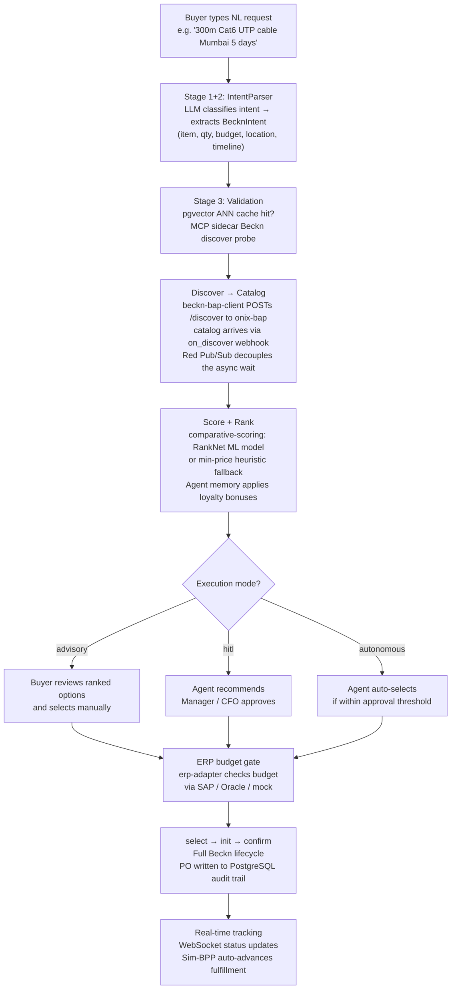

# Project Overview — Agentic AI Procurement Agent on Beckn Protocol

> **Self-contained reading.** This document describes what the system is, who uses it, how it works at a high level, and why the core technology choices were made. For the low-level architecture see [Architecture](ARCHITECTURE.md). For API contracts see [API Reference](API_REFERENCE.md). For service-by-service details see the individual `services/*/README.md` files.

---

## 1. Problem Statement

Enterprise procurement is a high-latency, high-friction process. Buyers enter RFQs into closed platforms (SAP Ariba, Coupa, Oracle Procurement Cloud), wait days for supplier responses, manually compare quotes, escalate approvals through email chains, and re-key approved orders into ERP systems. The entire cycle — from identifying a need to receiving a confirmed purchase order — typically takes 3–30 business days for non-catalogue purchases.

The core problem has two dimensions:

1. **Protocol lock-in.** Each procurement platform requires bilateral EDI or API integration agreements with every supplier. Small or new suppliers cannot participate without significant integration cost. Buyers are therefore restricted to a supplier roster determined by past IT investment, not current market quality or price.
2. **Manual translation work.** Procurement professionals spend a disproportionate share of their time reformatting natural-language needs into structured RFQ forms, chasing approval signatures, and reconciling purchase orders against ERP budget records. This is automatable work that does not require human judgment.

A Beckn-native procurement agent addresses both dimensions. Beckn Protocol v2.0.0 is an open, interoperable commerce protocol (similar in intent to SMTP for email) that allows any buyer application (BAP) to discover offers from any supplier network (BPP) without bilateral agreements. Combining Beckn with an LLM-driven intent parser and an automated orchestration layer eliminates the manual translation work and opens procurement to any Beckn-registered supplier, not just contracted ones.

---

## 2. Solution Summary

The system accepts a natural-language purchase request — for example, `"300 meters Cat6 UTP cable Mumbai 5 days"` — and drives the full procurement lifecycle to a confirmed purchase order without manual data-entry. The five-step flow is:

Every decision — intent parse, discover results, score rationale, approval decision, Beckn message payloads — is persisted to a SOX 404-compliant audit trail with 7-year retention.

---

## 3. Target Users

| User | Role | Interaction mode |
|---|---|---|
| Corporate buyer (routine) | Procurement officer sourcing standard office supplies, IT consumables, raw materials | Next.js web dashboard; types a natural-language request; reviews ranked options in advisory or hitl mode |
| IT buyer (complex) | IT manager sourcing servers, networking equipment, software licences | Same dashboard; additional CPO benchmarking panel comparing contracted price vs live Beckn market |
| System administrator | Infosys ops engineer or client IT team | Docker Compose stack; environment variable configuration; ERP connector setup |
| Procurement approver | Line manager or CFO | Email / Slack approval notification; approval workflow UI in the dashboard |
| Infosys InStep internship team | Four engineers (Eduardo Garcia Diaz, Cristian, CARBAJE, Emilio) building the reference implementation | Direct API access; local Docker Compose stack; pytest suite |

The primary demo context is the Infosys InStep internship programme. The system is the reference implementation that Infosys intends to productise for enterprise procurement clients targeting the $9.5 B global enterprise procurement software market.

---

## 4. Scope and Constraints

### Programme scope

This is a **16-week Infosys InStep internship project** (April–July 2026). It delivers a functionally complete reference implementation across three phases, with a fourth hardening phase explicitly deferred. It is **not a production system**. All deployment runs on a single developer workstation using Docker Compose. No cloud infrastructure, no Kubernetes cluster, and no live Beckn network registration are part of the current scope.

### What is in scope (Phases 1–3, complete)

- Full Beckn Protocol v2.0.0 lifecycle: `discover → select → init → confirm → status`
- Three-stage NL intent parsing pipeline (LLM classify → LLM extract → hybrid pgvector ANN + MCP sidecar validation)
- Six-service microservices pipeline on the Docker Compose stack
- ML-based comparative scoring (RankNet) with heuristic fallback
- Agent memory with time-decayed supplier loyalty bonuses
- SOX 404-ready audit trail (9 event types, 7-year retention)
- ERP integration: budget gate + PO push outbox, SAP + Oracle + mock surfaces, dual-HMAC webhook rotation, per-vendor circuit breakers
- Autonomous LangGraph price negotiation engine with three-layer guardrails
- RBAC-based approval workflow (advisory / hitl / autonomous modes)
- Real-time order tracking via WebSocket and sim-bpp auto-advance lifecycle
- Analytics dashboard: spend metrics, cycle-time KPIs, CPO benchmarking
- Notification fan-out: Kafka → Slack Block Kit, Teams Adaptive Card, SMTP email

### What is deferred (Phase 4, not started)

Kubernetes / Helm deployment, CI/CD pipeline (GitHub Actions), OWASP pen test, integration test coverage >= 80%, Kafka as primary event bus for audit and ERP, LangSmith LLM tracing, Splunk/SIEM sink, retention enforcement job, and Kong API gateway. See Section 7 for the full phase breakdown.

---

## 5. Key Design Principles

### Async-first throughout

Every service and every new feature ships as a coroutine. The orchestrator pipeline calls downstream microservices concurrently using `aiohttp` sessions. Non-critical side-effects — audit trail writes, agent memory persistence, ERP outbox rows — are fire-and-forget `asyncio.create_task(...)` calls that never block the critical response path. The sync wrapper in `IntentParser.core.parse_request` exists only for legacy test callers and explicitly disables Stage 3. Using `time.sleep()` to "wait for tasks" is explicitly prohibited in `CLAUDE.md` because it blocks the event loop and prevents tasks from running; `await asyncio.sleep(0)` must be used instead.

### Data sovereignty via local LLMs

The original spec called for GPT-4o and OpenAI embeddings, which would route procurement request content (item names, quantities, budgets, vendor names) through a third-party API with associated billing and data-egress risks. All primary inference runs locally: `qwen3:8b` and `qwen3:1.7b` via Ollama for intent classification and extraction; `all-MiniLM-L6-v2` (sentence-transformers) and `BAAI/bge-small-en-v1.5` (fastembed ONNX) for embeddings. Claude Sonnet 4.6 is used only as an opt-in last-resort fallback for Stage 3 query broadening, requiring an explicit `ANTHROPIC_API_KEY`, and is never on the primary pipeline path.

### Event-driven with Redis Pub/Sub for async Beckn discovery

Beckn v2.0.0 discovery is inherently asynchronous: `POST /discover` returns only an ACK, and the actual catalog arrives later via an `on_discover` webhook. A naive blocking wait would deadlock the asyncio event loop. ADR-0001 solves this with Redis Pub/Sub: the MCP sidecar subscribes to a per-transaction channel (`beckn_results:{transaction_id}`) before firing the discover request as `asyncio.create_task`, then awaits the Redis message. The `beckn-bap-client` publishes the catalog to the same channel when the webhook arrives. This decouples the wait without introducing new infrastructure, since Redis is already required for ONIX's internal cache.

### Anti-corruption layer on the domain model

`shared/models.BecknIntent` is the canonical representation of a buyer's intent extracted from natural language. Its types are strictly defined: `delivery_timeline` is `int` hours (not ISO 8601 strings), `location_coordinates` is `"lat,lon"` decimal (not city names), `budget_constraints` is a typed `{max, min}` struct (not raw strings). This ACL prevents NL ambiguities from propagating into Beckn protocol messages and ERP records.

### Vendor-neutral ERP via structural typing

The ERP adapter defines `ERPAdapter` as a Python `typing.Protocol` with six methods. SAP S/4HANA, Oracle ERP Cloud, and a mock stub each implement the protocol independently. Selecting the active adapter is a runtime configuration choice (`ERP_VENDORS` environment variable). Adding a new ERP vendor (e.g., Microsoft Dynamics) requires only implementing the six-method Protocol and registering it in the factory — no changes to the orchestrator, budget-gate logic, or webhook routes.

---

## 6. Technology Choices and Rationale

| Choice | Alternative considered | Why this was chosen |
|---|---|---|
| **qwen3:8b / qwen3:1.7b via local Ollama** (primary LLM) | GPT-4o / GPT-4o-mini (original spec) | Zero per-call cost; offline operation; procurement data never leaves the developer workstation; `instructor` Mode.JSON retry loop handles qwen3 JSON non-conformance; quality sufficient for structured `BecknIntent` extraction |
| **Claude Sonnet 4.6 (opt-in, Stage 3 only)** | General LLM fallback (original spec) | Scope-limited to the `broaden_procurement_query()` recovery path triggered only on ANN cache miss + item not found; not on the hot path; requires explicit `ANTHROPIC_API_KEY` opt-in |
| **pgvector in PostgreSQL 16** (vector store) | Qdrant self-hosted + pgvector mirror (original spec) | Pilot corpus < 100 K records where pgvector HNSW cosine is computationally equivalent to Qdrant HNSW; eliminates a separate container, StatefulSet, and backup strategy; vector writes are atomic with FK-dependent relational writes in the same transaction |
| **PostgreSQL outbox pattern** (`erp_sync_records` with `FOR UPDATE SKIP LOCKED`) | Apache Kafka broker (original spec) for ERP PO push | Kafka not yet deployed in Phases 1–3; outbox guarantees atomicity between PO write and sync record creation in a single database transaction — a Kafka publish after a DB commit can fail, leaving systems out of sync; `kafka_offset` column is pre-wired as a migration path to Kafka in Phase 4 |
| **Redis Pub/Sub** (`beckn_results:{transaction_id}`) | HTTP polling, in-process `asyncio.Queue`, direct callback injection | Redis was already a required dependency; Pub/Sub breaks the asyncio deadlock with no new infrastructure; channel name encodes `transaction_id` for natural isolation; observable live via `redis-cli subscribe` |
| **Docker Compose** (18 services, `beckn_network` bridge) | Kubernetes EKS/AKS/GKE + Helm + ArgoCD (original spec) | Phases 1–3 are development and pilot phases; Kubernetes adds cluster management overhead with no pilot-phase value; `docker compose up -d` is a one-command startup; service code is cluster-agnostic via env-variable-driven URLs; Kubernetes is the Phase 4 production-readiness target |
| **sim-bpp** (custom Node.js BPP simulator, port 3002) | `fidedocker/sandbox-2.0` (original spec) | sandbox-2.0 had a fixed, immutable catalog; sim-bpp hot-reloads `catalog.json`, supports AND-token catalog matching to prevent false positives, and drives an auto-advance fulfillment lifecycle (`ACCEPTED → DELIVERED`) enabling real-time notification and WebSocket tests |
| **ONIX adapter pinned at commit d43ec30d** | Latest `fidedocker/onix-adapter` upstream | A `$ref` resolution bug introduced after d43ec30d breaks `SignatureHeader` / `AckSignatureHeader` validation, causing 100% of Beckn transactions to fail; pinning preserves correct ED25519 signing at zero cost |
| **384-dim local embedding models** (`all-MiniLM-L6-v2`, `BAAI/bge-small-en-v1.5`) | OpenAI `text-embedding-3-large` (3072 dims, original spec) | Zero per-call cost; no data egress; sub-100 ms ONNX inference after warm-up; 384-dim HNSW indexes build faster and consume less memory; quality sufficient for < 100 K structured procurement records |

---

## 7. Project Phases

| Phase | Weeks | Focus | Status | Key deliverables |
|---|---|---|---|---|
| **1** | 1–4 (April 2026) | Foundation and Protocol Integration | Complete | ONIX Go adapter (ED25519, schema validator pinned at d43ec30d); core Beckn API flows (discover + select + init + confirm + status); NL IntentParser Stage 1+2 (qwen3 via Ollama + instructor); LangGraph ReAct agent framework; PostgreSQL schema (24 SQL scripts); shared domain models (BecknIntent, DiscoverOffering) |
| **2** | 5–8 (April–May 2026) | Core Intelligence and Transaction Flow | Complete | Six-service microservices pipeline (beckn-bap-client, catalog-normalizer, data-normalizer, comparative-scoring, orchestrator, analytics); IntentParser Stage 3 (pgvector ANN + MCP sidecar); ADR-0001 Redis Pub/Sub async discovery; sim-bpp replacing sandbox-2.0; RankNet MLOps stack (optional); ERP adapter (budget gate + outbox); Next.js frontend scaffold |
| **3** | 9–12 (June–July 2026) | Advanced Intelligence and Enterprise Features | Complete (current branch: `phase3`) | Agent memory with time-decayed loyalty bonuses (pgvector RAG); SOX 404 audit trail (9 event types, 7-year retention, frontend viewer); RBAC + three-tier approval workflow; LangGraph autonomous negotiation engine with three-layer guardrails; real-time order tracking (WebSocket + sim-bpp auto-advance + Kafka); notification fan-out (Slack / Teams / email); analytics dashboard; Keycloak OIDC authentication |
| **4** | 13–16 | Hardening and Production Readiness | Not started | Kubernetes + Helm chart + ArgoCD GitOps; CI/CD pipeline (GitHub Actions lint → test → build → Helm); OWASP Top 10 pen test; integration test coverage >= 80%; eval suite accuracy >= 85%; Kafka as primary event bus for audit and ERP; LangSmith LLM tracing; Splunk/SIEM sink; retention enforcement job; Kong API gateway; mTLS to SAP/Oracle |

---

## 8. Known Limitations

As of July 2026, the system is a functionally complete pilot that demonstrates the full procurement lifecycle end-to-end but has several gaps before it is production-grade. It runs on a single developer workstation with no horizontal scaling, no rolling deploys, and no automated health-based restarts. The Kafka broker is present only for real-time order-status notifications; the primary audit trail and ERP PO push paths use PostgreSQL direct-insert and outbox patterns with `kafka_offset=0` placeholders. The Phase 4 hardening work (Kubernetes, CI/CD, OWASP pen test, >= 80% integration test coverage) has not started. Authentication requires a live Phase Two Keycloak cloud tenant (`euc1.auth.ac`) and cannot run in a fully offline environment. The `embedding_model_type` database ENUM does not include the actual model names deployed (`BAAI/bge-small-en-v1.5` is absent), which is a known schema inconsistency worked around by storing a proxy label. The discovery_engine service (`services/discovery_engine/`) — intended to fan out across multiple Beckn networks — is code-complete but unintegrated: it is absent from `docker-compose.yml` and has no callers. The negotiation outcome is not persisted to the audit trail (the `negotiate` event type exists in the schema but has zero write sites). For the full list of spec-vs-as-built deviations, see [Architecture](ARCHITECTURE.md) and `KnowledgeBase/project_scaffold/implementation_deviations.md`.
