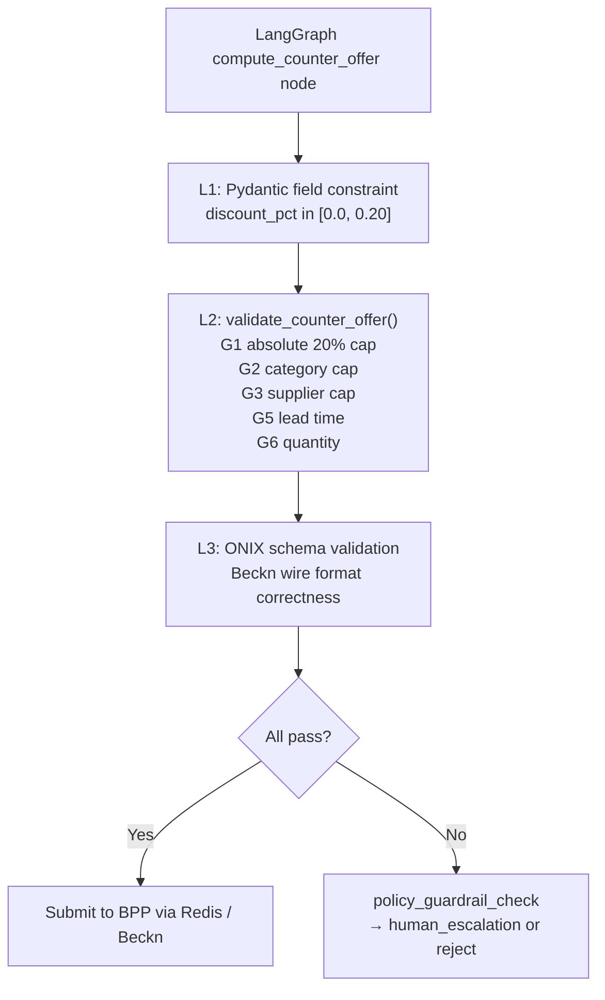

# Security

This document covers the complete security posture of the Procurement Agent as implemented across Phases 1-3. It distinguishes what is enforced today from what is planned for Phase 4 hardening. For environment variable references, see [Configuration](CONFIGURATION.md). For service topology context, see [Architecture](ARCHITECTURE.md).

---

## 1. Authentication Model

### 1.1 Frontend Authentication

The Next.js frontend (port 3000) enforces authentication via **NextAuth v4** using an exclusive **Keycloak OIDC provider** backed by the Phase Two (phasetwo.io) hosted Keycloak service. There is no stub credentials provider, no local fallback login, and no dev-mode bypass.

```typescript
// frontend/src/lib/auth.ts -- only provider configured
KeycloakProvider({
  clientId:     process.env.KEYCLOAK_CLIENT_ID!,
  clientSecret: process.env.KEYCLOAK_CLIENT_SECRET!,
  issuer:       process.env.KEYCLOAK_ISSUER!,
})
```

All three environment variables use the non-null assertion operator (`!`). The application throws at startup if any is absent.

**Session parameters:**

| Parameter | Value |
|---|---|
| Strategy | JWT |
| Max age | 28,800 s (8 hours) |
| Sign-in page | `/login` |
| Realm roles claim | `realm_access.roles` in ID token |

**Role model:**

| Role | Capability |
|---|---|
| `admin` | Full access; configure thresholds and approval policies |
| `approver` | Approve or reject requests above the requester's threshold |
| `requester` | Default role; cannot call `/commit` directly above their own threshold |

Role values are read from `realm_access.roles` in the ID token. If no recognized role is present, the session falls back to `requester`. The code also falls back to a manual base64url decode of `access_token` when the ID token claim is absent.

**Required env vars** (see [Configuration](CONFIGURATION.md) for full reference):

| Variable | Purpose |
|---|---|
| `NEXTAUTH_URL` | Public URL of the Next.js app; must match the Keycloak redirect URI exactly |
| `NEXTAUTH_SECRET` | Signs and verifies session JWTs; generate with `openssl rand -base64 32` |
| `KEYCLOAK_ISSUER` | OIDC issuer — Phase Two cloud: `https://euc1.auth.ac/auth/realms/procurement-agent` |
| `KEYCLOAK_CLIENT_ID` | Client ID in the Keycloak realm (`procurement-frontend`) |
| `KEYCLOAK_CLIENT_SECRET` | Client secret from the Keycloak dashboard; must never be committed |

**Minimum Keycloak client configuration:**

| Setting | Required value |
|---|---|
| Client authentication | ON (confidential client) |
| Standard flow | Enabled |
| Valid Redirect URIs | `${NEXTAUTH_URL}/api/auth/callback/keycloak` |
| Web origins | `${NEXTAUTH_URL}` |
| Realm roles mapper | Token claim name `realm_access.roles`, Add to ID token: ON |

> **Warning:** No Keycloak realm export or setup guide exists in the repository. Developers cloning the repo cannot authenticate to the frontend without access to the Phase Two tenant (`euc1.auth.ac`, realm `procurement-agent`). A Keycloak setup guide is a Phase 4 deliverable.

### 1.2 Internal Service Authentication

Only the `erp-adapter` service enforces inbound authentication. All other inter-service communication relies on Docker bridge network isolation (`beckn_network`).

| Boundary | Mechanism |
|---|---|
| `orchestrator` → `erp-adapter` | Bearer token: `Authorization: Bearer ${ERP_INTERNAL_TOKEN}` |
| `erp-adapter` ← vendor webhooks | HMAC-SHA256 dual-secret rotation (see §1.3) |
| All other service-to-service calls | None — Docker `beckn_network` bridge only |

The default `ERP_INTERNAL_TOKEN` in `docker-compose.yml` is `dev-internal-token-CHANGE_ME`. This must be replaced via environment variable before any deployment exposed to untrusted networks. Phase 4 plan: Kubernetes RBAC service accounts with per-service mTLS.

### 1.3 ERP Webhook Authentication (HMAC-SHA256)

Inbound vendor webhooks to `erp-adapter` carry a per-vendor HMAC-SHA256 signature:

```
X-{Vendor}-Signature: sha256=<hex_digest>
```

Example: `X-SAP-Signature: sha256=abcdef01...`

The adapter verifies the signature using `hmac.compare_digest` (constant-time comparison, preventing timing oracle attacks).

**Dual-secret rotation pattern:**

Two secrets are accepted simultaneously during key rotation, enabling zero-downtime rotation without a maintenance window.

| Variable | Purpose |
|---|---|
| `SAP_WEBHOOK_HMAC_SECRET` | Primary active secret for SAP webhooks |
| `SAP_WEBHOOK_HMAC_SECRET_NEXT` | New secret being rolled in; empty when no rotation is in progress |
| `ORACLE_WEBHOOK_HMAC_SECRET` | Primary active secret for Oracle webhooks |
| `ORACLE_WEBHOOK_HMAC_SECRET_NEXT` | New Oracle secret during rotation |
| `SELLER_WEBHOOK_HMAC_SECRET` | Primary secret for inbound seller push webhooks (orchestrator) |

```mermaid
sequenceDiagram
    participant Vendor
    participant erp-adapter :8007

    Vendor->>erp-adapter :8007: POST /api/v1/webhooks/sap/po-status<br/>X-SAP-Signature: sha256=<digest>
    erp-adapter :8007->>erp-adapter :8007: verify against SAP_WEBHOOK_HMAC_SECRET
    alt primary match
        erp-adapter :8007->>erp-adapter :8007: accept
    else primary no match
        erp-adapter :8007->>erp-adapter :8007: verify against SAP_WEBHOOK_HMAC_SECRET_NEXT
        alt _NEXT match
            erp-adapter :8007->>erp-adapter :8007: accept (rotation in progress)
        else both fail
            erp-adapter :8007-->>Vendor: 401 Unauthorized
        end
    end
```

**Zero-downtime rotation procedure:**

1. Set `{VENDOR}_WEBHOOK_HMAC_SECRET_NEXT` to the new secret value and deploy.
2. Configure the vendor's outbound webhook delivery to sign with the new secret.
3. Verify that new webhook deliveries arrive and are accepted.
4. Promote `_NEXT` to the primary variable; clear `_NEXT`.

### 1.4 Claude OpenAI Proxy Authentication

The `claude_openai_proxy` service (port 8012) implements `BearerAuthMiddleware` on all `/v1/*` paths. The auth key is controlled by `CLAUDE_PROXY_KEY`.

| Path | Auth required |
|---|---|
| `GET /healthz` | No |
| `GET /v1/models` | Yes — `Authorization: Bearer ${CLAUDE_PROXY_KEY}` |
| `POST /v1/chat/completions` | Yes — `Authorization: Bearer ${CLAUDE_PROXY_KEY}` |

If `CLAUDE_PROXY_KEY` is empty, authentication is **disabled** with a startup warning. In development, the proxy binds `127.0.0.1`. The production systemd unit (`claude-proxy.service`) binds `0.0.0.0` and relies on a UFW rule restricting port 8012 to loopback and the Docker bridge subnet `172.16.0.0/12`.

---

## 2. Beckn Protocol Security

### 2.1 ED25519 Request Signing

All outbound Beckn traffic from the BAP passes through the **onix-bap** Go adapter (port 8081), which signs every request with **ED25519**. The `beckn-bap-client` service never calls a BPP URL directly; all traffic is mediated by ONIX.

```mermaid
sequenceDiagram
    participant beckn-bap-client :8002
    participant onix-bap :8081
    participant onix-bpp :8082
    participant sim-bpp :3002

    beckn-bap-client :8002->>onix-bap :8081: POST /bap/caller/discover (unsigned)
    onix-bap :8081->>onix-bap :8081: ED25519 sign payload
    onix-bap :8081->>onix-bpp :8082: POST /bpp/receiver/discover (signed)
    onix-bpp :8082->>onix-bpp :8082: validate signature
    onix-bpp :8082->>sim-bpp :3002: POST /api/webhook/discover (stripped)
```

The two-adapter model (BAPCaller + BAPReceiver, BPPCaller + BPPReceiver) is defined in `config/generic-routing-*.yaml`. The signing pipeline for the caller is: `addRoute → sign → validateSchema`. The receiver pipeline is: `validateSign → addRoute → validateSchema`.

> **Rule:** Never POST directly to a BPP. All Beckn traffic must go through `onix-bap:8081`. The test suite enforces that `select_url` always contains `caller`.

### 2.2 Schema Validator Pin at Commit `d43ec30d`

The ONIX schema validator (`schemav2validator.so`) is **pinned to commit `d43ec30d`** of the `fidedocker/onix-adapter` image. Later commits introduced a `$ref` resolution bug in `SignatureHeader` and `AckSignatureHeader` that causes all signed Beckn messages to fail validation even when the signature and payload are correct.

> **Do not upgrade the ONIX schema validator without first running a full end-to-end signing test covering `discover → select → init → confirm → status` with ED25519-signed payloads.** The validator binary is compiled into the `.so` plugin and cannot be patched at runtime.

The validator enforces several contract-level constraints that all services must respect:

| Constraint | Detail |
|---|---|
| `Contract.status.code` valid values | `DRAFT`, `ACTIVE`, `CANCELLED`, `COMPLETE` — `CONFIRMED` is rejected with a 400 NACK |
| `Contract` additional properties | `additionalProperties: false`; only nine keys allowed |
| Buyer info placement | `participants[role=buyer]` — not inline in `Contract` |
| Fulfillment placement | `performance[]` — not inline in `Contract` |
| Payment placement | `settlements[]` — not inline in `Contract` |

### 2.3 Testnet Key Material

The current configuration uses **testnet sandbox ED25519 key pairs** from the Beckn Developer Program. These key pairs are checked into the repository in `config/generic-routing-BAPCaller.yaml` and `config/generic-routing-BAPReceiver.yaml`.

**Production key rotation procedure** (from `config/README.md`):

1. Generate a new ED25519 key pair using the Beckn key generation utility.
2. Register the public key in the target Beckn network's registry.
3. Update `config/generic-routing-BAPCaller.yaml` with the new private key and key ID.
4. Restart `onix-bap`. The new key takes effect immediately; no rolling restart is needed.

### 2.4 DeDi Registry Bypass

All four ONIX routing YAML files use `targetType: url` instead of `targetType: bpp` / `targetType: bap`. This bypasses DeDi registry lookup and routes directly to configured URLs, enabling a complete Beckn lifecycle flow inside the Docker network without a live registry.

**This bypass must be reverted before connecting to any live Beckn network.** Revert by setting `targetType: bpp`/`bap` and providing real registry entries in the YAML files. No application code changes are required.

---

## 3. Data Sovereignty

In the default deployment, all data, model inference, and vector search remain on the local host. No procurement data leaves the machine without explicit opt-in.

| Component | Provider | Data leaves host? |
|---|---|---|
| Intent classification (Stage 1) | qwen3:8b via local Ollama | No |
| BecknIntent extraction (Stage 2) | qwen3:8b / qwen3:1.7b via local Ollama | No |
| BPP catalog semantic cache | all-MiniLM-L6-v2 (sentence-transformers, local ONNX) | No |
| Agent memory embeddings | BAAI/bge-small-en-v1.5 (fastembed ONNX, local) | No |
| Vector search | pgvector (PostgreSQL on host) | No |
| Stage 3 broadening fallback | claude-sonnet-4-6 via Anthropic API (opt-in) | **Yes** — requires `ANTHROPIC_API_KEY` |
| SupplierAgent in demo flows | claude-sonnet-4-6 via `claude_openai_proxy:8012` | **Yes** — bills the host's Claude account |

### 3.1 Claude Stage-3 Broadening Fallback

`ANTHROPIC_API_KEY` is **unset by default**. When unset, IntentParser skips the Claude broadening step and the recovery flow falls through to stub functions (`log_unmet_demand`, `notify_buyer_no_stock`, `trigger_open_rfq_flow`).

When `ANTHROPIC_API_KEY` is set, only the broadening prompt is sent to the Anthropic API. The prompt contains the original procurement query text but no buyer identity, pricing, or supplier data. The model used is controlled by `CLAUDE_MODEL` (default: `claude-sonnet-4-6` in `IntentParser/config.py`).

### 3.2 Claude OpenAI Proxy Loopback Binding

The `claude_openai_proxy` service invokes the host-installed `claude` CLI (`CLAUDE_PROXY_BINARY_PATH`) for each inference request. Every request bills the host's Claude account (`~/.claude/.credentials.json`). The service binds `127.0.0.1` by default; the production systemd unit (`claude-proxy.service`) binds `0.0.0.0` and relies on UFW to restrict access to loopback and the Docker bridge subnet `172.16.0.0/12`.

---

## 4. Input Validation

### 4.1 BecknIntent Field Validation

All NL-derived intent data passes through `shared.models.BecknIntent` (Pydantic v2) before entering the pipeline. Validators use `@field_validator` decorators (Pydantic v2 — `@validator` is deprecated and not used).

Canonical encoding rules enforced at this layer:

| Field | Enforcement |
|---|---|
| `quantity` | Must be `> 0`; raises `ValidationError` otherwise |
| `delivery_timeline` | Must be `> 0` if provided; value is **int hours** (not ISO 8601 duration) |
| `location_coordinates` | String `"lat,lon"` decimal — not city names |
| `budget_constraints` | Typed `BudgetConstraints(max, min)` object — not a raw string |

### 4.2 ONIX Schema Validation

Every Beckn message (outbound and inbound) is validated against the Beckn v2.0.0 JSON schema by the ONIX adapter before forwarding. Invalid messages are rejected with a 400 NACK before reaching any application service. See §2.2 for the pin and the constraints it enforces.

### 4.3 MCP Sidecar Never-Throw Contract

The MCP sidecar's `search_bpp_catalog` tool never raises a JSON-RPC error. All failure paths — network timeouts, Redis unavailability, BPP returning no results — return a structured response:

```json
{"found": false, "items": [], "probe_latency_ms": N}
```

This prevents unhandled exceptions from propagating to the LLM-side caller in IntentParser Stage 3 and enables safe graceful degradation.

### 4.4 Database Error Middleware

`data-normalizer` wraps all PostgreSQL errors in `db_error_middleware`, mapping them to structured HTTP responses that do not expose raw database messages to callers:

| PostgreSQL error | HTTP response |
|---|---|
| `UniqueViolationError` | 409 `{"error": "duplicate"}` |
| `ForeignKeyViolationError` | 409 `{"error": "fk_violation"}` |
| `CheckViolationError` | 422 |
| `NotNullViolationError` | 422 |
| Other `PostgresError` | 500 |

### 4.5 ERP Budget Gate Fail-Closed

The ERP budget check (`POST /api/v1/budget/check`) is configured with `ERP_BUDGET_CHECK_REQUIRED` (default `false` in `docker-compose.yml`, should be `true` in production). When `true`, if the `erp-adapter` is unreachable or exceeds the 800 ms timeout (`ERP_BUDGET_CHECK_TIMEOUT_MS`), the orchestrator's `/commit` path **rejects** the purchase order rather than allowing it to proceed. This prevents orders from bypassing the budget gate due to infrastructure failures.

> **Production requirement:** Set `ERP_BUDGET_CHECK_REQUIRED=true`. The Docker Compose default of `false` is a development convenience only.

### 4.6 Negotiation Engine Guardrails

The negotiation engine enforces a three-layer guardrail stack to prevent the LLM from agreeing to out-of-policy terms:



The hard cap is **20% maximum discount** regardless of category profile or LLM output. This constraint is enforced at both the Pydantic model level (L1) and the imperative validation function (L2).

---

## 5. Secrets Management

### 5.1 Env-Var Pattern

All service secrets are loaded from environment variables via module-level `config.py` files (`IntentParser/config.py`, `Bap-1/src/config.py`, `services/*/config.py`). Inline `os.getenv(...)` calls in application logic are forbidden. Exceptions: `REDIS_URL` and `REDIS_RESULT_TIMEOUT` in `services/mcp-sidecar/bap_client.py` and `services/beckn-bap-client/src/handler.py` use `os.getenv()` directly because they predate the Pydantic Settings migration — they must be set as real process environment variables, not just in `.env` files.

### 5.2 .env Files

`.env` files are gitignored. Each service's `.env.example` documents all variables with safe placeholder values and serves as the onboarding template. The root `.env` is the canonical source for the Docker stack (loaded by `docker-compose.yml`).

### 5.3 Secrets That Must Be Rotated Before Any Production Deployment

The variables below have no safe default and will leave the system insecure or non-functional if not replaced:

| Variable | Service | Risk if not replaced |
|---|---|---|
| `NEXTAUTH_SECRET` | frontend | Session JWTs are unsigned; any JWT is accepted |
| `KEYCLOAK_CLIENT_SECRET` | frontend | OIDC flow breaks; no user can authenticate |
| `KEYCLOAK_ISSUER` | frontend | Auth goes to the Phase Two dev tenant instead of your realm |
| `ERP_INTERNAL_TOKEN` (`dev-internal-token-CHANGE_ME`) | orchestrator, erp-adapter | Any caller can hit `/api/v1/*` on erp-adapter |
| `SELLER_WEBHOOK_HMAC_SECRET` (`dev-seller-hmac-CHANGE_ME`) | orchestrator | Forged seller webhooks are accepted |
| `SAP_WEBHOOK_HMAC_SECRET` (`dev-sap-hmac-CHANGE_ME`) | erp-adapter, erp-mock | Forged SAP webhooks are accepted |
| `ORACLE_WEBHOOK_HMAC_SECRET` (`dev-oracle-hmac-CHANGE_ME`) | erp-adapter, erp-mock | Forged Oracle webhooks are accepted |
| `DB_PASSWORD` (`postgres123`) | data-normalizer, analytics, erp-adapter | Trivial password grants full DB access |
| `CLAUDE_PROXY_KEY` | claude_openai_proxy | Any client can trigger Claude CLI invocations that bill the host account |
| `BAP_ID` (`bap.example.com`) | beckn-bap-client | Placeholder — must be the registered BAP identifier on the target Beckn network |
| `BAP_URI` (`http://localhost:8000/beckn`) | beckn-bap-client | Localhost URI; ONIX cannot route callbacks back correctly from a remote network |

---

## 6. Known Security Gaps

The following gaps are confirmed in the Phases 1-3 implementation. All are either deferred to Phase 4 or carry a documented workaround.

| Gap | Severity | Current Mitigation | Phase 4 Plan |
|---|---|---|---|
| No authentication on internal HTTP APIs (intention-parser :8001, beckn-bap-client :8002, data-normalizer :8006, catalog-normalizer :8005, comparative-scoring :8003, analytics :8009) | Medium | Docker `beckn_network` bridge; services are not published to the public internet | Kubernetes NetworkPolicy + service mesh mTLS; API Gateway (Kong) RBAC on every request |
| Testnet ED25519 key pairs committed to `config/generic-routing-*.yaml` | High | Development only; testnet keys have no value outside the sandbox | Follow the 3-step key rotation procedure in `config/README.md` before any real deployment |
| `dev-*-CHANGE_ME` HMAC secrets in `docker-compose.yml` (SAP, Oracle, seller) | High | Docker bridge isolation | Replace with real secrets via environment variables before external deployment |
| `ERP_INTERNAL_TOKEN=dev-internal-token-CHANGE_ME` | High | Docker bridge isolation | Rotate via env var before deployment |
| Live Keycloak client secret potentially in `frontend/.env.local` (gitignored but in working tree) | High | File is gitignored; must not be committed | Rotate `KEYCLOAK_CLIENT_SECRET` in the Phase Two admin console if the file was ever shared |
| No Keycloak realm export or setup guide in the repository | Medium | Developers must have Phase Two tenant access | Document realm configuration and export realm JSON |
| mTLS to SAP / Oracle not activated in `erp-adapter` | Low | SSL context hook is wired but not called; vendor traffic is over plain HTTP in development | Activate per-vendor mTLS in Phase 4 production ERP connectivity |
| No container image scanning (Trivy) | Low | No containers pushed to a public registry in Phases 1-3 | Trivy in CI pipeline; block builds on HIGH/CRITICAL CVEs |
| Secrets passed as plain env vars in `docker-compose.yml` | Low | Local Docker Compose; no shared orchestration platform | Kubernetes Secrets + KMS in Phase 4 |
| `ERP_BUDGET_CHECK_REQUIRED=false` in `docker-compose.yml` (fail-open) | Medium | Development default; budget overruns are possible if erp-adapter fails | Set `true` in all non-development environments |
| `LOG_PAYLOADS=false` default in erp-adapter; must not be set `true` | Low | Default is safe; `true` would log full PO and budget payloads containing PII | No change needed — flag must remain `false` in production |
| Bap-1 hardcoded test users with cleartext passwords | Low | Bap-1 is a Phase 1 integration test harness, not in the production service path | Bap-1 test frontend is not user-exposed; resolved when Bap-1 is retired |

---

## 7. Security Checklist for New Features

Before merging any feature that introduces a new service, API endpoint, secret, or external dependency, verify all of the following:

- [ ] **No inline secrets.** All secrets loaded from environment variables via the service's `config.py`. No `os.getenv(...)` calls outside `config.py` (except the documented exceptions in `mcp-sidecar/bap_client.py` and `beckn-bap-client/handler.py`).
- [ ] **No new `.env` values committed.** Updated `.env.example` only; actual secret values in `.env` (gitignored).
- [ ] **No direct BPP calls.** All Beckn traffic routes through `onix-bap:8081`. `select_url` must contain `caller`.
- [ ] **No action name in ONIX target URLs.** ONIX appends the action automatically; including it in the target URL causes a 404 double-path.
- [ ] **No `Contract.status.code = "CONFIRMED"`.** The valid enum is `DRAFT | ACTIVE | CANCELLED | COMPLETE`.
- [ ] **Pydantic v2 validators on new BecknIntent fields.** Use `@field_validator`; never `@validator`.
- [ ] **MCP tools return structured failure, not exceptions.** Failure paths must return `{"found": false, ...}`.
- [ ] **No `time.sleep()` in async code.** Use `await asyncio.sleep(0)` to yield to the event loop.
- [ ] **No `await` on the `/discover` POST in the MCP sidecar.** It must be `asyncio.create_task(...)`; `await` reintroduces the deadlock described in ADR-0001.
- [ ] **New SQL migrations use the next free `NN_` prefix.** Do not reorder or renumber existing files. Migrations must be idempotent (`IF NOT EXISTS`).
- [ ] **No reuse of `transaction_id`.** Beckn channels (`beckn_results:{transaction_id}`) are derived from it; reuse delivers a stale catalog to a waiting subscriber.
- [ ] **`ERP_BUDGET_CHECK_REQUIRED=true` in any non-development deployment.** The Docker Compose default of `false` is unsafe outside a local dev environment.
- [ ] **`CLAUDE_PROXY_KEY` set before exposing `claude_openai_proxy` beyond loopback.** Empty key disables authentication.
- [ ] **New webhook endpoints use `hmac.compare_digest` for signature verification.** Never use `==` for HMAC comparison.
- [ ] **PII not included in LLM prompts.** The Stage-3 Claude broadening prompt must contain only the procurement query text, not buyer identity, pricing, or supplier data.

For contribution guidelines and the PR process, see [Architecture](ARCHITECTURE.md).
