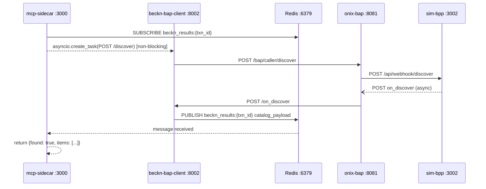

# System Design

This document describes the structural principles, communication contracts, and key architecture decisions that govern the Procurement Agent. It is the primary reference for engineers who need to understand why the system is built the way it is, not just what it does. For the service-by-service operational reference, see [Architecture](ARCHITECTURE.md). For practical troubleshooting, see [Troubleshooting](TROUBLESHOOTING.md). For database schema details, see [Database](DATABASE.md).

---

## 1. Service Boundaries and Responsibilities

The system has sixteen Docker-deployed services and two local processes. Each service owns exactly one concern. The boundaries below are enforced by deployment topology, not just convention.

### 1.1 Service Responsibility Map

| Service | Port | Single Responsibility |
|---|---|---|
| **orchestrator** | 8004 (8000) | Pipeline state machine — sole entry point for the frontend; coordinates all other services |
| **intention-parser** | 8001 | NL → BecknIntent translation (Stages 1–3) |
| **beckn-bap-client** | 8002 | Beckn protocol client — all `discover / select / init / confirm / status` calls through onix-bap |
| **catalog-normalizer** | 8005 | Raw `on_discover` payload → typed `DiscoverOffering` list |
| **comparative-scoring** | 8003 | ML-scored ranking of `DiscoverOffering` objects |
| **data-normalizer** | 8006 | Sole write path to PostgreSQL — all other services use it for persistence |
| **erp-adapter** | 8007 | Budget gate + PO push to SAP/Oracle/mock; owns the `erp_sync_records` outbox |
| **erp-mock** | 8008 | Local ERP stub used when `ERP_VENDORS=mock` |
| **analytics** | 8009 | Read-only reporting queries against PostgreSQL |
| **notification-dispatcher** | 8010 | Kafka consumer → Slack/Teams/Email fan-out |
| **negotiation-engine** | 18004 | LangGraph automated price negotiation with multi-layer guardrails |
| **demo-gateway** | 8015 | Frontend BFF; bridges orchestrator to negotiation-engine and hosts the SupplierAgent |
| **onix-bap** | 8081 | Beckn BAP-side Go adapter — ED25519 signing, schema validation, DeDi routing |
| **onix-bpp** | 8082 | Beckn BPP-side Go adapter |
| **sim-bpp** | 3002 | Local BPP simulator replacing sandbox-2.0 |
| **mcp-sidecar** | 3000 | MCP SSE bridge between IntentParser Stage 3 and the Beckn network |

Two host-local processes not in Docker:

| Process | Port | Role |
|---|---|---|
| **IntentParser** (local dev) | 8001 | Runs outside Docker when `qwen3:8b` complexity routing is needed |
| **claude\_openai\_proxy** | 8012 | Wraps Claude Code CLI as an OpenAI-compatible endpoint; required by negotiation-engine and demo-gateway |

### 1.2 Why the Orchestrator Is the Single Frontend Entry Point

The orchestrator exposes the `/run`, `/compare`, and `/commit` endpoints that the Next.js frontend calls. All other services are internal to the Docker network — they bind on `beckn_network` bridge addresses and are not directly reachable from a browser or external HTTP client.

This boundary exists for three reasons:

1. **State ownership.** The two-phase compare/commit flow requires session state (a `transaction_id` → session dict with 30-minute TTL) that must be consistent across both calls. Only one service can own that dict reliably on a single-host deployment.
2. **Approval workflow.** Spend-level routing (auto-approve / manager / CFO) requires a consistent view of the pipeline state and a blocking wait for the human decision. The orchestrator implements `POST /approvals/{id}/decide` and parks the pipeline until the decision arrives.
3. **Pipeline sequencing.** IntentParser, beckn-bap-client, comparative-scoring, and data-normalizer each do one thing. Sequencing their calls, handling partial failures, and enriching results with memory context is the orchestrator's job. Exposing those services directly to the frontend would push pipeline logic into the UI.

### 1.3 Why data-normalizer Is the Sole PostgreSQL Writer

Every service that needs to write to the database — orchestrator, beckn-bap-client, erp-adapter, sim-bpp, negotiation-engine — calls `data-normalizer :8006` instead of writing directly. This constraint is enforced by deployment: no other service has the PostgreSQL DSN injected as an environment variable.

Benefits of this design:

- **Single schema evolution point.** Adding a column or migration requires a change to one service's Pydantic models and one service's SQL, not six.
- **Centralised error handling.** The `db_error_middleware` in data-normalizer maps `asyncpg` exception types to structured HTTP error codes (409 for unique/FK violations, 422 for check/not-null violations, 500 for all other `PostgresError`). Callers branch on HTTP status, never on database exception types.
- **Idempotency.** A 409 response from data-normalizer is an explicit signal that the row already exists; callers treat it as success. Without this, every caller would need to implement its own duplicate-detection logic.
- **Audit centralisation.** All `audit_trail_events` writes go through `POST /normalize/audit`. The 20+ call sites in the orchestrator alone would be scattered across the codebase if they wrote directly.

---

## 2. Communication Patterns

The system uses four distinct communication patterns. The choice of pattern for each interaction is determined by latency requirements, whether the caller can tolerate eventual consistency, and whether the transport needs to bridge separate processes.

| Pattern | Services involved | When used | Why |
|---|---|---|---|
| **Synchronous HTTP (blocking)** | orchestrator → intention-parser, beckn-bap-client, comparative-scoring, erp-adapter | Critical-path steps where the pipeline result depends on the response | Pipeline sequencing requires ordered results; failures must halt the pipeline |
| **Redis Pub/Sub** | beckn-bap-client (PUBLISH) ↔ mcp-sidecar (SUBSCRIBE) on `beckn_results:{txn_id}`; negotiation-engine (SUBSCRIBE) ↔ demo-gateway (PUBLISH) on `beckn_on_select_results` | Beckn async discovery and negotiation engine resume | Beckn v2.0.0 returns only an ACK; the catalog arrives via webhook. Holding an HTTP connection open blocks the asyncio event loop — see [ADR-0001](#adr-0001-redis-pubsub-for-async-beckn-discovery) |
| **Kafka (deferred)** | sim-bpp (PUBLISH), erp-adapter (PUBLISH) → notification-dispatcher (CONSUME) on `po.status.changed` | Order lifecycle state transitions and ERP audit events | Durable, replayable fan-out to multiple independent consumers (Slack, Teams, Email); decouples the BPP simulator from the notification layer |
| **`asyncio.create_task` fire-and-forget** | orchestrator → data-normalizer for memory write, audit writes | Non-critical side effects after a confirmed PO | Audit and memory writes must not add to the critical-path latency. A lost audit write is tolerable; a blocked user interface is not |

### 2.1 Redis Pub/Sub Channels

| Channel | Publisher | Subscriber | Purpose |
|---|---|---|---|
| `beckn_results:{transaction_id}` | beckn-bap-client `/on_discover` handler | mcp-sidecar `search_bpp_catalog` tool | Delivers catalog payload from Beckn webhook to IntentParser Stage 3 |
| `beckn_on_select_results` | demo-gateway (SupplierAgent response) | negotiation-engine `OnSelectListener` | Resumes a parked LangGraph graph with the supplier's counter-offer |
| `po.status_changed:{txn_id}` | erp-adapter webhook handler | (Kafka fallback only) | Redis key written when Kafka is unavailable |

### 2.2 Beckn Async Discovery — Why `asyncio.create_task`, Not `await`

The critical rule enforced by CLAUDE.md: the MCP sidecar must fire `POST /discover` as `asyncio.create_task(...)`, never as `await`. Awaiting the POST blocks the event loop — the same event loop that must receive and process the `on_discover` callback. The result is a deadlock. The full five-step protocol is described in [ADR-0001](#adr-0001-redis-pubsub-for-async-beckn-discovery) and shown in the sequence diagram in [Architecture](ARCHITECTURE.md#32-async-discovery--adr-0001).

---

## 3. The Anti-Corruption Layer

`shared/models.BecknIntent` is the canonical model that crosses the boundary between natural language and the Beckn protocol. Every service that handles procurement intent either produces or consumes a `BecknIntent`. No service downstream of IntentParser knows about raw query strings, NLP intermediate representations, or locale-specific data formats.

### 3.1 Canonical Field Conventions

Three fields have invariants enforced by Pydantic v2 `field_validator` decorators. Violating them causes silent downstream errors that are hard to trace back to the parse step.

| Field | Type | Invariant | Example | What breaks if violated |
|---|---|---|---|---|
| `delivery_timeline` | `int` (hours) | Never ISO 8601 duration strings | `72` (not `"P3D"`) | The Beckn `fulfillment.start.time.duration` field expects a plain integer; downstream services that compute deadline timestamps fail if the value is a string |
| `location_coordinates` | `str` `"lat,lon"` decimal | Never city names or postal codes | `"19.0760,72.8777"` (not `"Mumbai"`) | pgvector ANN searches and Beckn location filtering require numeric coordinates; city names cause the BPP catalog match to silently return zero results |
| `budget_constraints` | `BudgetConstraints(max: float, min: float)` | Never raw strings | `{"max": 200.0, "min": 0.0}` | The ERP budget gate compares `amount_total` against `budget_constraints.max`; a raw string causes a type comparison failure |

### 3.2 Why These Invariants Exist

IntentParser Stages 1 and 2 use LLMs (`qwen3:8b` / `qwen3:1.7b` via Ollama) to extract structured data from natural language. LLMs without structured output enforcement will freely produce ISO 8601 durations, city names, and free-text budget ranges. The invariants exist because:

1. **LLM outputs are non-deterministic.** The same query may produce `"3 days"`, `"P3D"`, or `72` depending on the model's sampling state. Pydantic validation provides a deterministic contract.
2. **Downstream services do not know they received NL-derived data.** beckn-bap-client, erp-adapter, and comparative-scoring treat `BecknIntent` as a structured business object. They would need NL-aware parsing logic if the invariants were not enforced at the boundary.
3. **Reuse across paths.** The same `BecknIntent` is consumed by IntentParser Stage 3 (for catalog ANN search), the orchestrator (for Beckn request construction), and data-normalizer (for persistence). A single enforcement point is more reliable than six separate validations.

### 3.3 Model Routing and the Docker Override

IntentParser uses a complexity heuristic to route between two LLMs:

- Queries longer than 120 characters, containing at least 2 numeric tokens, or containing procurement keywords (e.g. "urgent", "approval", "RFQ") → `COMPLEX_MODEL` (local default: `qwen3:8b`)
- All other queries → `SIMPLE_MODEL` (`qwen3:1.7b`)

**Docker override discrepancy:** `docker-compose.yml` sets `COMPLEX_MODEL=qwen3:1.7b` for the `intention-parser` container. This collapses the two-tier routing — the Dockerized service uses `qwen3:1.7b` for all queries. The `qwen3:8b` model and complexity routing are only active when IntentParser runs locally outside Docker. No warning is emitted. Engineers running the full Docker stack may observe lower extraction quality on complex multi-constraint queries without knowing why.

---

## 4. Error Handling Philosophy

Each layer of the system has a documented error contract. The contracts are chosen to prevent failures from propagating upward — each service absorbs its layer's failures and presents a uniform signal to its caller.

### 4.1 Never-Throw MCP Contract

The MCP sidecar (`search_bpp_catalog` tool) is the most strictly contained service in the system. It never raises a JSON-RPC error. Every outcome — timeout, Redis unavailability, BAP client unreachable, malformed response, blank argument, unhandled exception — returns HTTP 200 with a consistent JSON body:

```json
{"found": false, "items": [], "probe_latency_ms": N}
```

A top-level `try/except Exception` in `server.py::search_bpp_catalog` enforces this. IntentParser Stage 3 branches on `result["found"]` without inspecting exception types. The contract means that if the entire Beckn discovery infrastructure is down, IntentParser degrades gracefully to its recovery flow rather than raising an unhandled exception.

The `not_found` recovery flow — query broadening (regex strip, then Claude Sonnet 4.6 via `ANTHROPIC_API_KEY` if set) → retry → `log_unmet_demand` / `notify_buyer_no_stock` / `trigger_open_rfq_flow` — is the designed degradation path. Note that the three terminal stubs in `IntentParser/recovery.py` are currently logger-only implementations; the real DB write, notification service call, and RFQ microservice integration are Phase 4 scope.

### 4.2 Fail-Closed ERP Budget Gate

The ERP budget gate is configured by two environment variables:

| Variable | docker-compose.yml default | Production intent |
|---|---|---|
| `ERP_BUDGET_CHECK_ENABLED` | `true` | Always true |
| `ERP_BUDGET_CHECK_REQUIRED` | `false` (fail-open) | Must be `true` (fail-closed) in production |
| `BUDGET_CHECK_TOTAL_TIMEOUT_MS` | `800` | Hard ceiling enforced by `asyncio.wait_for` |

**Important:** The docker-compose.yml default is fail-open (`ERP_BUDGET_CHECK_REQUIRED=false`) for development convenience. CLAUDE.md documents the intent as fail-closed. Engineers must explicitly set `ERP_BUDGET_CHECK_REQUIRED=true` before any deployment handling real procurement spend.

When `REQUIRED=true` and the ERP vendor does not respond within 800 ms (or its per-vendor `pybreaker` circuit breaker is OPEN), the commit is blocked and the orchestrator returns HTTP 402. No purchase order is created. This is the correct behaviour: an unknown budget status must block a spend commitment.

Per-vendor circuit breakers (one `pybreaker.CircuitBreaker` per vendor in `ERP_VENDORS`) trip to OPEN after `BREAKER_FAIL_MAX=5` consecutive failures and auto-probe after `BREAKER_RESET_TIMEOUT_SECS=60`. When a breaker is OPEN, budget checks fail immediately without consuming the 800 ms timeout. Business rejections (e.g. `INSUFFICIENT_FUNDS` returning a vendor-confirmed error) are not counted as circuit failures — only transport and infrastructure errors trip the breaker.

### 4.3 asyncio.gather Channel Isolation in Notifications

The notification-dispatcher fans out to Slack, Teams, and Email concurrently using:

```python
await asyncio.gather(
    send_slack(...), send_teams(...), send_email(...),
    return_exceptions=True
)
```

`return_exceptions=True` ensures a `SlackApiError` does not cancel the Teams or Email coroutines. Each result is inspected individually; failures are logged at WARNING level. An empty string for any webhook URL (`SLACK_WEBHOOK_URL=""`, `TEAMS_WEBHOOK_URL=""`, `SMTP_HOST=""`) silently disables that channel — the service starts normally with any combination active.

**Kafka consumer gap:** No dead-letter queue exists for the Kafka consumer. Malformed or unrecognised messages are logged and skipped; `enable_auto_commit=True` advances the offset regardless. A message that cannot be JSON-parsed will never be reprocessed.

### 4.4 LLM Supplier Selection Explanation — Non-Blocking Side-Channel

The supplier selection explanation (`POST /explain-selection` on the intention-parser Docker service) is intentionally designed as a non-blocking side-channel, not a pipeline step.

- The main procurement pipeline — discover → score → rank → HITL decision — completes independently of the explanation call. The ranked comparison table is available to the buyer before the explanation response arrives.
- `SelectionExplanationCard` fires after the page renders via `useEffect`. A `useRef` guard ensures the call is made exactly once per render, not on every re-render. The buyer can review the comparison table and make a proceed/approve decision while the LLM is still generating.
- The explanation call fails gracefully: a 502 response from intention-parser (e.g. Ollama unreachable) sets `llmError=true` and renders an advisory message in the card. The error never propagates to the pipeline state machine, never triggers a retry, and never blocks the proceed or approve action.
- `qwen3:1.7b` is the model used for explanation generation regardless of query complexity, because this is a post-decision summarisation task rather than structured extraction; latency matters more than raw model capacity here.

### 4.5 Always-200 Discovery Engine

The `discovery_engine` service (currently orphaned — it has no `docker-compose.yml` entry and no callers) returns HTTP 200 for all requests, including partial failures:

```json
{"items": [...], "total": 3, "degraded": true, "failed_networks": ["network_b"]}
```

Callers must check `degraded: true` and `failed_networks`. The per-network circuit breaker (`DISCOVERY_CB_FAILURE_THRESHOLD=3`, `DISCOVERY_CB_RECOVERY_TIMEOUT_S=30`) excludes misbehaving networks from fan-out results rather than failing the entire response.

### 4.6 Negotiation Engine Three-Layer Guardrails

Counter-offers in the negotiation engine pass through three independent validation layers before being sent to a BPP:

1. **L1 Pydantic:** `discount_pct` field constraint `[0.0, 0.20]` — absolute maximum 20% discount enforced at schema level.
2. **L2 `validate_counter_offer()`:** Five guardrail rules (G1: absolute cap, G2: category-specific cap, G3: supplier cap, G5: lead time policy, G6: minimum order quantity). A G2 or G3 violation routes the LangGraph state machine to the `human_escalation` HITL interrupt node.
3. **L3 ONIX schema validation:** Beckn wire-format validation before the message reaches the protocol adapter.

For practical guidance on ONIX schema rejection causes (wrong `Contract.status.code`, misplaced billing/fulfillment fields, action names in routing URLs), see [Troubleshooting](TROUBLESHOOTING.md).

---

## 5. Data Consistency

The system has no distributed transactions. The consistency model is chosen deliberately: strong consistency only where financial commitments are being made; eventual consistency for observability and learning data.

### 5.1 Strong Consistency — ERP Outbox

The only path that uses a durability guarantee is the ERP PO push. When the orchestrator calls `POST /confirm`, the Beckn confirmation and the `erp_sync_records` outbox row are written in the **same PostgreSQL transaction** inside data-normalizer. If the PO row is committed, the outbox row is guaranteed to exist. The erp-adapter background worker picks it up, pushes to the ERP vendor, and updates the row status using `SELECT ... FOR UPDATE SKIP LOCKED` to prevent double-processing.

Retry schedule: `5, 30, 120, 600, 3600` seconds (exponential, configurable via `WORKER_BACKOFF_CSV`). After exhausting retries the row moves to `DLQ` status; manual replay is available via `POST /api/v1/admin/outbox/{sync_id}/replay`.

See [Database](DATABASE.md) for the `erp_sync_records` schema and `19b_erp_sync_records_outbox.sql`.

### 5.2 Fire-and-Forget Writes — Eventual Consistency with Silent Failure Risk

Memory and audit writes are non-blocking side effects. The orchestrator wraps them in `asyncio.create_task(...)` and never awaits them:

```
asyncio.create_task(_persist_memory(...))      # agent_memory_vectors
asyncio.create_task(_persist_audit(...))       # audit_trail_events (20+ call sites)
```

A 5-second timeout is applied to pipeline data writes (`_persist`); memory and audit helpers catch all exceptions internally and log them. The pipeline continues regardless of persistence failures.

**Consequences:**

- If the orchestrator process crashes between task creation and task completion (e.g. during a hot-restart under Docker Compose), the audit event and memory record are permanently lost. There is no buffer, queue, or retry.
- The `audit_trail_events` table carries a `retention_until = NOW() + 7 years` marker (SOX 404 / GDPR / IT Act 2000), but the write itself is not durable. Phase 4 Kafka integration is intended to address this gap: all `_persist_audit` calls currently set `kafka_offset=0` with a `# TODO(kafka): real offset when topic is wired` comment.

**The `time.sleep()` prohibition** is directly related to this design. `time.sleep()` blocks the event loop thread — a fire-and-forget task created just before a `time.sleep()` call will never execute because the event loop cannot schedule it. Tests that assert on fire-and-forget side effects must use `await asyncio.sleep(0)` to yield control.

### 5.3 In-Memory Session State

The orchestrator's compare/commit session dict (`_sessions`, TTL 1800 s) and approval workflow state (`_pending_approvals`) are in-process Python dicts. A service restart loses all in-flight sessions. There is no Redis or database backend for session state in Phases 1–3. See [Section 6](#6-scalability-design-and-current-limits) for the Phase 4 plan to externalise this.

---

## 6. Scalability Design and Current Limits

### 6.1 Current State (Phases 1–3)

The entire system runs on a single Docker Compose host. There is no horizontal scaling, rolling update, or pod-level health restart.

| Constraint | Root cause | Phase 4 plan |
|---|---|---|
| orchestrator cannot run more than one replica | Session dict is in-process; two replicas would not share state | Externalise sessions to Redis; use a shared dict under `ORCHESTRATOR_REDIS_DSN` |
| negotiation-engine state is in-memory (`MemorySaver`) by default | `NEGOTIATION_POSTGRES_DSN` is optional; without it `AsyncPostgresSaver` is not used | Set `NEGOTIATION_POSTGRES_DSN` for durable LangGraph checkpoints |
| `claude_openai_proxy :8012` is a host-local process, not a Docker service | Requires the `claude` binary installed on the host; loopback-only bind | Will require special handling in Kubernetes (sidecars, or replacement with a managed Claude API endpoint) |
| Port collision workarounds | orchestrator maps both `:8000` and `:8004` for frontend compatibility; negotiation-engine uses `:18004` to avoid conflict | Kubernetes service DNS eliminates host-port workarounds |
| `discovery_engine` multi-network fan-out is not deployed | No `docker-compose.yml` entry, no callers | Wire into orchestrator's discovery step in Phase 4 if multi-network support is needed |


---

## 7. Architecture Decision Records

### ADR-0001: Redis Pub/Sub for Async Beckn Discovery

**Status:** Accepted — May 2026. Formal ADR at `docs/architecture/decisions/0001-use-redis-pubsub-for-async-beckn-responses.md`.

**Context:**
Beckn Protocol v2.0.0 makes discovery inherently asynchronous. `POST /discover` to onix-bap returns only an ACK; the actual catalog arrives later via an `on_discover` webhook callback. The MCP sidecar must fire a discover request and return a synchronous result to IntentParser Stage 3. The naive implementation — `await` the discover POST — blocks the asyncio event loop. The `on_discover` callback must be processed by the same event loop, creating a deadlock: the sidecar is suspended awaiting the callback while the callback can never be received because the event loop is blocked.

**Decision:**
Use Redis Pub/Sub on per-transaction channels `beckn_results:{transaction_id}`. The five-step protocol:



The `/on_discover` handler also calls `CallbackCollector.handle_callback("on_discover", payload)` so the orchestrator's synchronous discovery path (which does not use the sidecar) is unblocked by the same webhook.

**Rationale:**
- Breaks the deadlock by decoupling the two coroutines across an external message channel.
- Redis was already a required dependency (onix-bap uses it for its internal cache); no new infrastructure is introduced.
- The channel name embeds `transaction_id`, providing natural isolation between concurrent discovery probes.
- Observable in real time via `redis-cli subscribe beckn_results:<uuid>`.
- Three rejected alternatives: HTTP polling (adds latency, requires server-side state), direct callback injection (circular dependency), in-process `asyncio.Queue` (breaks the microservices boundary — mcp-sidecar and beckn-bap-client are separate processes).

**Consequences:**
- Positive: Deadlock eliminated; producer/consumer fully decoupled; no new infrastructure.
- Negative: Redis is a hard runtime dependency for IntentParser Stage 3. If Redis is unavailable, the sidecar degrades to `{"found": false, "items": []}` rather than raising an error.
- Negative: Two code paths handle the same `on_discover` event — the Redis publish path (MCP sidecar) and `CallbackCollector` (orchestrator). Both must be maintained in sync.
- Negative: `transaction_id` must be pre-generated and passed into the discover request so the channel name is known before the subscription is opened.
- Timeout ceiling: `REDIS_RESULT_TIMEOUT` (default 15 s) is the effective latency ceiling for all discovery probes. `MCP_BAP_TIMEOUT` (default 8 s) governs only the HTTP fire-and-forget task and is not the meaningful end-to-end deadline.

---

### pgvector Instead of Qdrant

**Status:** Implemented as-built deviation from the original spec.

**Context:**
The original design specified Qdrant (self-hosted) or Pinecone (managed) as the vector store, with `text-embedding-3-large` (3072 dimensions) from the OpenAI embedding API. The system requires two vector stores: a BPP catalog semantic cache for IntentParser Stage 3 ANN validation (`bpp_catalog_semantic_cache`), and an agent memory store for time-decayed supplier loyalty scoring (`agent_memory_vectors`).

**Decision:**
Use pgvector exclusively. Two tables serve the vector workload, both at 384 dimensions:

| Table | Migration | Index | Model |
|---|---|---|---|
| `bpp_catalog_semantic_cache` | `18_bpp_catalog_semantic_cache.sql` | HNSW cosine | `all-MiniLM-L6-v2` (sentence-transformers) |
| `agent_memory_vectors` | `22_agent_memory_vector_dim.sql` | HNSW cosine `ef_search=100` | `BAAI/bge-small-en-v1.5` (fastembed ONNX) |

**Rationale:**
- The pilot corpus is below 100,000 records. At this scale, pgvector HNSW is computationally equivalent to Qdrant HNSW in both latency and recall.
- Eliminating Qdrant removes one container, one StatefulSet, one backup strategy, and one infra dependency.
- PostgreSQL was already the primary datastore; vector operations execute inside the same ACID-transactional connection pool, enabling atomic writes of relational data and embedding vectors.
- Local embedding models (`all-MiniLM-L6-v2` ~90 MB, `BAAI/bge-small-en-v1.5` ~65 MB ONNX) replace the OpenAI embedding API, eliminating per-call cost, network dependency, and data egress.

**Consequences:**
- Positive: One fewer external service; vector writes can be made atomic with FK-dependent relational writes.
- Negative: At scale beyond ~500 K vectors, pgvector HNSW recall and throughput will degrade relative to a purpose-built ANN engine. Phase 4 should re-evaluate if the corpus grows.
- Known schema bug: `database/sql/00_extensions_and_types.sql` defines `embedding_model_type` ENUM with only `'text-embedding-3-large'` and `'e5-large-v2'`. Migration `22_agent_memory_vector_dim.sql` adds `'all-MiniLM-L6-v2'` but never adds `'BAAI/bge-small-en-v1.5'`. The `embedding_model` column DEFAULT is also never updated from `'text-embedding-3-large'`. Inserts using the BAAI model name will fail with a PostgreSQL invalid enum value error until this is fixed. See [Database](DATABASE.md) for the migration sequence.

---

### Local LLMs (qwen3:8b / qwen3:1.7b) Instead of GPT-4o

**Status:** Implemented as-built deviation from the original spec.

**Context:**
The original design specified GPT-4o as the primary LLM (intent classification and BecknIntent extraction) and GPT-4o-mini for lightweight queries. Using cloud LLM APIs introduces per-call cost, network latency, procurement data egress to a third-party API, and external service availability risk.

**Decision:**
Replace GPT-4o with `qwen3:8b` (complex queries) and GPT-4o-mini with `qwen3:1.7b` (simple queries), both served locally via Ollama at `OLLAMA_BASE_URL=http://localhost:11434/v1`. Claude Sonnet 4.6 is retained as a last-resort broadening fallback in IntentParser Stage 3 only — opt-in, requires `ANTHROPIC_API_KEY`, invoked solely when a `not_found` result needs semantic query broadening.

Complexity routing in `IntentParser/orchestrator.py`: queries longer than 120 characters, containing at least two numeric tokens, or containing procurement domain keywords are routed to `COMPLEX_MODEL`; all others to `SIMPLE_MODEL`.

**Docker override discrepancy:** `docker-compose.yml` sets `COMPLEX_MODEL=qwen3:1.7b`, collapsing complexity routing in the Docker container. The `qwen3:8b` model is only used when IntentParser runs locally.

**Rationale:**
- Zero per-call LLM cost. Offline capability. Data sovereignty — procurement request content never leaves the developer machine.
- Structured JSON extraction via `instructor` Mode.JSON with `max_retries=3` achieves required accuracy for the constrained `BecknIntent` schema using qwen3 models.

**Consequences:**
- Positive: Zero LLM cost, offline operation, data sovereignty.
- Negative: qwen3 is less capable than GPT-4o on ambiguous or multi-constraint queries. Stage 3 recovery (Claude broadening fallback) is the safety net but requires `ANTHROPIC_API_KEY`.
- Negative: The Docker container silently degrades to `qwen3:1.7b` for all queries; no metric indicates that complex queries are not reaching the larger model.

---

### Outbox Pattern for ERP PO Push Instead of Kafka

**Status:** Implemented as-built deviation from the original spec.

**Context:**
The original design specified Apache Kafka as the central event bus for ERP integration: PO creation events published to a Kafka topic, consumed by an ERP sync worker pushing to SAP S/4HANA or Oracle ERP Cloud. No Kafka broker was deployed in Phases 1–3.

**Decision:**
Replace the Kafka publish/consume pattern for PO push with a PostgreSQL transactional outbox. The `erp_sync_records` table (`database/sql/19b_erp_sync_records_outbox.sql`) acts as the outbox. The orchestrator writes a row to `erp_sync_records` within the same database transaction that creates the `purchase_orders` row. An erp-adapter background worker polls `WHERE status = 'pending'` with `FOR UPDATE SKIP LOCKED`, pushes to the vendor ERP, and updates the row status. A `kafka_offset` BIGINT column and `splunk_indexed` BOOLEAN are pre-wired as placeholders for Phase 4 Kafka migration.

**Rationale:**
- Atomic guarantee: if the PO write succeeds, the outbox row is guaranteed to exist (same transaction). With Kafka, the PO could be committed to PostgreSQL while the Kafka publish fails.
- `FOR UPDATE SKIP LOCKED` provides safe concurrent worker execution without a separate job queue service.
- `kafka_offset` placeholder makes the Kafka migration non-breaking.

**Consequences:**
- Positive: Atomic write + queue in a single transaction. No Kafka broker dependency in Phases 1–3. Retry with exponential backoff and DLQ replay.
- Negative: Outbox worker polls on `WORKER_POLL_INTERVAL_SECONDS` (default 2 s) instead of being event-driven, introducing up to 2 s of additional PO-push latency.
- Negative: PostgreSQL outbox does not support multi-consumer fan-out. Phase 4 Kafka migration is required when multiple independent consumers are needed.

---

### DeDi Registry Bypass (`targetType: url`)

**Status:** Feature beyond spec, implemented in Phase 1.

**Context:**
Beckn Protocol's standard topology uses a DeDi (Decentralised Distributed) registry to resolve BPP endpoints. A BAP performing discovery queries the DeDi registry to obtain the target BPP's ONIX caller URL. No DeDi registry is deployed in the local Docker Compose environment; routing Beckn traffic through a live registry would require external network access and registration of sim-bpp.

**Decision:**
Set `targetType: url` in all four ONIX routing YAML files under `config/` (`generic-routing-BAPCaller.yaml`, `generic-routing-BAPReceiver.yaml`, `generic-routing-BPPCaller.yaml`, `generic-routing-BPPReceiver.yaml`). This routes all Beckn traffic directly to configured `target` URLs, bypassing the DeDi registry lookup entirely.

**Rationale:**
- Enables a complete Beckn protocol flow within the Docker bridge network without external dependencies.
- Eliminates latency from two DeDi registry round-trips per transaction.
- Switching to a real Beckn network requires only changing `targetType` to `bap`/`bpp` and setting `registryUrl` in the YAML files — no code changes.

**Consequences:**
- Positive: Self-contained, fully offline Beckn lifecycle.
- Negative: The DeDi trust model (BPP identity verification via registry) is bypassed in development. This is acceptable in a dev environment but must be reverted before any deployment handling real procurement data.
- The `config/README.md` documents the exact 3-step production procedure for switching to DeDi and rotating key material.

**Related constraint — ONIX schema validator pin at commit `d43ec30d`:** Later ONIX commits introduced a `$ref` resolution bug in `SignatureHeader` / `AckSignatureHeader` that causes 100% of Beckn transactions to fail schema validation. The `fidedocker/onix-adapter` image is pinned to the last known-good commit. Do not upgrade without running a full end-to-end signing test covering discover → select → init → confirm → status with ED25519-signed payloads.

---

## 8. Frontend State Management

### 8.1 Navigation Guard Design

The `useNavigationGuard` hook protects in-progress procurement runs from accidental navigation. It uses a three-pronged intercept approach so that all navigation vectors — browser controls, in-app links, and programmatic triggers — are covered:

1. **`popstate` listener** — intercepts browser back/forward navigation. When the guard is active, a history entry is pushed on mount so that the first back-press fires `popstate` instead of leaving the page. Each `popstate` event re-pushes the entry to keep the guard armed, then shows the confirmation modal.

2. **`beforeunload`** — fires the browser-native tab-close or page-reload dialog. The message text cannot be customised; the browser always shows its own generic prompt. This is a browser security constraint, not a framework limitation.

3. **DOM capture-phase `click` listener on `document`** — intercepts in-app `<a>` clicks before Next.js router handles them. The capture phase (third argument `true` on `addEventListener`) ensures the handler fires before any React event handlers or the router's own link handler, allowing the guard to call `preventDefault()` and show the modal first.

**Phase 4 addition — `trigger(href)` method:** Buttons and other non-anchor interactive elements that need to participate in the guard cannot be handled by the `<a>`-click intercept. `trigger(href)` provides a programmatic modal activation path: the caller passes the intended destination `href`, the guard shows the confirmation modal, and on confirmation the guard disables itself and navigates to the href. This is how the Cancel button on the RunView page participates in the guard without being wrapped in an `<a>` tag.

The guard is disabled (and all listeners removed) on component unmount, on successful confirmation, and via an explicit `disable()` call used when the orchestrator commits a run — at that point navigation is intentional and should not be intercepted.
