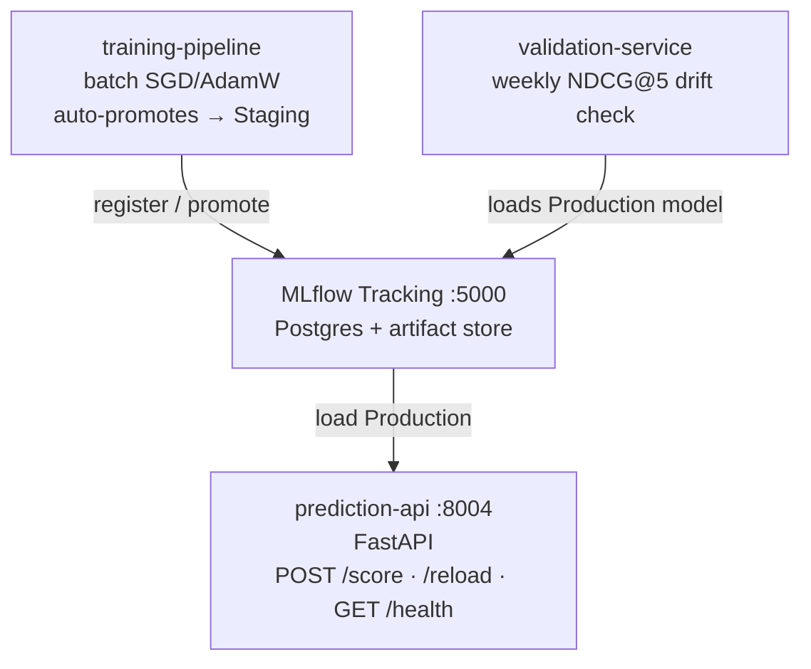

# ComparativeAndScoreing — Phase 2 (RankNet/SGD) MLOps Service

Production implementation of the Comparison & Scoring Engine, **Phase 2** of the
roadmap: a linear RankNet scorer trained via SGD on procurement override events,
with MLflow-backed model registry, weekly drift validation, and a FastAPI inference
endpoint.

> **Why Phase 2?** See [`architectural_benchmark_comparison.ipynb`](../../notebooks/architectural_benchmark_comparison.ipynb)
> for the empirical evidence that Phase 2 sits on the Pareto-optimal point between
> Phase 1's hand-coded heuristic and Phase 3's expensive OptNet/cvxpylayers solver.
> Reference math: [`phase2_learning_to_rank.md`](../../KnowledgeBase/project_scaffold/ai_models/comparasion_scoring_model/phase2_learning_to_rank.md).

---

## Architecture

The service is **strictly decomposed into independently deployable microservices**
that communicate only through MLflow (model artifacts + metrics) and the catalog
payload schema (`shared/models.DiscoverOffering`).



### Component Layout

```
services/ComparativeAndScoreing/
├── README.md                       # this file
├── requirements.txt                # pinned deps for all 3 sub-services
├── docker-compose.mlops.yaml       # 5-service stack (mlflow + db + 3 sub-services)
├── Dockerfile.prediction           # FastAPI inference container
├── Dockerfile.training             # batch trainer container
├── Dockerfile.validation           # weekly drift checker container
│
├── core/                           # shared library — no I/O, no MLflow
│   ├── model.py                    # Phase2Scorer (nn.Linear(3,1) + helpers)
│   ├── ranknet.py                  # RankNet pairwise loss + ndcg_at_k
│   ├── features.py                 # CatalogNormalizer payload -> (n,3) tensor
│   └── schemas.py                  # Pydantic v2 request/response models
│
├── prediction_api/                 # Sub-service 1: inference
│   ├── config.py                   # env-driven module-level config
│   └── main.py                     # FastAPI app (lifespan loads MLflow model)
│
├── training_pipeline/              # Sub-service 2: training
│   └── train.py                    # CLI: builds pairs, trains, logs to MLflow,
│                                   #     auto-promotes to Staging if NDCG ≥ threshold
│
└── validation_service/             # Sub-service 3: drift check
    └── validate.py                 # CLI: loads Production model, computes NDCG@5
                                    #     on fresh holdout, alerts if drift > threshold
```

### Why Three Containers?

- **Training-pipeline** runs **occasionally** (nightly/weekly), needs CPU bursts,
  zero uptime requirement. Wasting an idle container 24/7 is anti-pattern.
- **Prediction-api** runs **continuously**, latency-sensitive (<10 ms target),
  must reload model without restart for zero-downtime promotions.
- **Validation-service** is a **scheduled idempotent job** — same lifecycle as
  training but different code path (loads vs. trains).

Decoupling them lets each scale, fail, and version independently.

---

## Data Flow

### Input — `CatalogNormalizer` payload

Each catalog item enters as a dict with at least:

| Key                    | Type          | Notes                                                   |
|------------------------|---------------|---------------------------------------------------------|
| `id`                   | str           | stable item identifier (Beckn `item_id`)                |
| `price` / `price_value`| float \| str  | `"1200.50"`, `"₹ 1,200"`, `1200` — all coerced to float |
| `delivery_time_hours` / `fulfillment_hours` | int | promised delivery window (hours)        |
| `risk_score` / `rating`| float \| None | optional — defaults to 0.5 (neutral) when absent        |
| `supplier_name` / `provider_name` | str   | optional, for logging                                   |

`core/schemas.py::CatalogItem.from_discover_offering()` maps the canonical Beckn
`DiscoverOffering` schema (`shared/models.py`) into this form.

### Feature Vector — `(n, 3)` matrix in `[0, 1]`

`core/features.py::extract_features_from_catalog()` produces three normalised
features per item, all min-max scaled **within the session** so higher = better:

| Feature           | Source                  | Direction                                |
|-------------------|-------------------------|------------------------------------------|
| `x_price`         | inverted price          | cheaper item → higher value             |
| `x_speed`         | inverted delivery hours | faster delivery → higher value          |
| `x_risk`          | rating (if present)     | higher rating → higher value            |

A zero-variance column collapses to `1.0` for every item (neutral — the linear
scorer cannot discriminate on a constant column anyway).

### Output — `ScoreResponse`

```json
{
  "recommended": { "id": "item_42", "price": 1180.0, ... },
  "ranked_list": [
    { "item": { ... }, "score": 1.342, "rank": 1 },
    { "item": { ... }, "score": 1.118, "rank": 2 },
    ...
  ],
  "model_version": "ProcurementRanker:v7 (Production)",
  "pipeline": "phase2_ranknet"
}
```

---

## Running the Stack

### 1. Bring up MLflow + Prediction API

```bash
cd services/ComparativeAndScoreing
docker compose -f docker-compose.mlops.yaml up -d mlflow-db mlflow-server prediction-api
```

- MLflow UI: <http://localhost:5000>
- Prediction API:  <http://localhost:8004/health>

On first start the prediction-api will fail to load a model from MLflow (none
registered yet) and **fall back to static weights `[0.4, 0.3, 0.3]`**. Disable
this safety net for canary deploys with `ALLOW_FALLBACK_WEIGHTS=false`.

### 2. Train the first model

```bash
docker compose -f docker-compose.mlops.yaml --profile training up training-pipeline
```

What happens:

1. Synthetic procurement sessions are generated (replace with real audit-log
   data via `DATA_PATH` env var when wiring to PostgreSQL).
2. RankNet pair construction → 200 epochs of SGD → NDCG@5 on holdout.
3. Run + params + metrics + `learned_weights.json` logged to MLflow.
4. Model registered under `ProcurementRanker`.
5. If `test_ndcg_at_5 ≥ AUTO_PROMOTE_NDCG` (default 0.85), the new version is
   auto-promoted to **Staging** — **never** to Production. Production
   transitions are gated by human ops.

### 3. Manually promote Staging → Production

```bash
# Via MLflow CLI (or use the UI at :5000)
mlflow models transition-stage \
    --name ProcurementRanker \
    --version 1 \
    --to-stage Production \
    --archive-existing-versions

# Tell the running prediction-api to reload (no restart needed)
curl -X POST http://localhost:8004/reload
```

### 4. Score a request

```bash
curl -X POST http://localhost:8004/score \
  -H 'Content-Type: application/json' \
  -d '{
    "transaction_id": "txn-demo-001",
    "items": [
      { "id": "i1", "price": 1200, "delivery_time_hours": 48, "risk_score": 0.9 },
      { "id": "i2", "price":  980, "delivery_time_hours": 72, "risk_score": 0.7 },
      { "id": "i3", "price": 1400, "delivery_time_hours": 24, "risk_score": 0.95 }
    ]
  }'
```

### 5. Weekly drift check

Schedule the validation container via cron / k8s CronJob / Airflow:

```bash
docker compose -f docker-compose.mlops.yaml --profile validation up validation-service
```

Behaviour:

- Loads the current **Production** model from MLflow.
- Computes NDCG@5 on a fresh holdout.
- Compares against the NDCG@5 logged when the Production version was registered.
- If `current_ndcg < baseline_ndcg − NDCG_DRIFT_THRESHOLD` (default `0.05`):
  - exits **1** (alertmanager / cron can detect),
  - writes `/tmp/model_drift_detected.flag` with timestamp + metrics,
  - logs a `validation_summary status=DRIFT_DETECTED` block to stdout.
- Otherwise: exits **0**, clears any stale drift flag.

Wire the exit code into your alerting backbone — Prometheus textfile collector,
PagerDuty event, Slack webhook, etc.

---

## Environment Variables

All env vars are read **only** in module-level `config.py` files (or `_Config`
dataclasses in the batch scripts). Never `os.getenv()` inline elsewhere.

| Variable                  | Default                       | Where               | Notes |
|---------------------------|-------------------------------|---------------------|-------|
| `MLFLOW_TRACKING_URI`     | `http://mlflow-server:5000`   | all                 | |
| `MODEL_NAME`              | `ProcurementRanker`           | all                 | MLflow registered name |
| `MODEL_STAGE`             | `Production`                  | prediction-api      | which stage to load |
| `MLFLOW_EXPERIMENT_NAME`  | `procurement-ranker`          | train / validate    | distinct exp for validation runs |
| `N_EPOCHS`                | `200`                         | train               | SGD epochs |
| `LR`                      | `0.05`                        | train               | SGD learning rate |
| `GAMMA`                   | `1.0`                         | train               | RankNet sigmoid sharpness |
| `SEED`                    | `7` (train) / `11` (validate) | train / validate    | independent RNG streams |
| `AUTO_PROMOTE_NDCG`       | `0.85`                        | train               | min NDCG@5 for auto-Staging promotion |
| `NDCG_DRIFT_THRESHOLD`    | `0.05`                        | validate            | abs degradation triggering alert |
| `N_TRAIN_SESSIONS`        | `160`                         | train               | synthetic data only |
| `N_TEST_SESSIONS`         | `40`                          | train               | synthetic data only |
| `N_HOLDOUT_SESSIONS`      | `50`                          | validate            | weekly holdout size |
| `N_SUPPLIERS`             | `10`                          | train / validate    | |
| `PORT`                    | `8004`                        | prediction-api      | |
| `LOG_LEVEL`               | `INFO`                        | prediction-api      | |
| `ALLOW_FALLBACK_WEIGHTS`  | `true`                        | prediction-api      | set `false` for canary deploys |
| `DRIFT_FLAG_PATH`         | `/tmp/model_drift_detected.flag` | validate         | written on drift |

---

## Relationship to the Existing `comparative-scoring` Service

The repo already contains [`services/comparative-scoring/`](../comparative-scoring/),
a thin aiohttp adapter that calls **this service's `prediction-api`** as its primary path
and falls back to the Phase 1 heuristic only when `prediction-api` is unreachable.
`comparative-scoring` is already wired to Phase 2 — the transition described below
has effectively happened at the adapter level. `ComparativeAndScoreing/` provides
the MLOps training and inference stack that `comparative-scoring` depends on.

The production handover (replacing the Phase 1 fallback entirely) completes once:

1. ≥ 5 000 override events have accumulated in the audit trail,
2. The training pipeline has produced a model with NDCG@5 ≥ 0.85,
3. Ops has manually promoted that model from Staging to Production.

Until then, the prediction-api falls back to static Phase-1-equivalent weights
`[0.4, 0.3, 0.3]` so the service is always available — there is no cold-start
outage window.

---

## Gating to Phase 3

Per `_comparison_engine_index.md` §"Engineering Transition Gating", promote
this service to the Phase 3 OptNet/cvxpylayers architecture when **any** of:

- NDCG@5 plateaus (< 0.5 % improvement over three consecutive retraining cycles)
- Closed procurement records exceed **50 000** in PostgreSQL
- Procurement team requests multi-supplier split-orders (structurally
  incompatible with the single-argmax output of this service)
- Decision-quality gap exceeds **15 %** relative regret on holdout vs. oracle

Until then, this service is the production scorer.
