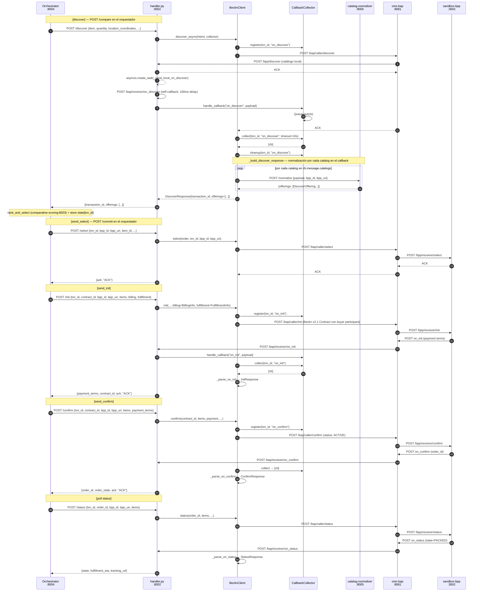
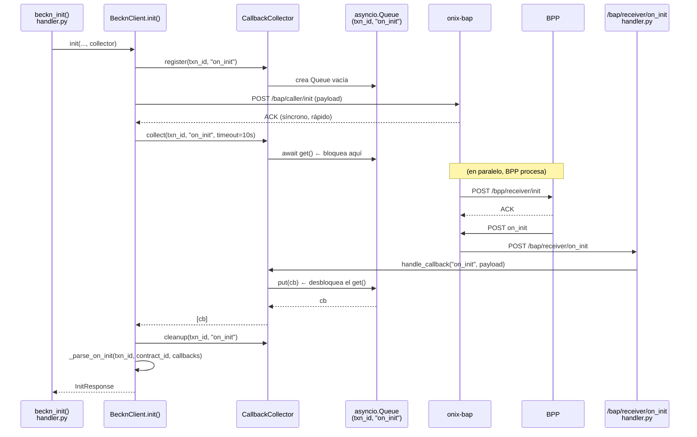

# Arquitectura — Beckn BAP Client (Lambda 2 — Microservicios)

> Estado del sistema tras el milestone **Microservices Migration + Full Transaction Flow**.
> Documenta **lo implementado** en `services/beckn-bap-client/`, no el diseño teórico.

---

## 1. Rol en la arquitectura de microservicios

```
┌───────────────────────────────────────────────────────────────────────┐
│                    Frontend (Next.js :3000)                            │
│  /login · /dashboard · /request/new                                    │
│  /request/[txn_id]/compare · /request/[txn_id]/order                  │
└───────────────────────────┬───────────────────────────────────────────┘
                            │ HTTP
                            ▼
┌───────────────────────────────────────────────────────────────────────┐
│                 Orchestrator (aiohttp :8004)                           │
│           services/orchestrator/src/workflow.py                        │
│                                                                        │
│   POST /parse     → intention-parser:8001/parse                        │
│   POST /compare   → discover + score → session_store                  │
│   POST /commit    → select + init + confirm                            │
│   GET  /status    → beckn-bap-client:8002/status                      │
└──────────────┬─────────────────────────┬──────────────────────────────┘
               │ POST /discover          │ POST /select
               │ POST /init              │ POST /confirm
               │ POST /status            │
               ▼                         ▼
┌──────────────────────────────────────────────────────────────────────┐
│              beckn-bap-client (aiohttp :8002)                         │
│              services/beckn-bap-client/src/                           │
│                                                                       │
│  POST /discover  → BecknClient.discover_async() → ONIX              │
│  POST /select    → BecknClient.select()         → ONIX              │
│  POST /init      → BecknClient.init()           → ONIX              │
│  POST /confirm   → BecknClient.confirm()        → ONIX              │
│  POST /status    → BecknClient.status()         → ONIX              │
│  POST /bap/receiver/{action}  ← callbacks ONIX                      │
│  POST /bpp/discover           ← catálogo local (ONIX routing)       │
└──────┬───────────────────────────────────────────────┬──────────────┘
       │ HTTP :8081                                    │ HTTP :8005
       ▼                                               ▼
┌──────────────────────────┐              ┌───────────────────────────┐
│  onix-bap (Go :8081)     │              │  catalog-normalizer :8005 │
│  ED25519 signing         │              │  /normalize               │
│  Schema validation       │              │  (on_discover callbacks)  │
│  Registry lookup (DeDi)  │              └───────────────────────────┘
└──────────┬───────────────┘
           │
           ▼
┌──────────────────────────────────────────┐
│  onix-bpp (Go :8082)                     │
│     │                                    │
│     ▼                                    │
│  sandbox-bpp (Node :3002)                │
│  o BPPs reales en red Beckn              │
└──────────────────────────────────────────┘
```

---

## 1b. Flujo compare / commit (dos pasos con estado en el orquestador)

El flujo está dividido en dos fases. El estado intermedio vive en el orquestador
(`TransactionSessionStore`), no en este servicio.

```
Frontend              Orchestrator :8004               beckn-bap-client :8002
────────              ──────────────────               ──────────────────────
POST /compare ──────► discover:
                        POST /discover ─────────────► discover_async() → ONIX
                        POST /score (scoring:8003)
                        store state[txn_id]
                      ◄── offerings + selected + reasoning_steps

(usuario revisa)
POST /commit ───────► load state[txn_id]
{chosen_item_id}        override selected
                        POST /select ───────────────► select() → ONIX → BPP
                        POST /init ─────────────────► init(billing, fulfillment) → ONIX → BPP
                        POST /confirm ──────────────► confirm(payment) → ONIX → BPP
                      ◄── order_id + order_state + payment_terms

GET /status ────────► POST /status ────────────────► status() → ONIX → BPP
(poll 30s)           ◄── {state, fulfillment_eta}
```

**Billing y fulfillment**: el orquestador construye ambos desde env vars (`BUYER_*`)
y los manda en el body de `POST /init`. Este servicio los deserializa y los pasa
al adapter, que los serializa en el wire payload de Beckn v2.1.

---

## 2. Inventario archivo por archivo

### Capa de protocolo Beckn — `src/beckn/`

| Archivo | Clases / funciones clave | Responsabilidad |
|---|---|---|
| `models.py` | `BecknContext`, `BecknIntent`, `BudgetConstraints`, `DiscoverOffering`, `DiscoverResponse`, `SelectOrder`, `SelectedItem`, `SelectProvider`, `Address`, `BillingInfo`, `FulfillmentInfo`, `PaymentTerms`, `OrderState` (enum), `InitResponse`, `ConfirmResponse`, `StatusResponse`, `CallbackPayload`, `AckResponse` | **Pydantic v2 models** del protocolo. Wire format camelCase + Python snake_case. `BecknIntent` y `BudgetConstraints` vienen de `shared/models.py` |
| `adapter.py` | `BecknProtocolAdapter` con `build_*_wire_payload()` para discover/select/init/confirm/status + helpers `_wire_context`, `_build_commitments`, `_address_dict`, `_buyer_participant_dict`, `_performance_dict`, `_settlement_dict` | **Construye payloads Beckn v2** (camelCase) + URL builders (`discover_url`, `select_url`, `caller_action_url(action)`) |
| `client.py` | `BecknClient` con `discover_async()`, `select()`, `init()`, `confirm()`, `status()` + parsers `_parse_on_init`, `_parse_on_confirm`, `_parse_on_status`, `_build_discover_response` | **Cliente HTTP async** (aiohttp). Orquesta: register → POST → collect callback → parse. Llama a `catalog-normalizer:8005/normalize` en el flujo de discover |
| `callbacks.py` | `CallbackCollector.register()`, `handle_callback()`, `collect()`, `cleanup()` | **Correlaciona** callbacks async del ONIX a la llamada Python que los espera, por `(txn_id, action)` |

### Infraestructura — `src/`

| Archivo | Responsabilidad |
|---|---|
| `config.py` | `BecknConfig(BaseSettings)` — lee `ONIX_URL`, `BAP_URI`, `BAP_ID`, `CALLBACK_TIMEOUT`, `CATALOG_NORMALIZER_URL` de env vars con defaults para dev local |
| `handler.py` | Servidor aiohttp en puerto 8002. Cinco rutas orquestador-facing (`/discover`, `/select`, `/init`, `/confirm`, `/status`), receptor de callbacks ONIX (`/bap/receiver/{action}`), catálogo local BPP (`/bpp/discover`). Singletons `config` y `collector` compartidos entre rutas |

### Catálogo local — `handler.py::_LOCAL_CATALOG`

Tres offerings hardcoded (OfficeWorld ₹195, PaperDirect ₹189, Stationery Hub ₹201) usados
por `/bpp/discover`. Son los mismos que en `Bap-1/src/server.py` — si se actualiza uno,
actualizar el otro.

---

## 3. Secuencia end-to-end — NL query hasta orden confirmada



---

## 4. Detalle de correlación de callbacks (cualquier acción async)

Idéntico al patrón de Bap-1. La clave es que `CallbackCollector` convierte el modelo
asíncrono de Beckn (callbacks HTTP separados) en una llamada `async/await` lineal.



---

## 5. Wire format de billing y fulfillment en `/init`

En Bap-1 el adapter tenía un `ProviderBundle` con `BillingProvider` y `FulfillmentProvider`.
Aquí la fuente es el orquestador: construye `billing` y `fulfillment` desde env vars `BUYER_*`
y los envía en el body de `POST /init`. El adapter los serializa al wire así:

```
message.contract.participants[0]   ← buyer info (permissivo, sin additionalProperties: false)
  id: config.bap_id
  descriptor.code: "buyer"
  descriptor.name: billing.name
  contact.{name, email, phone}
  address.{city, state, country, areaCode, ...}
  taxId: billing.tax_id (solo si presente)

message.contract.performance[0]   ← fulfillment (estricto, ver §6 #4)
  id: "performance-{hex8}"
  status.code: "PENDING"
  commitmentIds: [...]
  # performanceAttributes OMITIDO — ver TODO(beckn-v2.1-context)
```

Si el orquestador no manda `billing`, el adapter usa un fallback mock
(`procurement@example.com`) para backward compat.

---

## 6. Known production blockers

Lo que está **stubbed, hardcoded, o deliberadamente deshabilitado** en este servicio.
Heredados de Bap-1 salvo donde se indica lo contrario.

### 6.1 Protocolo & red

| # | Bloqueante | Estado hoy | TODO marker | Fase esperada |
|---|---|---|---|---|
| 1 | **`performanceAttributes` omitido en `/init`** — dirección y timeline de delivery no viajan en el wire. El BPP no sabe dónde entregar. | `_performance_dict` devuelve `{id, status, commitmentIds}` sin `performanceAttributes` para evitar que el validador ONIX haga HTTP-GET al `@context` URI (que no existe en la red Beckn aún). | `TODO(beckn-v2.1-context)` en `adapter.py::_performance_dict` | 3–4 |
| 2 | **DeDi registry: subscriber no registrado** | ONIX hace lookup de `bap.example.com` contra el registry DeDi y falla silenciosamente. En sandbox esto no bloquea; en red real sí. | Sin marker — config `.env` + onboarding al registry | 4 |
| 3 | **Claves ED25519 de desarrollo** | `simplekeymanager` del ONIX carga claves estáticas. Para producción: KMS/Vault, rotación, audit trail. | Sin marker — responsabilidad del equipo plataforma | 4 |
| 4 | **Discovery Service local (shortcut de dev)** | `/bpp/discover` en `handler.py` actúa como catalog service local (3 offerings hardcoded). En producción, `BAPCaller.yaml` rutea a una Discovery Service real externa. | Sin marker — cambio en `config/generic-routing-BAPCaller.yaml` | 3 |

### 6.2 Datos & lógica de negocio

| # | Bloqueante | Estado hoy | Fase esperada |
|---|---|---|---|
| 5 | **Catálogo hardcoded** — toda query devuelve los mismos 3 offerings de papel A4 | `_LOCAL_CATALOG` en `handler.py`. Búsquedas de laptops, oxígeno, etc. dan papel. | 2 (catalog-normalizer ya listo) |
| 6 | **Billing desde env vars** — un único perfil de comprador para todas las órdenes | `BUYER_*` env vars en el orquestador. En producción: base de datos de perfiles por usuario autenticado. | 3 |
| 7 | **Payment: solo COD hardcoded** | El orquestador manda `{type: "ON_FULFILLMENT", collected_by: "BPP"}`. Sin UPI, Razorpay, invoice/NET-30. | 3 |

### 6.3 Seguridad & acceso

| # | Bloqueante | Estado hoy | Fase esperada |
|---|---|---|---|
| 8 | **Sin auth entre orchestrator y este servicio** | Cualquier cliente en `beckn_network` puede llamar a `/init` o `/confirm`. En producción: mTLS o token interno. | 4 |

### Cómo leer esta tabla

- **TODO marker** — grep literal en el código para encontrar el punto de swap.
- **Fase esperada** — alineada con `KnowledgeBase/project_scaffold/milestones/phase{3,4}_*.md`.

### Qué **sí** está production-ready hoy

- Beckn v2.1 wire shape: `/discover`, `/select`, `/init`, `/confirm`, `/status` pasan validación contra el validador Go real.
- `CallbackCollector`: correlación async de `on_*` por `(txn_id, action)`. Seguro concurrente.
- Modelos tipados: `InitResponse`, `ConfirmResponse`, `StatusResponse`, `OrderState` (enum con fallback a `CREATED` para valores inválidos de BPP).
- Billing/fulfillment reales del comprador (Infosys) fluyen al wire payload vía `participants[]`.
- `/confirm` timeout devuelve `{ack: "NACK"}` (200) en lugar de 5xx — el orquestador puede hacer fallback a mock sin lanzar excepción.
- `/status` nunca devuelve 5xx — polling resiliente a timeouts.

---

## 7. Configuración

| Env Var | Default | Descripción |
|---|---|---|
| `ONIX_URL` | `http://localhost:8081` | beckn-onix Go adapter (BAP caller) |
| `BAP_URI` | `http://localhost:8002` | URI pública de este servicio (para callbacks) |
| `BAP_ID` | `bap.example.com` | Identificador BAP en la red Beckn |
| `DOMAIN` | `nic2004:52110` | Network domain (Beckn context) |
| `CALLBACK_TIMEOUT` | `10.0` | Segundos a esperar por callbacks `on_*` |
| `CATALOG_NORMALIZER_URL` | `http://localhost:8005` | URL del microservicio catalog-normalizer |

---

## 8. Referencia cruzada

- Beckn v2.1 gotchas (wire shape, blockers de validación): `Bap-1/CLAUDE.md §Beckn v2.1 wire shape`
- Milestones: `KnowledgeBase/project_scaffold/milestones/`
- Tests del stack completo: `KnowledgeBase/project_scaffold/tests/phase2_microservices.md`
- Orquestador: `services/orchestrator/src/workflow.py`
