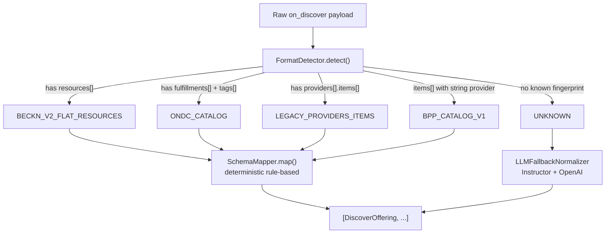

# catalog-normalizer — Beckn Catalog Normalization Bridge

Thin aiohttp microservice (port 8005) that accepts raw Beckn `on_discover` callback payloads and normalizes them into a standard list of `DiscoverOffering` objects. Called by `beckn-bap-client` once per catalog entry in the `on_discover` callback.

## Normalization pipeline



Variants are checked in the order listed. ONDC is checked before LEGACY because ONDC catalogs also have `providers[]` — the more specific fingerprint takes priority.

## Endpoints

### `GET /health`

```json
{"status": "ok", "service": "catalog-normalizer"}
```

### `POST /normalize`

**Request:**
```json
{
  "payload": { ...raw Beckn on_discover message... },
  "bpp_id": "bpp.example.com",
  "bpp_uri": "http://onix-bpp:8082/bpp/receiver"
}
```

**Response:**
```json
{
  "offerings": [
    {
      "bpp_id": "bpp.example.com",
      "bpp_uri": "http://onix-bpp:8082/bpp/receiver",
      "provider_id": "PROV-001",
      "provider_name": "OfficeWorld Supplies",
      "item_id": "ITEM-001",
      "item_name": "A4 Paper 80gsm",
      "price_value": 350.0,
      "price_currency": "INR",
      "available_quantity": 500,
      "rating": 4.8,
      "specifications": ["80gsm", "A4", "500 sheets per ream"],
      "fulfillment_hours": 48,
      "category": "Office Supplies"
    }
  ]
}
```

## LLM fallback

When no deterministic format matches (`UNKNOWN`), the service calls the OpenAI API via Instructor with a structured extraction prompt. Requires `OPENAI_API_KEY` to be set. If the key is absent and an unknown payload arrives, the service returns an empty `offerings` list rather than an error.

## Source package dependency

The `CatalogNormalizer` class lives in the repo-root `CatalogNormalizer/` package, **not** inside this service directory. Docker Compose bind-mounts `CatalogNormalizer/` into the container at `/app/CatalogNormalizer`. Do not move logic into this service directory — keep `services/catalog-normalizer/src/` as a thin HTTP adapter only.

## Configuration

| Var | Default | Description |
|-----|---------|-------------|
| `PORT` | `8005` | Listen port |
| `OPENAI_API_KEY` | `""` | Required for LLM fallback on UNKNOWN payloads |

`CATALOG_NORMALIZER_URL` is consumed by `beckn-bap-client`, not set here.

## Run

```bash
docker compose up -d catalog-normalizer
# or
python src/handler.py
```
