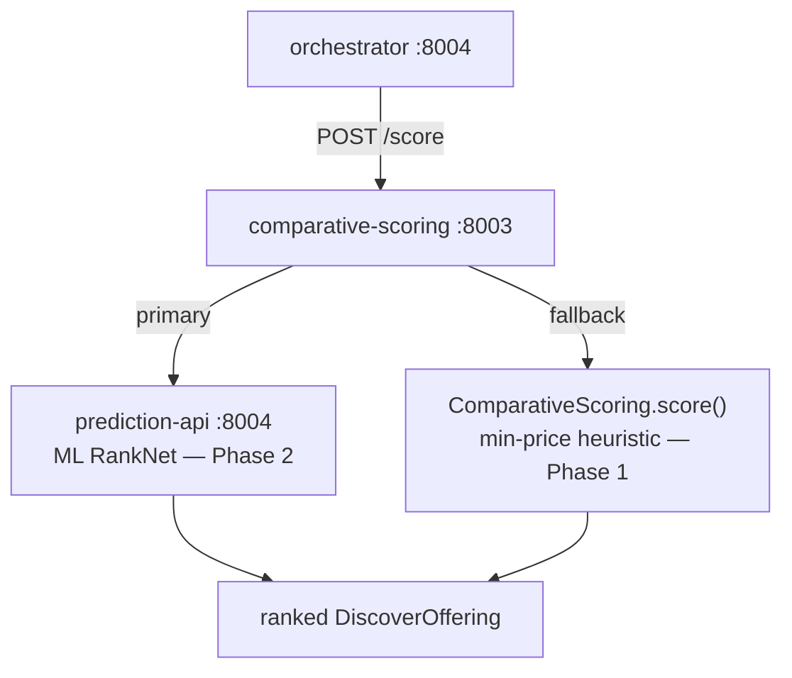

# comparative-scoring — ML Scoring Adapter

Thin aiohttp adapter (port 8003) that ranks `DiscoverOffering` items by forwarding them to the ML prediction API and mapping results back to the canonical offering shape. Falls back to a deterministic min-price heuristic when the ML backend is unavailable.

## Architecture



This service is an adapter — it does not contain scoring logic. Phase 1 heuristic lives in `ComparativeScoring/scorer.py`; Phase 2 ML lives in `services/ComparativeAndScoreing/`.

## Endpoints

### `GET /health`

```json
{"status": "ok", "service": "comparative-scoring"}
```

### `POST /score`

**Request:**
```json
{
  "offerings": [
    {
      "bpp_id": "bpp.example.com",
      "item_name": "A4 Paper 80gsm",
      "price_value": 350.0,
      "fulfillment_hours": 48,
      "provider_name": "OfficeWorld Supplies",
      "rating": 4.8,
      ...
    }
  ]
}
```

**Response (ML path):**
```json
{
  "selected": { ...DiscoverOffering... },
  "scoring": {
    "engine": "ml",
    "model_version": "1.0.0",
    "pipeline": "phase2_ranknet",
    "ranking": [
      {"bpp_id": "...", "item_id": "...", "score": 0.92, "rank": 1},
      ...
    ]
  }
}
```

**Response (fallback path):**
```json
{
  "selected": { ...DiscoverOffering... },
  "scoring": {"engine": "heuristic_min_price"}
}
```

Use the `scoring.engine` field to determine which path served the request.

## Field mapping

The adapter translates `DiscoverOffering` fields to the ML API's `CatalogItem` format:

| DiscoverOffering | CatalogItem (prediction-api) |
|-----------------|------------------------------|
| `item_id` | `id` |
| `price_value` | `price` |
| `fulfillment_hours` | `delivery_time_hours` |
| `provider_name` | `supplier_name` |
| `rating` | `risk_score` |

## ML backend

The ML scoring backend (`prediction-api`) is part of the separate MLOps stack in `services/ComparativeAndScoreing/`. Start it with:

```bash
docker compose -f services/ComparativeAndScoreing/docker-compose.mlops.yaml up prediction-api
```

When no MLflow Production model exists yet, `prediction-api` uses static weights `[0.4, 0.3, 0.3]` (price / speed / risk). Set `SCORING_FALLBACK_ENABLED=false` to hard-fail when the ML backend is unreachable instead of silently falling back.

## Configuration

| Var | Default | Description |
|-----|---------|-------------|
| `PREDICTION_API_URL` | `http://prediction-api:8004` | ML scoring backend URL |
| `PREDICTION_TIMEOUT_S` | `8.0` | Timeout for ML API call |
| `SCORING_FALLBACK_ENABLED` | `true` | Fall back to min-price heuristic on ML failure |

## Run

```bash
docker compose up -d comparative-scoring
```
