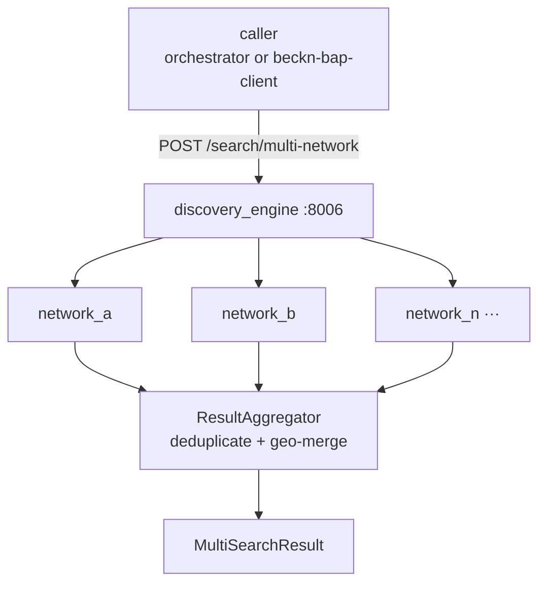

# discovery_engine — Multi-Network Beckn Discovery

FastAPI microservice (port 8006) that fans a single procurement intent out to multiple Beckn network gateways concurrently, enforces per-network timeouts and circuit breakers, and aggregates results into one deduplicated response.

## Architecture



Each network call is wrapped in a per-network circuit breaker (CLOSED → OPEN → HALF_OPEN). A failed network does not block results from healthy networks.

## Endpoints

### `GET /healthz`

Kubernetes liveness probe. Always returns 200 while the process is alive.

### `GET /readyz`

Readiness probe. Returns 503 if no networks are configured (preventing a K8s restart loop while still signaling misconfiguration).

### `POST /search/multi-network`

**Request (`IntentPayload`):**
```json
{
  "item": "Cat6 UTP Cable",
  "descriptions": ["UTP", "305m"],
  "quantity": 1,
  "location_coordinates": "19.0760,72.8777",
  "delivery_timeline": 72
}
```

**Response (`MultiSearchResult`):**
```json
{
  "items": [...],
  "total": 5,
  "degraded": false,
  "failed_networks": [],
  "sources": ["network_a", "network_b"]
}
```

**Always returns HTTP 200.** Check `degraded` and `len(items)` — do not branch on HTTP status. When all networks fail, `items` is empty and `degraded=true`.

## Deduplication

`ResultAggregator` deduplicates by `provider_id:item_id:currency`. For same-name/currency items from different networks within `DISCOVERY_GEO_PROXIMITY_KM` (default 0.5 km), it merges the `sources` list rather than creating duplicate entries.

## Circuit breaker

Per-network circuit breaker with asyncio.Lock. Translates all exception types (timeout, 5xx, 4xx, connection refused, invalid JSON) into a typed `NetworkStatus` enum value. Trips to OPEN after `DISCOVERY_CB_FAILURE_THRESHOLD` consecutive failures, auto-probes after `DISCOVERY_CB_RECOVERY_TIMEOUT_S`.

## Configuration

| Var | Default | Description |
|-----|---------|-------------|
| `DISCOVERY_NETWORKS_JSON` | `[{"name":"network_a","base_url":"http://localhost:8080","timeout_s":5.0}]` | JSON array of network gateway configs. Each entry: `name`, `base_url`, `timeout_s`, `headers` (optional) |
| `DISCOVERY_DEFAULT_TIMEOUT_S` | `5.0` | Default per-network timeout |
| `DISCOVERY_CB_FAILURE_THRESHOLD` | `3` | Failures before circuit opens |
| `DISCOVERY_CB_RECOVERY_TIMEOUT_S` | `30` | Seconds before circuit probes again |
| `DISCOVERY_GEO_PROXIMITY_KM` | `0.5` | Distance threshold for geo-based dedup |
| `DISCOVERY_HTTP_CONNECTOR_LIMIT` | `100` | aiohttp connector pool size |
| `DISCOVERY_HTTP_OUTER_TIMEOUT_S` | `15.0` | Overall request timeout |
| `DISCOVERY_API_HOST` | `0.0.0.0` | |
| `DISCOVERY_API_PORT` | `8006` | |
| `DISCOVERY_LOG_LEVEL` | `INFO` | |

**`DISCOVERY_NETWORKS_JSON` format:**
```json
[
  {"name": "beckn_testnet", "base_url": "https://gateway.becknprotocol.io", "timeout_s": 8.0},
  {"name": "local_sim", "base_url": "http://onix-bap:8081", "timeout_s": 3.0, "headers": {"X-Api-Key": "..."}}
]
```

## Run

```bash
docker compose up -d discovery_engine
# or
uvicorn src.main:app --host 0.0.0.0 --port 8006
```
