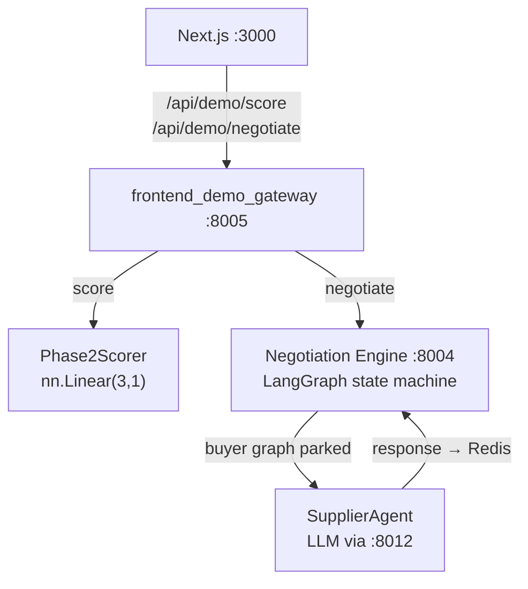

# frontend_demo_gateway — Demo Backend-for-Frontend

FastAPI microservice (port 8005) that bridges the Next.js frontend to the real scoring and negotiation backends for the demo flows. Exposes all endpoints under `/api/demo/*` with CORS open to `localhost:3000/3001`.

**Design principle: real components, mocked infrastructure.** The PyTorch LTR model and LangGraph negotiation state machine are production code. Only external infrastructure is replaced with simulators — no MLflow registry, no live Beckn network, no Qdrant writes.

## Architecture



## Endpoints

| Method | Path | Description |
|--------|------|-------------|
| GET | `/healthz` | Kubernetes liveness probe |
| GET | `/readyz` | Readiness — confirms Phase2Scorer + SupplierAgent loaded, Ollama reachable |
| POST | `/api/demo/score` | Runs real Phase-2 LTR PyTorch `nn.Linear(3,1)` on submitted suppliers |
| POST | `/api/demo/negotiate` | Kicks off a real LangGraph negotiation on the Negotiation Engine |
| GET | `/api/demo/negotiate/{thread_id}` | Polls current negotiation state |
| POST | `/api/demo/negotiate/{thread_id}/supplier-respond` | Drives the LLM supplier to respond and resumes the buyer graph |

## Scoring pipeline

`POST /api/demo/score` flow:
1. Coerces the frontend payload through `CatalogItem` schema.
2. Extracts `(n, 3)` feature tensor: `price` / `speed` / `risk`, each min-max normalized to `[0, 1]`.
3. Runs real `nn.Linear` forward pass. Falls back to `[0.50, 0.30, 0.20]` weights if no trained model loaded.
4. Returns ranked list with per-item feature vectors.

## Negotiation wiring

`POST /api/demo/negotiate` flow:
1. Sends offer list to Negotiation Engine (`POST /negotiate`).
2. The engine's LangGraph parks at `wait_for_async_callback` after issuing a guardrail-bounded counter-offer (max 20% discount).
3. `POST /api/demo/negotiate/{thread_id}/supplier-respond` calls `SupplierAgent` (Claude via proxy at `:8012`) to generate a supplier response.
4. The supplier response is published to Redis channel `beckn_on_select_results`, resuming the parked buyer graph.
5. Poll `GET /api/demo/negotiate/{thread_id}` to see the updated state.
6. On `max_rounds` exhaustion the buyer concedes to the supplier's final price.

The supplier agent falls back to a deterministic step-down formula if LLM output is unusable.

## Configuration

| Var | Default | Description |
|-----|---------|-------------|
| `OLLAMA_BASE_URL` | `http://localhost:8012/v1` | OpenAI-compatible Claude proxy |
| `OLLAMA_API_KEY` | `""` | API key for the proxy |
| `SUPPLIER_MODEL` | `claude-3-5-sonnet` | LLM model for SupplierAgent |
| `BUYER_HUMANIZE_MODEL` | `gpt-4o-mini` | Model for buyer message humanization |
| `SUPPLIER_ACCEPTABLE_DISCOUNT_FLOOR` | `0.08` | Min acceptable discount (8%) |
| `SUPPLIER_MAX_ROUNDS` | `3` | Max negotiation rounds |
| `SUPPLIER_TEMPERATURE` | `0.4` | LLM sampling temperature |
| `SUPPLIER_TIMEOUT_S` | `60.0` | LLM call timeout |
| `NEGOTIATION_ENGINE_URL` | `http://localhost:8004` | Negotiation Engine base URL |
| `REDIS_URL` | `redis://localhost:6379/0` | Redis for async graph resume |
| `REDIS_ON_SELECT_CHANNEL` | `beckn_on_select_results` | Redis channel name |
| `ENGINE_TIMEOUT_S` | `15.0` | Negotiation Engine call timeout |

## CORS

Open to `localhost:3000` and `localhost:3001` in dev. Narrow `allow_origins` before any production deployment.

## External dependencies

- Negotiation Engine at `:8004`
- Redis at `localhost:6379`
- Claude proxy at `:8012` (or Ollama for local LLMs)

## Note on mock_negotiate.py

`mock_negotiate.py` is a legacy in-process stub that has been superseded by `live_negotiate.py`. Do not add new code to `mock_negotiate.py`.

## Run

```bash
docker compose up -d frontend_demo_gateway
# or
uvicorn services.frontend_demo_gateway.main:app --port 8005
```
