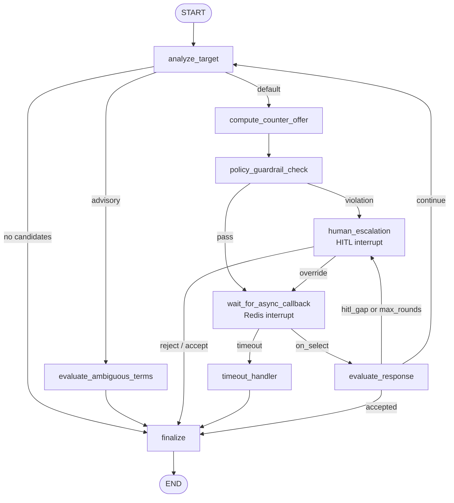

# negotiation_engine — Automated Price Negotiation

FastAPI microservice (port 8004) that drives multi-round automated price negotiation using a LangGraph state machine. Given a ranked list of supplier offers, it iteratively drafts counter-offers, enforces policy guardrails, and resolves the session to a terminal outcome.

## Pipeline position

```
[comparative-scoring :8003]
         │ ranked DiscoverOffering list
         ▼
[negotiation_engine :8004]  ← this service
         │ (outcome: accepted/rejected/escalated/timed_out/abandoned)
         ▼
[beckn-bap-client :8002]  → /select
```

## Endpoints

| Method | Path | Description |
|--------|------|-------------|
| POST | `/negotiate` | Start negotiation. Returns 202 Accepted with `thread_id` and `paused_at`. |
| GET | `/negotiate/{transaction_id}` | Inspect current LangGraph snapshot (for HITL UIs and operators). |
| GET | `/healthz` | Kubernetes liveness probe. |
| GET | `/readyz` | Readiness — reports graph compiled, Kafka/Postgres config state. |

### `POST /negotiate` — start session

**Request (`NegotiateRequest`):**
```json
{
  "transaction_id": "txn-abc123",
  "category": "office_supplies",
  "ranked_offers": [...],
  "policy": {"max_discount_pct": 0.15, "approval_threshold_pct": 0.10},
  "max_rounds": 3
}
```

**Response (202):**
```json
{
  "thread_id": "txn-abc123",
  "paused_at": "wait_for_async_callback",
  "round": 1,
  "final_outcome": null
}
```

`paused_at: "wait_for_async_callback"` means the graph issued a counter-offer and is waiting for the supplier's on_select response via Redis. Poll `GET /negotiate/{transaction_id}` for updates.

## Category profiles

| Archetype | base_discount | alpha_multiplier | advisory_only | Aliases |
|-----------|---------------|-----------------|---------------|---------|
| `commodity` | 10% | 1.00 | No | office_supplies, stationery, cabling |
| `specialized` | 5% | 0.70 | No | machinery, industrial |
| `it_equipment` | 0% | 0.50 | **Yes** | laptops, servers, enterprise_it |
| `medical` | 0% | 0.40 | **Yes** | medical_devices, pharma |
| `unknown` | 5% | 0.60 | No | any unrecognized category |

`advisory_only=True` routes directly to LLM review (no auto-commit).

## Guardrail layers

Three independent layers prevent a violating counter-offer from reaching the wire:

| Layer | Mechanism | What it enforces |
|-------|-----------|-----------------|
| L1 | Pydantic field constraint | `discount_pct` ∈ [0.0, 0.20] (absolute cap G1) |
| L2 | `validate_counter_offer()` | G1 (20% absolute), G2 (category cap), G3 (supplier cap), G5 (lead time), G6 (quantity) |
| L3 | ONIX schema validation | Beckn wire format correctness |

## LangGraph state machine



`wait_for_async_callback` is a machine interrupt — resumed by the Redis broker when `on_select` arrives. `human_escalation` is a HITL interrupt — resumed by the approval workflow over hours or days.

## Async resume

`OnSelectListener` subscribes to Redis channel `beckn_on_select_results`. When a message arrives, it extracts `transaction_id` and calls `graph.ainvoke(Command(resume=payload))` to resume the parked graph.

## Checkpointing

Uses `AsyncPostgresSaver` when `NEGOTIATION_POSTGRES_DSN` is set (state survives process restart). Falls back to `MemorySaver` otherwise (state lost on restart).

## Audit trail

Kafka producer writing to `procurement.negotiation.v1`. Policy violations are also mirrored to `procurement.negotiation.policy_violations.v1`. Fail-open: Kafka unavailability logs to stdout without blocking the negotiation.

## Configuration

| Var | Default | Description |
|-----|---------|-------------|
| `OLLAMA_BASE_URL` | `http://localhost:11434/v1` | LLM for advisory analysis |
| `OLLAMA_MODEL` | `qwen3:8b` | |
| `NEGOTIATION_POSTGRES_DSN` | `""` | PostgreSQL DSN for durable checkpointing |
| `KAFKA_BOOTSTRAP` | `""` | Kafka broker for audit trail |
| `REDIS_URL` | `redis://localhost:6379` | For async on_select listener |
| `BECKN_ON_SELECT_CHANNEL` | `beckn_on_select_results` | Redis channel |
| `PORT` | `8004` | |

## Run

```bash
docker compose up -d negotiation-engine
# or
uvicorn src.main:app --host 0.0.0.0 --port 8004
```
