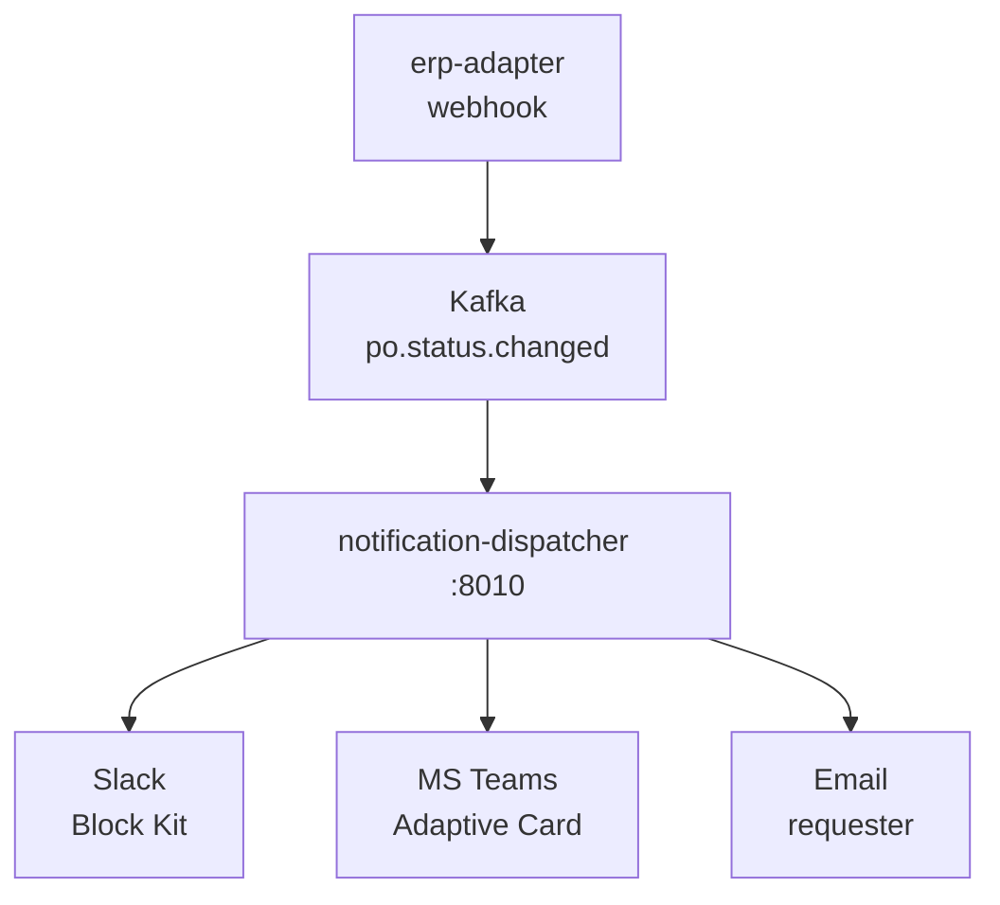

# notification-dispatcher — Order Status Notifications

aiohttp microservice (port 8010) with a background Kafka consumer. Subscribes to `po.status.changed` and fans out order status notifications to Slack, Microsoft Teams, and email. Terminal leg of the real-time tracking pipeline.

## Pipeline position



## Routing rules

| Order status | Slack | Teams | Email |
|-------------|-------|-------|-------|
| `confirmed` | ✓ | ✓ | ✓ |
| `shipped` | ✓ | ✓ | — |
| `delivered` | ✓ | ✓ | ✓ |
| `cancelled` | ✓ | ✓ | — |
| anything else | — | — | — |

Status matching is case-insensitive. Key `po_status` is tried first; `state` is the fallback.

## Channel behavior

Each channel is independent — one channel's failure does not block others (`asyncio.gather(..., return_exceptions=True)`). A channel with an empty configuration URL/host is silently disabled. The service starts normally with any combination of channels, including none.

## Email recipient resolution

The recipient address is resolved by joining from `purchase_orders.beckn_confirm_ref = order_id` through the FK chain to `users.email`. If the DB is unavailable or no match is found, the email channel is skipped for that event without affecting Slack/Teams.

The lookup key is `order_id` from the Kafka payload (equals `purchase_orders.beckn_confirm_ref`).

## Channel payloads

**Slack:** Block Kit format with a header block (emoji per state: ✅ confirmed, 🚛 shipped, 📦 delivered, ❌ cancelled) and a section block with `order_id`, `transaction_id`, `source`, `observed_at`.

**Teams:** Adaptive Card v1.4. Same four fields in a FactSet. Color coding: confirmed/delivered = `good`, shipped = `accent`, cancelled = `attention`.

**Email:** HTML rendered from Jinja2 templates (`email_confirmed.html`, `email_delivered.html`, `email_generic.html`). Subject: `Order {STATE} — {order_id}`. STARTTLS on `SMTP_HOST:SMTP_PORT`.

## Endpoints

Single `GET /health` → `{"status": "ok", "service": "notification-dispatcher"}`.

## Kafka consumer

`AIOKafkaConsumer` with `auto_offset_reset="latest"` and `enable_auto_commit=True`. No dead-letter queue — malformed messages are logged at WARNING and skipped.

## Configuration

| Var | Default | Description |
|-----|---------|-------------|
| `KAFKA_BOOTSTRAP` | `""` | Kafka broker(s). Empty = consumer never starts |
| `KAFKA_TOPIC` | `po.status.changed` | |
| `KAFKA_GROUP_ID` | `notification-dispatcher` | |
| `SLACK_WEBHOOK_URL` | `""` | Empty = Slack disabled |
| `TEAMS_WEBHOOK_URL` | `""` | Empty = Teams disabled |
| `SMTP_HOST` | `""` | Empty = email disabled |
| `SMTP_PORT` | `587` | STARTTLS port |
| `SMTP_USER` | `""` | |
| `SMTP_PASSWORD` | `""` | |
| `SMTP_FROM` | `noreply@procurement-agent.local` | |
| `DB_HOST` | `localhost` | For email recipient lookup |
| `DB_PORT` | `5432` | |
| `DB_NAME` | `procurement_agent` | |
| `DB_USER` | `""` | Empty = email lookup disabled |
| `DB_PASSWORD` | `""` | |
| `PORT` | `8010` | |

## Run

```bash
docker compose up -d notification-dispatcher
# KAFKA_BOOTSTRAP must be set for the consumer to start
```
