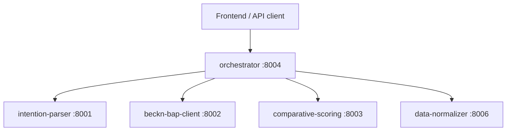

# orchestrator — Procurement Pipeline State Machine

Central coordinator for the procurement pipeline. Implements a local Step Functions-style state machine that chains intent parsing → discovery → scoring → selection, and manages the full commit flow (select → init → confirm). Runs on port 8004.

## Role in the stack



The orchestrator is the only service that calls all other services. Every other service has a single responsibility and calls only its direct dependencies.

## Endpoints

| Method | Path | Description |
|--------|------|-------------|
| GET | `/health` | Liveness — service + upstream URLs |
| GET | `/analytics` | Procurement analytics dashboard data |
| POST | `/run` | Full 4-step pipeline from NL query |
| GET | `/run/{run_id}` | Retrieve run result |
| POST | `/run/{run_id}/decide` | Human-in-the-loop decision on an autonomous run |
| POST | `/parse` | Proxy NL query to intention-parser |
| POST | `/discover` | Steps 2–3–4 with pre-parsed BecknIntent |
| POST | `/compare` | Steps 2–3 only (discover + score), stores session |
| POST | `/commit` | Load session + run select → init → confirm |
| GET | `/status/{txn_id}/{order_id}` | Poll Beckn order status |
| GET | `/order/{request_id}` | Order detail from data-normalizer |
| GET | `/admin/users` | List users (admin RBAC) |
| GET | `/approvals` | List pending approval requests |
| POST | `/approvals/{request_id}/decide` | Approve or reject a pending commit |
| GET | `/ws/status/{txn_id}` | WebSocket for real-time order tracking |
| POST | `/webhooks/seller/status` | HMAC-signed seller push notification |

## Pipeline

### Full run: `POST /run`

```
Step 1: POST intention-parser /parse           → BecknIntent
Step 2: POST beckn-bap-client /discover        → [DiscoverOffering]
Step 3: POST comparative-scoring /score        → ranked DiscoverOffering
Step 4: POST beckn-bap-client /select          → Beckn select ACK
```

Result is stored in memory and retrievable via `GET /run/{run_id}`.

### Two-phase compare/commit

`POST /compare` runs Steps 2–3 and stores the session (keyed by `transaction_id`, 30-minute TTL). `POST /commit` loads the session and runs select → init → confirm, applying the ERP budget gate before confirm.

## Execution modes

Controlled by the `PolicyEngine` via the `PROCUREMENT_EXECUTION_MODE` env var:

| Mode | Behaviour |
|------|-----------|
| `advisory` | Presents ranked options; user selects manually |
| `hitl` | Agent recommends; human approves before commit |
| `autonomous` | Agent commits automatically within RBAC threshold |

The `PolicyEngine` is the sole owner of policy decisions — no other component makes mode-specific choices directly.

## Agent memory

After each confirmed order, the orchestrator writes a memory record via `data-normalizer /normalize/memory/write` (pgvector embedding, `all-MiniLM-L6-v2`). On subsequent discover calls it queries `data-normalizer /normalize/memory/search` to apply time-decayed loyalty bonuses to scoring — preferred suppliers rise in ranking without hard-coding preference rules.

## Autonomous negotiation

When negotiation is enabled, `_run_autonomous_negotiation()` calls the LangGraph demo gateway (poll/respond loop, up to 120 polls at 1 s, max 3 rounds, 18% below list-price target). The negotiation result is factored into the commit decision.

## ERP integration

| Env var | Default | Purpose |
|---------|---------|---------|
| `ERP_BUDGET_CHECK_ENABLED` | `false` | Gate confirm on budget approval |
| `ERP_BUDGET_CHECK_REQUIRED` | `true` | Fail-closed (budget denial blocks commit) |
| `ERP_SYNC_ENABLED` | `false` | Push confirmed PO to ERP adapter |
| `ERP_DEFAULT_COST_CENTER` | `CC-IND-PROC-01` | Cost center for budget requests |

## Environment variables

| Var | Default | Purpose |
|-----|---------|---------|
| `INTENTION_PARSER_URL` | `http://localhost:8001` | |
| `BECKN_BAP_URL` | `http://localhost:8002` | |
| `COMPARATIVE_SCORING_URL` | `http://localhost:8003` | |
| `DATA_NORMALIZER_URL` | `http://localhost:8006` | |
| `ERP_ADAPTER_URL` | `http://localhost:8007` | |
| `ANALYTICS_URL` | `http://localhost:8009` | |
| `DEMO_GATEWAY_URL` | `http://localhost:8015` | LangGraph negotiation gateway |
| `REDIS_URL` | `""` | Legacy cache (disabled when empty) |
| `KAFKA_BOOTSTRAP` | `""` | Real-time tracking (disabled when empty) |
| `PROCUREMENT_EXECUTION_MODE` | `advisory` | `advisory` / `hitl` / `autonomous` |
| `BUYER_NAME` | `Procurement Agent` | Stamped on Beckn context |
| `BUYER_EMAIL` | `buyer@example.com` | |
| `SELLER_WEBHOOK_HMAC_SECRET` | `dev-hmac-CHANGE_ME` | Verifies inbound seller webhooks |

## Session management

Sessions from `POST /compare` are stored in memory with a 30-minute TTL. Lazy eviction — expired sessions are removed on the next `POST /commit` or `GET /run/{run_id}` call that references them.

## Run

```bash
docker compose up -d orchestrator
# or
python src/workflow.py
```
