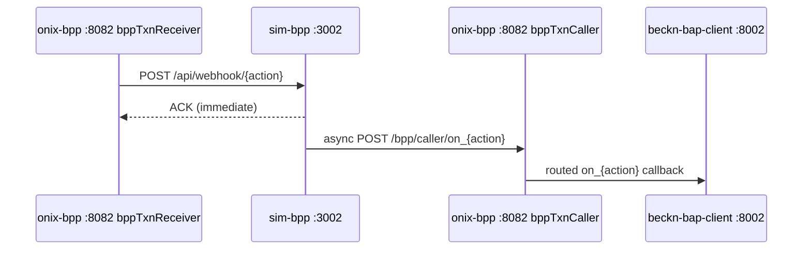

# sim-bpp — Local Beckn BPP Simulator

A high-fidelity local BPP (Beckn Provider Platform) that replaced the old `sandbox-2.0` image. It handles the full Beckn v2.0.0 lifecycle — discovery plus all nine transactional actions — through the real signed and schema-validated ONIX path.

**Key guarantee:** if the BAP works against this simulator, it works against a real Beckn network. The only differences are routing (`targetType: url` instead of DeDi registry lookup) and identity/keys (testnet vs. production).

## Architecture position



sim-bpp receives signed requests from `onix-bpp`, processes them, and fires an async `on_{action}` callback back through `onix-bpp` to the BAP.

## API Endpoints

| Method | Path | Description |
|--------|------|-------------|
| GET | `/api/health` | `{"status": "ok", "service": "sim-bpp", "bpp_id": "<BPP_ID>"}` |
| POST | `/api/webhook/{action}` | Inbound Beckn action from `onix-bpp`. Returns immediate ACK, then fires async `on_{action}` callback. Unknown actions return HTTP 404 with NACK. |

Supported actions: `discover`, `select`, `init`, `confirm`, `status`, `track`, `update`, `cancel`, `rate`, `support`.

## Discovery behavior

The `build_on_discover` function filters `catalog.json` using `intent.textSearch`:

1. Reads `catalog.json` on every request (hot-reload — edit catalog without restart).
2. Tokenizes both query and catalog entries (lowercase, light singularization).
3. Filters query tokens against the catalog vocabulary — discards filler words that match nothing (e.g. "Mumbai", "days") to prevent every item matching.
4. Matches items where **all** filtered query tokens appear in the item name + keywords (AND logic, not OR).
5. Returns `message.catalogs[]` in Beckn v2 flat-resource wire format.

## Catalog

`catalog.json` contains 9 providers and 31 items across 5 categories (Office Supplies, IT Equipment, IT Peripherals, Networking, Furniture). All items include `fulfillment_hours`, `stock` count, and `specs[]`.

The catalog file is bind-mounted at runtime — edit it without rebuilding the image.

## Transactional actions

| Action | `status.code` returned |
|--------|----------------------|
| `select` | `ACCEPTED` |
| `init` | `ACTIVE` |
| `confirm` | `ACTIVE` |
| `status` | Current order status |
| `cancel` | `CANCELLED` |

## Auto-advance lifecycle

When `SIM_BPP_AUTO_ADVANCE=true`, a confirmed order automatically progresses through:

```
ACCEPTED → PACKED → SHIPPED → OUT_FOR_DELIVERY → DELIVERED
```

Each transition (every `SIM_BPP_ADVANCE_INTERVAL_SECS` seconds):
- PATCHes `data-normalizer` at `PATCH /normalize/po_status`.
- Publishes an event to Kafka topic `po.status.changed` (triggers WebSocket fan-out and notifications).

Auto-advance is **off by default** to preserve manual test workflows. A `/cancel` action cancels the background task for that order. Scheduling is idempotent — the same `order_id` cannot be double-scheduled.

## Configuration

| Var | Default | Description |
|-----|---------|-------------|
| `PORT` | `3002` | Listen port |
| `ONIX_BPP_CALLER` | `http://onix-bpp:8082/bpp/caller` | Base URL for `on_{action}` callbacks |
| `BPP_ID` | `bpp.example.com` | BPP identifier stamped on all responses |
| `BPP_URI` | `http://onix-bpp:8082/bpp/receiver` | BPP URI stamped on all responses |
| `CATALOG_PATH` | `/app/catalog.json` | Path to catalog (bind-mounted at runtime) |
| `SIM_BPP_AUTO_ADVANCE` | `false` | Enable autonomous fulfillment lifecycle |
| `SIM_BPP_ADVANCE_INTERVAL_SECS` | `5` | Seconds between lifecycle state transitions |
| `KAFKA_BOOTSTRAP` | `""` | Kafka broker; empty = Kafka disabled |
| `KAFKA_TOPIC` | `po.status.changed` | Topic for order state events |
| `DATA_NORMALIZER_URL` | `http://data-normalizer:8006` | |

## Tests

`tests/test_auto_advance.py` covers the lifecycle, cancel, idempotency, and flag-off behaviors.

## Run

```bash
docker compose up -d sim-bpp
# or standalone (bind-mount the catalog):
docker run -p 3002:3002 -v ./catalog.json:/app/catalog.json sim-bpp
```
